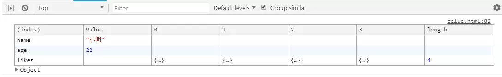
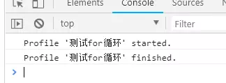
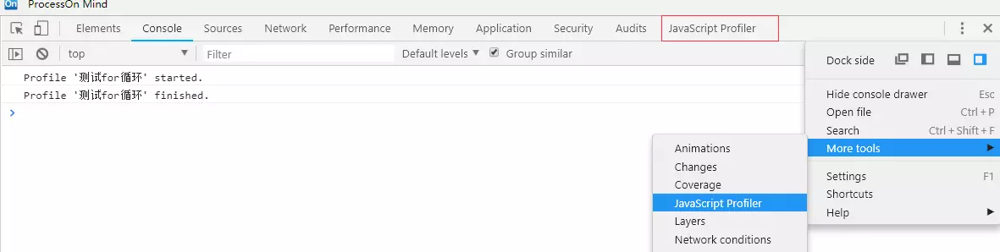
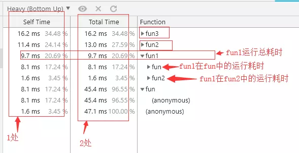

## 一、console

### 1、console.log占位符
* 1、==%s== 字符串
* 2、==%d== 或 ==%i== 整数
* 3、==%f== 浮点数
* 4、==%o== 对象的链接
* 5、==%c== CSS格式字符串

**注意：**
* 如果方法的第一个参数中使用了占位符，那么就依次使用后面的参数进行替换。
* 拼接混合使用也可以。
* 但es6的字符串模板中，只能使用%c占位符，其他占位符是没有效果的。


```js?linenums
const name = 'chinaBerg';
const age = 88;
const money = 12.88;
const obj = {
    status: '很积极'
}

console.log('我叫%s，%d岁，有%f元，状态：%o', name, age, money, obj.status, '又打印一句话')
```

谷歌打印结果：

     我叫chinaBerg，88岁，有12.88元，状态："很积极" 又打印一句话

### 2、console.clear()

清除控制台打印的内容，并将光标回归到第一行。

### 3、console.assert(表达式 [,arg1, arg2……argn])打印断言。

第一个参数用来判断是否打印断言的表达式，只有当表达式的值为false的时候，才会打印后续的参数：

```js?linenums
const arr = [1,2,3];

//打印断言，如果arr[0]的值不等于2，则打印提示信息。
console.assert(arr[0] === 2 , "arr[0]的值不等于2");
```
谷歌打印：

     Assertion failed: arr[0]的值不等于2
	 
如果没有参数，默认打印如下字符串：

     Assertion failed: console.arrsert
	
其它注意点：
   * 客户端的==console.assert==打印断言，并且不会阻塞后续代码的执行，只有在断言的表达式为false的时候，向控制台打印你的内容。
   * 而在==node.js==中，值为假的断言将会导致一个==AssertionError==被抛出，使得代码执行被打断。这两者是有区别的。

### 4、console.count()打印计数。输出他被调用了多少次。

传递一个参数作为计数提示：

```js?linenums
for(let i = 0; i < 10 ;i++) {
   console.cunt('我被调用了');
}
```

谷歌控制台：

	我被调用了: 1
	我被调用了: 2
	我被调用了: 3
	我被调用了: 4
	我被调用了: 5
	我被调用了: 6
	我被调用了: 7
	我被调用了: 8
	我被调用了: 9
	我被调用了: 10
	
注意：
 * 如果你给count()传递的参数值不一样，那么是分开计数的。
 * 如果不传递参数，默认的计数提示标签是default字符串。

### 5、console.time()和console.timeEnd()打印计时。

用来跟踪某一个操作的占用时长。每一个计时器必须拥有唯一的名字，time()的参数名和timeEnd()的参数名要一样。可以没有参数，默认计时提示为default。

```js?linenums
// 立即启动计时器
console.time("time")

// 某些操作
for (let i = 0; i < 10000; i++) {
    // 某些操作				
}

// 立即结束计时器，并输出计时结果
console.timeEnd("time")
```

谷歌输出：
   
     time: 1.10986328125ms
	 

注意：

* 页面中最多同时运行10,000个计时器
* 该方法并不会将计算结果返回到js中，而只是打印到控制台上。所以不能使用吃方法在js中来作为普通计时器使用或者进行性能收集器的一部分。


### 6、console.dir()
 
 输出以JavaScript形式表示的指定对象。如果正在记录的对象是HTML元素，将输出其以DOM形式表示的属性。
 
 ```js
 // dir打印
console.dir(document.body);

// log打印
console.log(document.body)
 ```
 * console.dir()会将dom的所有属性和事件都被打印出来：
 
 
 * console.log()打印的就是dom：


### 7、console.group() + console.groupEnd()将控制台输出的内容进行分组。
例如：


### 8、console.table()可以将数组、对象等复杂类型的数据打印成表格的形式。

```js?linenums
const obj = {
    name: '小明',
    age: 22,
    likes: [
        {
            a: 1,
            b: 2
        },
        {
            a: 3,
            b: 4
        },
    ]
}
```


### 9、console.trace()堆栈中调用此方法的路径。

### 10、console.warn()打印一条警告信息

### 11、console.error()打印错误。

该方法主要用来打印错误，但是==throw==抛出错误的方式也会用到不少。

### 12、console.profile() 和 console.profileEnd() 新建一个性能分析器(基于cpu的使用情况)。用于函数性能分析的利器。

```js?linenums
// 简单新建一个数组吧，新建一个一千万个成员为1的数组
let arr = new Array(10000000).fill(1);
				
// 第一种for循环书写方式				
function fun1 () {
    for (let i = 0, len = arr.length; i < len; i++) {}
}

// 第二种for循环书写方式				
function fun2 () {
    for (let i = arr.length; i --; ) {}
    fun1();
}

// 第三种for循环书写方式		
function fun3 () {
    for (let i = 0, item; item = arr[i++]; ) {}
}

// 执行三个函数		
function fun () {
    fun1();
    fun2();
    fun3();
}

// 立即开始一个性能分析器
console.profile('测试for循环');
fun();
//
console.profileEnd('测试for循环');
```

运行如以上程序，打开谷歌控制台一看：



性能分析器在javascript Profiler面板中：



分析：



* 1处，Self Time表示当前函数自身运行耗时，就是说当前函数自身执行耗时，不包括函数中调用的其他函数运行耗时。
* 2处，Total Time 表示当前函数运行总耗时，包括了自身运行耗时+函数内部调用的其他函数的执行耗时。
* Function那一列，我们通过上图打开的fun1那一栏说明，fun1展开后的结果包括fun和fun2，这指的是函数fun1在函数fun和fun2中被调用执行的耗时。通过代码我们知道，fun1函数确实在fun函数和fun2个被调用过1次，所以这里展示了fun在这两处被调用执行的耗时时间。
* 每个函数行最右边还会堆栈位置，点击即可进入resouce面板中该函数所在的文件位置。

### 13、console.timeStamp('事件信息')，在Performance(以前叫Timeline)性能面板中的会话录制期间插入一条添加一个事件。

性能调试的时候会用到。在Perdormance面板中，我们可以分析当前页面的性能，可以得知页面加载和用户交互相关的事件分析结果。关于Performance这块的内容，如果仔细说起来，内容是比较多的。这里暂且只介绍和console.timeStamp方法相关的内容。以后可以单独把这块拿出来细细分析和记录。

### 14、console.timeLine('标签参数')配合 console.timeLineEnd('标签参数')录制一段时间的时间轴。 

```js?linenums
// 录制第一段时间的会话信息
console.timeline('测试循环100万相关的性能分析')
for (let i = 0; i < 1000000; i ++) {}
console.timelineEnd('测试循环100万相关的性能分析')


// 录制第二段时间的会话信息				
console.timeline('测试循环1000万相关的性能分析')
for (let i = 0; i < 10000000; i ++) {}
console.timelineEnd('测试循环1000万相关的性能分析')
```

转载链接：https://juejin.im/post/5b586ec06fb9a04fc436c9b3

## 二、