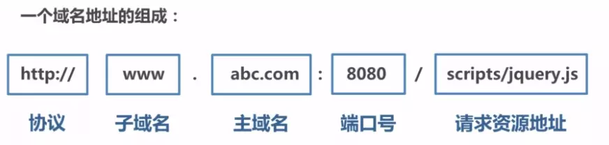
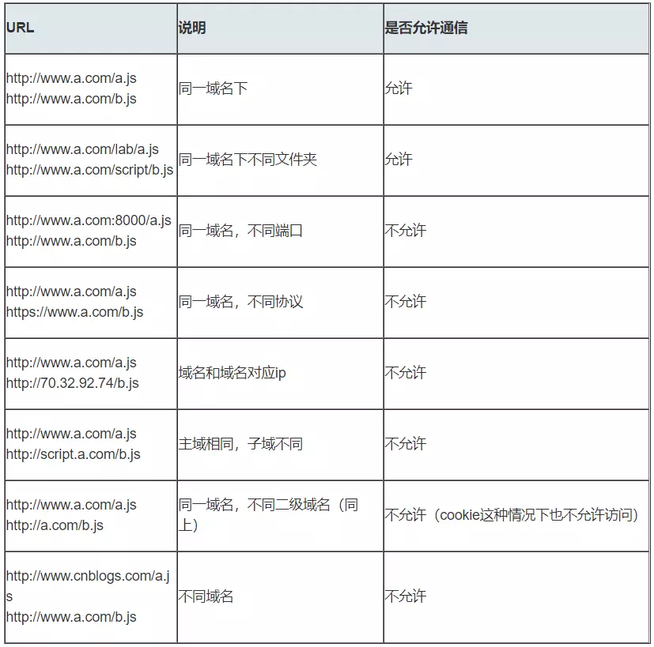

## 一、什么是跨域？

### 1. 什么是同源策略及其限制内容 ？ 

> 同源 指 " 协议 + 域名 + 端口  " 三者相同，即便两个不同的域名指向同一个ip地址，也非同源。



**同源策略限制内容有：**

* Cookie、LocalStorage、IndexedDB 等存储性内容
* DOM 节点
* AJAX 请求发送后，结果被浏览器拦截了

**但是有三个标签是允许跨域加载资源：**

* < img src=XXX >
* < link href=XXX >
* < script src=XXX >

### 2、常见跨域场景

当协议、子域名、主域名、端口号中任意一个不相同时，都算不同域。
不同域之间相互请求资源，就算作跨域。常见跨域如下如图：



特别说明：
	
* 如果是协议和端口造成的跨域问题“前台”是无能为力的。
* 在跨域的问题上，仅仅是通过“URL的首部”来识别而不会根据域名对应的IP地址是否相同来判断。“URL的首部”可以理解为“协议，域名和端口必须匹配”。


跨域并不是请求发布出去，请求能发出去，服务端能收到请求并正常返回结果，只能结果被浏览器拦截了。你可能会疑问明明通过表单的方式可以发起跨域请求，为什么AJAX就不会？因为归根结底，跨域是为了阻止用户读取到另一个域名下的内容，AJAX可以获取响应，浏览器认为这不安全，所以拦截了响应。但是表单不会获取新的内容，可以跨域请求。同时也说明了跨域并不能完全阻止CSRF，因为请求毕竟发出去了。

## 二、 跨域解决方案

### 2.1 jsonp

#### 2.1.1 jsonp原理

利用< script > 标签没有跨域限制的漏洞，网页可以得到从其他来源动态产生的JSON数据。JSONP请求一定需要对方的服务器做支持才可以。

#### 2.1.2 jsonp 和 ajax 对比

jsonp和ajax相同，都是客户端向服务器端发送请求，从服务器端获取数据的方式。但ajax属于同源策略，jsonp属于非同源策略（跨域请求）

#### 2.1.3 jsonp 优缺点

jsonp优点是简单兼容性好，可用于解决主流浏览器的跨域数据访问的问题。缺点是仅支持get方法具有局限性，不安全可能会遭受XSS攻击。

#### 2.1.4 jsonp的实验流程

* 声明一个回调函数，其函数名（如show）当做参数值，要传递给跨域请求数据的服务器，函数形参为要获取目标数据（服务器返回的data）
* 创建一个 < script > 标签，把那个跨域的API数据接口地址，赋值给script的src，还要在这个地址中向服务器传递该函数名（可以通过问号传参？callback=show）。
* 服务器接收到请求后，需要进行特殊的处理：把传递进来的函数名和它需要给你的数据拼接成一个字符串，例如: 传递进去的函数名是show，它准备好的数据是 show("我不爱你")。
* 最后服务器把准备的数据通过HTTP协议返回给客户端，客户端再调用执行之前声明的回调函数（show）,对返回的数据进行操作。

```js?linenums
function jsonp({ url, params, callback }) {
  return new Promise((resolve, reject) => {
    let script = document.createElement('script')
    window[callback] = function(data) {
      resolve(data)
      document.body.removeChild(script)
    }
    params = { ...params, callback } // wd=b&callback=show
    let arrs = []
    for (let key in params) {
      arrs.push(`${key}=${params[key]}`)
    }
    script.src = `${url}?${arrs.join('&')}`
    document.body.appendChild(script)
  })
}
jsonp({
  url: 'http://localhost:3000/say',
  params: { wd: 'Iloveyou' },
  callback: 'show'
}).then(data => {
  console.log(data)
})
```