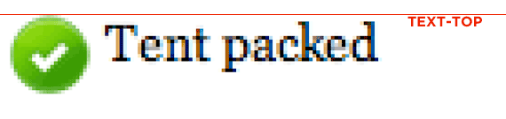
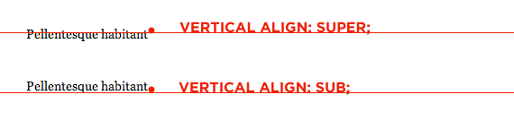
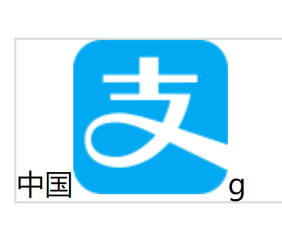
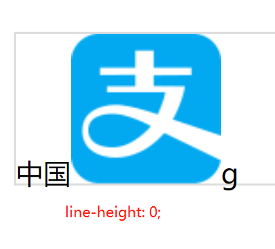
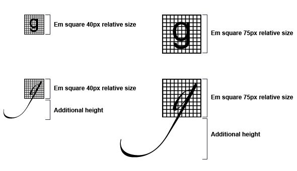
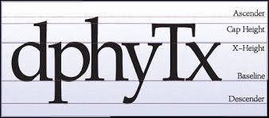
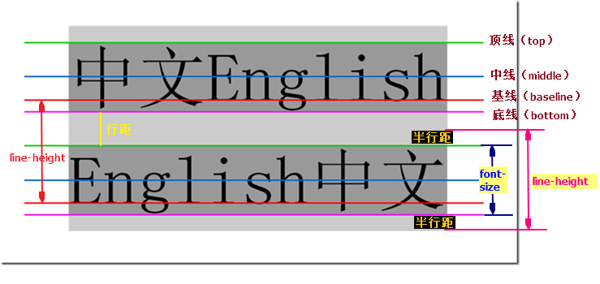
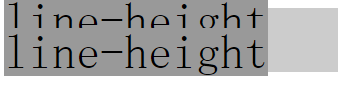
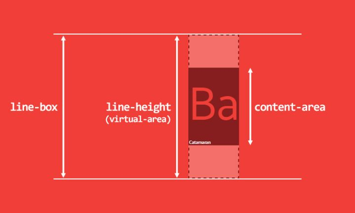
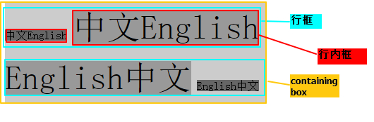

## 一、vertical-align

>用来指定行内元素（inline）或表格单元格（table-cell）元素的垂直对齐方式。
>取值：baseline | sub | super | text-top | text-bottom | middle | top | bottom | < percentage > | < length >

### 1、取值 (对于行内(inline)元素)

大部分取值是相对于父元素来说的：

* **baseline**

   默认值。 元素基线与父元素的基线对齐。
   
   图像将与文本基线处的文本对齐。请注意，字母上的下降点低于基线。图像不与下降点的最低点对齐，这不是基线。
   
   
   
* **middle**

  元素的中心与父元素的基线加上小写x一半的高度值对齐。
  
  
  
* **text-bottom**

  与类型的基线不同，是文本的底部，下降到的地方。图像也可以与此深度对齐：
  
  
 
* **text-top**

  与text-bottom相反，是text-top，是当前font-size的最高点。您也可以与此对齐。请注意，当前字体Georgia可能有一些比这里所示的更高的上升，因此差距很小。
  
  
  
* **top**

   元素及其后代的顶端与整行的顶端对齐。
   
* **bottom**

  元素及其后代的底端与整行的底端对齐。
  
* **sub**

    元素基线与父元素的下标基线对齐。
	
	
* **super**

   元素基线与父元素的上标基线对齐。
   
   
   
### 2、取值 (对于table-cell元素)

* **baseline**

   与同行单元格的基线对齐。
   
* **top**

   单元格的内边距的上边缘与行的顶端对齐。
   
* **middle**

   单元格垂直居中。
   
* **bottom**
  
  单元格的内边距的下边缘与行的底端对齐。

* 可以取负值。

### 3、注意

 ### img在严格模式下（DOCTYPE），下面会有几像素的空白。
 
 图片文字等inline元素默认是和父级元素的baseline对齐的，即：vertical-align 的默认值是 baseline；而baseline又和父级底边bottom有一定距离；
 
 img出现的空白就是baseline和bottom之间的这段距离；即使只有图片没有文字，只要是 inline 的图片这段空白都会存在。
 
 img 标签 是inline 元素， inline元素默认是baseline对齐的。 当baseline对齐的时候，baseline和bottom之间有段距离，就是出现的空白；
 
 
 
 
 
 
*  top 和 bottom 之间的值即为 line-height。假如把 line-height 设置为0，那么 baseline 与 bottom 之间的距离也变为0，那道空白也就不见了。
 
 
 
 *  如果没有设置 line-height，line-height 的默认值是基于 font-size 的，视渲染引擎有所不同，但一般是乘以一个系数（比如1.2）。因此，在没有设置 line-height 的情况下把 font-size 设为0也可以达到同样的效果。当然，这样做的后果就是不能图文混排了。
 
 
 
 * img 设置为块级元素
 
 * 设置vertical-align的属性值

## 二、font-size

```html?linenums
<p>
	<span class="a">Ba</span>
	<span class="c">Ba</span>
	<span class="b">Ba</span>
</p>
```

```css
p span{ background: #eee;}
p { font-size: 100px; }
.a { font-family: Helvetica; }
.b { font-family: STLiti; }
.c { font-family: 	KaiTi; }
```


font-size 相同，font-family 不同，得到的 span 元素的高度也不同。

**原因在于字体本身，这是字体的原理**：

* 一款字体会定义一个[em-square](http://designwithfontforge.com/zh-CN/The_EM_Square.html)，它是用来盛放字符的金属容器。这个em-square 一般被设定为宽高均为 1000 相对单位，不过也可以是 1024、2048 相对单位。



* 字体度量都是基于这个相对单位设置的，包括 ascender、descender、capital height、x-height 等。注意这里面的值是允许相对于 em-square 出血（bleed outside）的（译者注：大概可以理解为超出 em-square）



* 在浏览器中，上面的 1000 相对单位会按照你需要的 font-size 缩放。

## 三、line-height

 CSS 属性用于设置多行元素的空间量，比如文本。对于块级元素，它指定元素行盒（line boxes）的最小高度。对于非替代的inline元素，它用于计算行盒（line box）的高度。
 
 行高是指文本行基线间的垂直距离
 
  
 
 图中两条红线之间的距离就是行高（line-height），上一行的底线和下一行的顶线之间的距离就是行距，而同一行顶线和底线之间的距离是font-size的大小，行距的一半是半行距，半行距、font-size、line-height之间的关系看图片的右下角就一目了然了~
 
 ```js
 半行距 = （line-height - font-size）/2
 ```
 当然，半行距也可能为负值（当line-height < font-size），这时候两行之间就会重叠，如下图所示：
 
 
 
 **4种box**
 
 
 
 要说的4种盒子分别是==inline box==、==line box==、==content area==、==containing box==
 
 * **inline box (行内框)** 每个行内元素会生成一个行内框，行内框是一个浏览器渲染模型中的一个概念，无法显示出来，行内框的高度等于font-size，设定line-height时，行内框的高度不变，改变的是行距。


 * **line box （行框）** 行框是指本行的一个虚拟的矩形框，由该行中行内框组成。行框也是浏览器渲染模式中的一个概念，无法显示出来。行框高度等于本行中所有行内框高度的最大值。当有多行内容时，每一行都有自己的行框。

 * **content area （内容区）** 内容区是围绕着文字的一种box，无法显示出来，其高度取决于font-size和padding。

* **containing box containing box** 是包裹着上述三种box的box
 
 
 
 **取值**：
 
   * **normal**
   
     取决于用户端。桌面浏览器（包括Firefox）使用默认值，约为1.2，这取决于元素的 font-family。
    
  * **<数字>**

    该属性的应用值是这个无单位数字乘以该元素的字体大小。计算值与指定值相同。大多数情况下，这是设置line-height的推荐方法，不会在继承时产生不确定的结果。
 
 * **<长度>**

   指定<长度>用于计算 line box 的高度。查看<长度> 获取可能的单位。以em为单位的值可能会产生不确定的结果。
   
  * **<百分比>**
      
	  与元素自身的字体大小有关。计算值是给定的百分比值乘以元素计算出的字体大小。百分比值可能会带来不确定的结果。
	  
### 1、

## 四、图片居中的方式

```html?linenums
<body>
    <div>
        
    </div>
</body>
```

### 1、弹性布局flex
> img 高度固定，img宽度自适应 ，图片等高缩小，水平居中
```css
<style type="text/css">
    *{margin: 0;padding:0;}
    div{
        width:150px;
        height: 100px;
        border:1px solid #000;
        display: flex;
        justify-content: center;
        align-items: center;
    }
    img {
        height: 50px;
    }
</style>
```
### 2、定位 （img宽高固定 ，父元素宽高大于img宽高）

```css
<style type="text/css">
    *{margin: 0;padding:0;}
    div{
        width:150px;
        height: 100px;
        position: relative;
        border:1px solid #000;
    }
    img {
        width: 50px;
        height: 50px;
        position: absolute;
        top: 0;
        left: 0;
        right: 0;
        bottom: 0;
        margin: auto;
    }
</style>
```

### 3、定位 + transform  ，不知道元素的宽高 (或者控制高度 或者宽度缩放显示)

**宽高固定**
```css
<style type="text/css">
    *{margin: 0;padding:0;}
    div{
        width:150px;
        height: 100px;
        position: relative;
        border:1px solid #000;
    }
    img {
        width: 50px;
        height: 50px;
        position: absolute;
        top: 50%;
        left: 50%;
        transform: translate(-50%,-50%);
    }
</style>
```

**宽不固定 高固定 按高缩放，水平居中**
```css
<style type="text/css">
    *{margin: 0;padding:0;}
    div{
        width:150px;
        height: 100px;
        position: relative;
        border:1px solid #000;
    }
    img {
        height: 50px;
        position: absolute;
        left: 50%;
        transform: translate(-50%,0);
    }
</style>
```

### 3、定位 ，img宽高固定 图片的中心位于div的中心，就需要将图片向上移动图片高度的一半，并向左移动图片宽度的一半。

```css
<style type="text/css">
    *{margin: 0;padding:0;}
    div{
        width:150px;
        height: 100px;
        position: relative;
        border:1px solid #000;
    }
    img {
        width: 50px;
        height: 50px;
        position: absolute;
        top: 50%;
        left: 50%;
        margin-top: -25px; /* 高度的一半 */
        margin-left: -25px; /* 宽度的一半 */
    }
</style>
```

### 4、display table-cell, 然后水平居中设置text-align为center，垂直居中设置vertical-align为middle

```css
<style type="text/css">
    *{margin: 0;padding: 0;}
    div{
        width:150px;
        height: 100px;
        display: table-cell;
        vertical-align: middle;
        text-align: center;
        border:1px solid #000;
    }
    img {
        width: 50px;
        height: 50px;
    }
</style>
```

## 五、display

用于规定元素生成的框类型，影响显示方式

值: none | inline | block | inline-block | list-item | run-in | table | inline-table | table-row-group | table-header-group | table-footer-group | table-row | table-colume-group | table-column | table-cell | table-caption | inherit

[注意]：IE7-浏览器不支持table类属性值及inherit

### 5.1、block，inline和inlinke-block细节对比

#### 5.1.1、display:block

* block元素会独占一行，多个block元素回去各自新起一行。默认情况下，block元素宽度自动填满其父元素宽度。
* block元素可以设置width，height属性。块级元素即使设置了宽度，仍然是独占一行。
* block元素可以设置margin和pading属性。

#### 5.1.2、display:inline

* inline元素不会独占一行，多个相邻的行内元素会排列在同一行里，知道一行排列不下，才会新一行，其宽度随元素的内容而变化。
* inline元素设置width和height属性无效。
* inline元素的 margin和padding属性，水平方向的 padding-left，padding-right，margin-left，margin-right都会产生边距效果，但竖直方向的padding-top，padding-bottom，margin-top和margin-bottom不会产生边距效果。

#### 5.1.3、display:inline-block

简单来说就是将对象呈现为inline对象，但是对象的内容作为block对象呈现。之后的内联对象会被排列在同一行内。比如我们可以给一个link（a元素）inline-block属性值，使其既具有block的宽度高度特性又具有inline的同行特性。

注意：IE（低版本IE）本来是不支持inline-block的，所以在IE中对内联元素使用display:inline-block，理论上IE是不识别的，但使用display:inline-block在IE下会触发layout，从而使内联元素拥有了display:inline-block属性的表象。

### 5.2、display:none

隐藏元素并脱离文档流

### 5.3、display: list-item

此属性默认会把元素作为列表显示，要完全模仿列表的话还需要加上 list-style-position，list-style-type

### 5.4、display: table

此元素会作为块级表格来显示（类似table），表格前后带有换行符。

### 5.5、display: flex

弹性布局属性

注意，设为Flex布局以后，子元素的float、clear和vertical-align属性将失效。

主要属性有两大类：**容器属性** 和 **项目的属性**

**容器属性**

* flex-direction: 属性决定主轴的方向（即项目的排列方向）。
* flex-wrap: 默认情况下，项目都排在一条线（又称"轴线"）上。flex-wrap属性定义，如果一条轴线排不下，如何换行。
* flex-flow: 属性是flex-direction属性和flex-wrap属性的简写形式，默认值为row nowrap。
* justify-content: 属性定义了项目在主轴上的对齐方式。
* align-items: 属性定义项目在交叉轴上如何对齐。
* align-content: 属性定义了多根轴线的对齐方式。如果项目只有一根轴线，该属性不起作用。

**项目属性**

* order: 定义项目的排列顺序。数值越小，排列越靠前，默认为0。
* flex-grow: 定义项目的放大比例，默认为0，即如果存在剩余空间，也不放大。
* flex-shrink: 属性定义了项目的缩小比例，默认为1，即如果空间不足，该项目将缩小。
* flex-basis: 属性定义了在分配多余空间之前，项目占据的主轴空间（main size）。浏览器根据这个属性，计算主轴是否有多余空间。它的默认值为auto，即项目的本来大小。
* flex: 属性是flex-grow, flex-shrink 和 flex-basis的简写，默认值为0 1 auto。后两个属性可选。
* align-self: 属性允许单个项目有与其他项目不一样的对齐方式，可覆盖align-items属性。默认值为auto，表示继承父元素的align-items属性，如果没有父元素，则等同于stretch。

## 六、overflow

visible | hidden | scroll | auto | inherit


overflow-x：对水平方向内容溢出的剪切。
overflow-y：定义对垂直方向内容溢出的剪切。


visible：元素的内容在元素框之外也可见。
auto：如果内容被剪裁，则浏览器会显示滚动条以便查看其余的内容。
scroll：元素的内容会在元素框的边界处剪裁，但浏览器会显示滚动条以便查看其余的内容
hidden：元素的内容会在元素框的边界处剪裁，并且超出剪裁区域的内容不可见。

## 七、选择器

### 7.1 类选择器
指“.”这个点号开头的选择器。
### 7.2 ID选择器
指“#”打头，权重相当高，
### 7.3 属性选择器
指含有[ ]的选择器，形如[title]{}、[title= "css-world"]{}、[title~="css-world"]{}、[title^= "css-world"]{}和[title$="cssworld"]{}等。
### 7.4  伪类选择器
一般指前面有个英文冒号（:）选择器，如:first-child 或:lastchild 等。
### 7.5 伪元素选择器
就是有连续两个冒号（::）的选择器，如::first-line::firstletter、::before 和::after。
### 7.6  关系选择器

* 后代选择器，小玄子所有合乎规则的后代元素，空格链接
* 相邻后台选择器，仅仅选择合乎规则的儿子元素，孙子、重孙元素忽略，因此又称“子选择器”。 “>”连接。适合IE7以上版本
* 兄弟选择器，选择当前元素相邻的那个合乎规则的兄弟元素。“+”连接。

### 7.7 选择器的优先级和权重


| 选择器 | 举例 | 权重 | 
| ------ | --- |  --- |
| !important | 行尾加入!important | Infinity/10000 |
| 行间样式 | style='' | 1000 | 
| id | #id | 100 | 
|class/属性/伪类 | .class/[attr]/a:link | 10 | 
| 标签/伪元素 | div/:first-line | 1 | 
| 通配符、子选择器、相邻选择器等的。|*、>、+  | 0 | 


## 八、