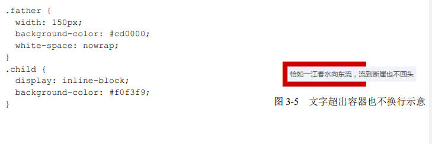
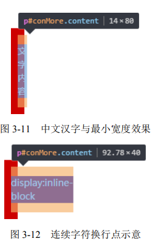
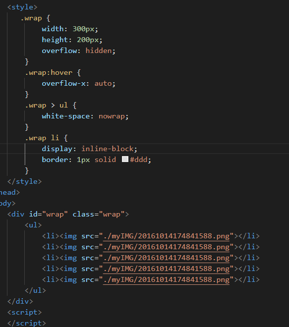
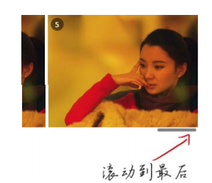
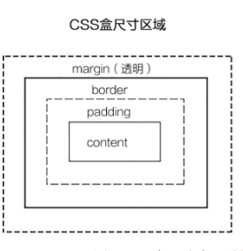
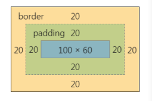
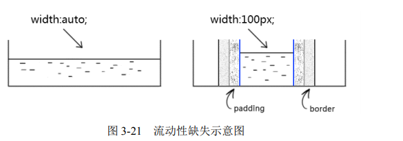
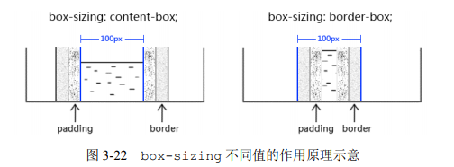

## 一、vertical-align

>用来指定行内元素（inline）或表格单元格（table-cell）元素的垂直对齐方式。
>取值：baseline | sub | super | text-top | text-bottom | middle | top | bottom | < percentage > | < length >

### 1、取值 (对于行内(inline)元素)

大部分取值是相对于父元素来说的：

* **baseline**

   默认值。 元素基线与父元素的基线对齐。
   
   图像将与文本基线处的文本对齐。请注意，字母上的下降点低于基线。图像不与下降点的最低点对齐，这不是基线。
   
   
   
* **middle**

  元素的中心与父元素的基线加上小写x一半的高度值对齐。
  
  
  
* **text-bottom**

  与类型的基线不同，是文本的底部，下降到的地方。图像也可以与此深度对齐：
  
  
 
* **text-top**

  与text-bottom相反，是text-top，是当前font-size的最高点。您也可以与此对齐。请注意，当前字体Georgia可能有一些比这里所示的更高的上升，因此差距很小。
  
  
  
* **top**

   元素及其后代的顶端与整行的顶端对齐。
   
* **bottom**

  元素及其后代的底端与整行的底端对齐。
  
* **sub**

    元素基线与父元素的下标基线对齐。
	
	
* **super**

   元素基线与父元素的上标基线对齐。
   
   
   
### 2、取值 (对于table-cell元素)

* **baseline**

   与同行单元格的基线对齐。
   
* **top**

   单元格的内边距的上边缘与行的顶端对齐。
   
* **middle**

   单元格垂直居中。
   
* **bottom**
  
  单元格的内边距的下边缘与行的底端对齐。

* 可以取负值。

### 3、注意

 ### img在严格模式下（DOCTYPE），下面会有几像素的空白。
 
 图片文字等inline元素默认是和父级元素的baseline对齐的，即：vertical-align 的默认值是 baseline；而baseline又和父级底边bottom有一定距离；
 
 img出现的空白就是baseline和bottom之间的这段距离；即使只有图片没有文字，只要是 inline 的图片这段空白都会存在。
 
 img 标签 是inline 元素， inline元素默认是baseline对齐的。 当baseline对齐的时候，baseline和bottom之间有段距离，就是出现的空白；
 
 
 
 
 
 
*  top 和 bottom 之间的值即为 line-height。假如把 line-height 设置为0，那么 baseline 与 bottom 之间的距离也变为0，那道空白也就不见了。
 
 
 
 *  如果没有设置 line-height，line-height 的默认值是基于 font-size 的，视渲染引擎有所不同，但一般是乘以一个系数（比如1.2）。因此，在没有设置 line-height 的情况下把 font-size 设为0也可以达到同样的效果。当然，这样做的后果就是不能图文混排了。
 
 
 
 * img 设置为块级元素
 
 * 设置vertical-align的属性值

## 二、font-size

```html?linenums
<p>
	<span class="a">Ba</span>
	<span class="c">Ba</span>
	<span class="b">Ba</span>
</p>
```

```css
p span{ background: #eee;}
p { font-size: 100px; }
.a { font-family: Helvetica; }
.b { font-family: STLiti; }
.c { font-family: 	KaiTi; }
```


font-size 相同，font-family 不同，得到的 span 元素的高度也不同。

**原因在于字体本身，这是字体的原理**：

* 一款字体会定义一个[em-square](http://designwithfontforge.com/zh-CN/The_EM_Square.html)，它是用来盛放字符的金属容器。这个em-square 一般被设定为宽高均为 1000 相对单位，不过也可以是 1024、2048 相对单位。


* 字体度量都是基于这个相对单位设置的，包括 ascender、descender、capital height、x-height 等。注意这里面的值是允许相对于 em-square 出血（bleed outside）的（译者注：大概可以理解为超出 em-square）


* 在浏览器中，上面的 1000 相对单位会按照你需要的 font-size 缩放。

## 三、line-height

 CSS 属性用于设置多行元素的空间量，比如文本。对于块级元素，它指定元素行盒（line boxes）的最小高度。对于非替代的inline元素，它用于计算行盒（line box）的高度。
 
 行高是指文本行基线间的垂直距离
 
  
 
 图中两条红线之间的距离就是行高（line-height），上一行的底线和下一行的顶线之间的距离就是行距，而同一行顶线和底线之间的距离是font-size的大小，行距的一半是半行距，半行距、font-size、line-height之间的关系看图片的右下角就一目了然了~
 
 ```js
 半行距 = （line-height - font-size）/2
 ```
 当然，半行距也可能为负值（当line-height < font-size），这时候两行之间就会重叠，如下图所示：
 
 
 
 **4种box**
 
 
 
 要说的4种盒子分别是==inline box==、==line box==、==content area==、==containing box==
 
 * **inline box (行内框)** 每个行内元素会生成一个行内框，行内框是一个浏览器渲染模型中的一个概念，无法显示出来，行内框的高度等于font-size，设定line-height时，行内框的高度不变，改变的是行距。


 * **line box （行框）** 行框是指本行的一个虚拟的矩形框，由该行中行内框组成。行框也是浏览器渲染模式中的一个概念，无法显示出来。行框高度等于本行中所有行内框高度的最大值。当有多行内容时，每一行都有自己的行框。

 * **content area （内容区）** 内容区是围绕着文字的一种box，无法显示出来，其高度取决于font-size和padding。

* **containing box containing box** 是包裹着上述三种box的box
 
 
 
 **取值**：
 
   * **normal**
   
     取决于用户端。桌面浏览器（包括Firefox）使用默认值，约为1.2，这取决于元素的 font-family。
    
  * **<数字>**

    该属性的应用值是这个无单位数字乘以该元素的字体大小。计算值与指定值相同。大多数情况下，这是设置line-height的推荐方法，不会在继承时产生不确定的结果。
 
 * **<长度>**

   指定<长度>用于计算 line box 的高度。查看<长度> 获取可能的单位。以em为单位的值可能会产生不确定的结果。
   
  * **<百分比>**
      
	  与元素自身的字体大小有关。计算值是给定的百分比值乘以元素计算出的字体大小。百分比值可能会带来不确定的结果。
	  
### 1、

## 四、图片居中的方式

```html?linenums
<body>
    <div>
        
    </div>
</body>
```

### 1、弹性布局flex
> img 高度固定，img宽度自适应 ，图片等高缩小，水平居中
```css
<style type="text/css">
    *{margin: 0;padding:0;}
    div{
        width:150px;
        height: 100px;
        border:1px solid #000;
        display: flex;
        justify-content: center;
        align-items: center;
    }
    img {
        height: 50px;
    }
</style>
```
### 2、定位 （img宽高固定 ，父元素宽高大于img宽高）

```css
<style type="text/css">
    *{margin: 0;padding:0;}
    div{
        width:150px;
        height: 100px;
        position: relative;
        border:1px solid #000;
    }
    img {
        width: 50px;
        height: 50px;
        position: absolute;
        top: 0;
        left: 0;
        right: 0;
        bottom: 0;
        margin: auto;
    }
</style>
```

### 3、定位 + transform  ，不知道元素的宽高 (或者控制高度 或者宽度缩放显示)

**宽高固定**
```css
<style type="text/css">
    *{margin: 0;padding:0;}
    div{
        width:150px;
        height: 100px;
        position: relative;
        border:1px solid #000;
    }
    img {
        width: 50px;
        height: 50px;
        position: absolute;
        top: 50%;
        left: 50%;
        transform: translate(-50%,-50%);
    }
</style>
```

**宽不固定 高固定 按高缩放，水平居中**
```css
<style type="text/css">
    *{margin: 0;padding:0;}
    div{
        width:150px;
        height: 100px;
        position: relative;
        border:1px solid #000;
    }
    img {
        height: 50px;
        position: absolute;
        left: 50%;
        transform: translate(-50%,0);
    }
</style>
```

### 3、定位 ，img宽高固定 图片的中心位于div的中心，就需要将图片向上移动图片高度的一半，并向左移动图片宽度的一半。

```css
<style type="text/css">
    *{margin: 0;padding:0;}
    div{
        width:150px;
        height: 100px;
        position: relative;
        border:1px solid #000;
    }
    img {
        width: 50px;
        height: 50px;
        position: absolute;
        top: 50%;
        left: 50%;
        margin-top: -25px; /* 高度的一半 */
        margin-left: -25px; /* 宽度的一半 */
    }
</style>
```

### 4、display table-cell, 然后水平居中设置text-align为center，垂直居中设置vertical-align为middle

```css
<style type="text/css">
    *{margin: 0;padding: 0;}
    div{
        width:150px;
        height: 100px;
        display: table-cell;
        vertical-align: middle;
        text-align: center;
        border:1px solid #000;
    }
    img {
        width: 50px;
        height: 50px;
    }
</style>
```

## 五、display

用于规定元素生成的框类型，影响显示方式

值: none | inline | block | inline-block | list-item | run-in | table | inline-table | table-row-group | table-header-group | table-footer-group | table-row | table-colume-group | table-column | table-cell | table-caption | inherit

[注意]：IE7-浏览器不支持table类属性值及inherit

### 5.1、block，inline和inlinke-block细节对比

#### 5.1.1、display:block

* block元素会独占一行，多个block元素回去各自新起一行。默认情况下，block元素宽度自动填满其父元素宽度。
* block元素可以设置width，height属性。块级元素即使设置了宽度，仍然是独占一行。
* block元素可以设置margin和pading属性。

#### 5.1.2、display:inline

* inline元素不会独占一行，多个相邻的行内元素会排列在同一行里，知道一行排列不下，才会新一行，其宽度随元素的内容而变化。
* inline元素设置width和height属性无效。
* inline元素的 margin和padding属性，水平方向的 padding-left，padding-right，margin-left，margin-right都会产生边距效果，但竖直方向的padding-top，padding-bottom，margin-top和margin-bottom不会产生边距效果。

#### 5.1.3、display:inline-block

简单来说就是将对象呈现为inline对象，但是对象的内容作为block对象呈现。之后的内联对象会被排列在同一行内。比如我们可以给一个link（a元素）inline-block属性值，使其既具有block的宽度高度特性又具有inline的同行特性。

注意：IE（低版本IE）本来是不支持inline-block的，所以在IE中对内联元素使用display:inline-block，理论上IE是不识别的，但使用display:inline-block在IE下会触发layout，从而使内联元素拥有了display:inline-block属性的表象。

### 5.2、display:none

隐藏元素并脱离文档流

### 5.3、display: list-item

此属性默认会把元素作为列表显示，要完全模仿列表的话还需要加上 list-style-position，list-style-type

### 5.4、display: table

此元素会作为块级表格来显示（类似table），表格前后带有换行符。

### 5.5、display: flex

弹性布局属性

注意，设为Flex布局以后，子元素的float、clear和vertical-align属性将失效。

主要属性有两大类：**容器属性** 和 **项目的属性**

**容器属性**

* flex-direction: 属性决定主轴的方向（即项目的排列方向）。
* flex-wrap: 默认情况下，项目都排在一条线（又称"轴线"）上。flex-wrap属性定义，如果一条轴线排不下，如何换行。
* flex-flow: 属性是flex-direction属性和flex-wrap属性的简写形式，默认值为row nowrap。
* justify-content: 属性定义了项目在主轴上的对齐方式。
* align-items: 属性定义项目在交叉轴上如何对齐。
* align-content: 属性定义了多根轴线的对齐方式。如果项目只有一根轴线，该属性不起作用。

**项目属性**

* order: 定义项目的排列顺序。数值越小，排列越靠前，默认为0。
* flex-grow: 定义项目的放大比例，默认为0，即如果存在剩余空间，也不放大。
* flex-shrink: 属性定义了项目的缩小比例，默认为1，即如果空间不足，该项目将缩小。
* flex-basis: 属性定义了在分配多余空间之前，项目占据的主轴空间（main size）。浏览器根据这个属性，计算主轴是否有多余空间。它的默认值为auto，即项目的本来大小。
* flex: 属性是flex-grow, flex-shrink 和 flex-basis的简写，默认值为0 1 auto。后两个属性可选。
* align-self: 属性允许单个项目有与其他项目不一样的对齐方式，可覆盖align-items属性。默认值为auto，表示继承父元素的align-items属性，如果没有父元素，则等同于stretch。

## 六、overflow

visible | hidden | scroll | auto | inherit


overflow-x：对水平方向内容溢出的剪切。
overflow-y：定义对垂直方向内容溢出的剪切。


visible：元素的内容在元素框之外也可见。
auto：如果内容被剪裁，则浏览器会显示滚动条以便查看其余的内容。
scroll：元素的内容会在元素框的边界处剪裁，但浏览器会显示滚动条以便查看其余的内容
hidden：元素的内容会在元素框的边界处剪裁，并且超出剪裁区域的内容不可见。

## 七、选择器

### 7.1 类选择器
指“.”这个点号开头的选择器。
### 7.2 ID选择器
指“#”打头，权重相当高，
### 7.3 属性选择器
指含有[ ]的选择器，形如[title]{}、[title= "css-world"]{}、[title~="css-world"]{}、[title^= "css-world"]{}和[title$="cssworld"]{}等。
### 7.4  伪类选择器
一般指前面有个英文冒号（:）选择器，如:first-child 或:lastchild 、:hover 、:active 等。
### 7.5 伪元素选择器
就是有连续两个冒号（::）的选择器，如::first-line::firstletter、::before 和::after。
### 7.6  关系选择器

* 后代选择器，小玄子所有合乎规则的后代元素，空格链接
* 相邻后台选择器，仅仅选择合乎规则的儿子元素，孙子、重孙元素忽略，因此又称“子选择器”。 “>”连接。适合IE7以上版本
* 兄弟选择器，选择当前元素相邻的那个合乎规则的兄弟元素。“+”连接。

### 7.7 :after、:before 与 ::after 、::before的区别
* 他们都是CSS伪元素，与:hover/:active等伪类不一样。
* :after、:before伪元素是在CSS2中提出来的，所以兼容性可能到IE8了。 
* ::after 、::before是伪元素，有CSS3提出。为了将伪类和伪元素区分开。但是平时为了兼容性，还是会用一个冒号的写法。
* 这两个伪类下特有的属性 content ，用于在 CSS 渲染中向元素逻辑上的头部或尾部添加内容。

### 7.8 选择器的优先级和权重


| 选择器 | 举例 | 权重 | 
| ------ | --- |  --- |
| !important | 行尾加入!important | Infinity/10000 |
| 行间样式 | style='' | 1000 | 
| id | #id | 100 | 
|class/属性/伪类 | .class/[attr]/a:link | 10 | 
| 标签/伪元素 | div/:first-line | 1 | 
| 通配符、子选择器、相邻选择器等的。|*、>、+  | 0 | 


## 八、标签两大类：块级元素和内联元素

### 8.1 块级元素  block-level element

常见的有： div、li 和 table

需要注意是，“块级元素”和“display 为 block 的元素”不是一个概念。

例如：li 元素默认的display值是list-item，table元素默认的display值是table，但他们是“块级元素”

IE浏览器不支持伪元素的display值为list-item。对于IE浏览器，普通元素设置为display：list-item有效，但是：before和:after伪元素不行。

## 九、width/height

### 9.1 width

值有：
* auto，默认值
* 百分比
* px
* rem、em等等

#### 9.1.1 深藏不露的 width:auto 

我们应该都知道，width 的默认值是 auto。auto 因为是默认值，包含以下4中不同的宽度表现：

* 充分利用可用空间。比方说，div、p这些元素的宽度默认是 100%于父级容器的。
* 收缩与包裹。典型代表就是浮动、绝对定位、inline-block元素或者table元素
* 收缩到最小。这个最容易出现在 table-layout 为 auto 的表格中
* 超出容器限制。除非有明确的width相关设置，否则以上3中情况尺寸是不会主动超过父级容器宽度的，但存在一些特殊的情况。例如：内容是很长的连续的数字和英文，或者内联元素被设置了white-space:nowrap。



子元素既保持了 inline-block 元素的收缩特性，又同时让内容宽度最大，直接无视父
级容器的宽度限制。

**外部尺寸与流体特性**

* 1）、正常流宽度。当我们在一个容器里倒入足量的水时，水一定会均匀铺满整个容器。
        在页面中随便扔一个div元素，其尺寸表现就会和这水流一样铺满容器。这就是 block 容器的流特性。
		所以display: block之后就没必要再写width: 100%
* 2）、格式化宽度。仅出现在“绝对定位模型”中，也就是出现在 position属性值为 absolute 或 fixed 的元素中。，当 left/top 或 top/bottom 对立方位的属性值同时存在的时候，元素的宽度表现为“格式化宽度”，其宽度大小相对于最近的具有定位特性（position 属性值不是 static）的祖先元素计算


**内部尺寸与流体特性**
所谓“内部尺寸”，简单来讲就是元素的尺寸由内部的元素决定，而非由外部的容器决定。

* 1）、包裹性。如果其 display 属性值是 inline-block，那么即使其里面内容再多，只要是正常文本，宽度也不会超过容器。
    按钮就是 CSS 世界中极具代表性的 inline-block 元素，可谓展示“包裹性”最好的例子，具体表现为：按钮文字越多宽度越宽（内部尺寸特性），但如果文字足够多，则会在容器的宽度处自动换行（自适应特性）。
	按钮会自动换行？
	实际项目中，按钮上的文字个数比较有限，没机会换行；button标签按钮才会自动换行，input标签按钮，默认 white-space:pre，是不会换行的，需要将 pre 值重置为默认的 normal。
	除了 inline-block 元素，浮动元素以及绝对定位元素都具有包裹性，均有类似的智能宽度行为。
* 2）、首选最小宽度。指的是元素最适合的最小宽度。

	```tex
	外部容器的宽度是 240 像素，假设宽度是 0，请问里面的 inline-block 元素的宽度是多少？
	是 0 吗？不是。
	在 CSS 世界中，图片和文字的权重要远大于布局，因此，CSS 的设计者显然是不会让图文在 width:auto 时宽度变成 0 的，此时所表现的宽度就是“首选最小宽度”。
	```
	.
* 3）、最大宽度
   最大宽度就是元素可以有的最大宽度。我自己是这么理解的，“最大宽度”实际等同于“包裹性”元素设置 white-space:nowrap 声明后的宽度。
	
	“最大宽度”对我们实际开发有什么作用呢？ 如下两张图：
	.
	.
	
	```tex
	有 5 张图片，每张图片宽度 200 像素，假设图片元素紧密排列，则“最大宽度”就是 1000 像素。但是，实际开发的时候，我们懒得计算，可能直接设置容器 width:2000px，这里 2000px 就是“很大宽度”，宽度足够大，作用是保证图片不会因为容器宽度不足而不在一行内显示。
	```
#### 9.1.2 width值作用的细节



我们的这个“内在盒子”又被分成了 4 个盒子，分别是 content box、padding box、border box
和 margin box。

通常情况下，设置width作用在了content box上。如果设置 box-sizing: border-box或者IE浏览器下作用在整个盒子上。

如果padding box、border box和 margin box都写上值，整个盒子就会变宽。

.

这样有两点不足：

* 流动性丢失
   对于块状元素，如果 width:auto，则元素会如水流般充满整个容器，而一旦设定了 width具体数值，则元素的流动性就会被阻断，因为元素给定宽度就像河流中间竖了两个大闸一样，就没有了流动性。
   
* 与现实世界表现不一致的困扰。
   包含 padding 或 border 会让元素宽度变大的这种 CSS 表现往往会让 CSS 使用者困惑：我设置宽度为 100 像素，其实是希望整个最终的宽度是 100 像素，这样才符合现实理解嘛。比方说，我买个 140m2的房子，肯定是连墙体面积在内的啊，实际使用面积比 140m2 小才是现实，你说现在最终面积比 140m2还大，这种事情显然是不科学不合理的。
   
#### 9.1.3 CSS 流体布局下的宽度分离原则

所谓“宽度分离原则”，就是 CSS 中的 width 属性不与影响宽度的 padding/border（有时候包括 margin）属性共存

**为何要宽度分离**

在前端领域，一提到分离，作用一定是便于维护。
比方说，样式和行为分离、前后端分离或者这里的“宽度分离”。

例如，下面这个简单的 CSS：

```css
.box {
 width: 100px;
 border: 1px solid;
} 
此时宽度是 102 像素。然后，设计师希望元素边框内有 20 像素的留白，这时候，我们会增加padding 设置：
.box {
 width: 100px;
 padding: 20px;
 border: 1px solid;
} 
结果此时宽度变成了 142 像素，大了 40 像素，跟原来宽度差异明显，显然布局很容易出问题。
为了不影响之前的布局，我们还需要通过计算减去 40 像素的 padding 大小才行：
.box {
 width: 60px; // 通过计算，减去 40 像素
 padding: 20px;
 border: 1px solid;
} 
但是，如果我们使用了宽度分离，事情就会轻松很多：
.father {
 width: 102px;
}
.son {
 border: 1px solid;
} 
嵌套一层标签，父元素定宽，子元素因为 width 使用的是默认值 auto，所以会如水流般
自动填满父级容器。因此，子元素的 content box 宽度就是 100 像素，和上面直接设置 width
为 100 像素表现一样。
然后，同样的故事，设计师希望元素边框内有 20 像素的留白，这时候，我们会增加 padding
设置：
.father {
 width: 102px;
}
.son {
 border: 1px solid;
 padding: 20px;
} 
然后……就没有然后了，宽度还是 102 像素，子元素的 content box 自动变成了 60 像素，
和上面反例的表现一样。
```
我们没有任何计算，要 padding 留白，加一下就好，要修改边框宽度，改一下就好，浏览器会自动计算，完全不用担心尺寸的变化。

那有没有什么既无须计算，又无须额外嵌套标签的实现呢？有，那就是可以改变 width作用细节的 box-sizing 属性。

#### 9.1.4 改变 width/height 作用细节的 box-sizing

box-sizing 虽然是 CSS3 属性，但是，让人受宠若惊的是 IE8 浏览器也是支持它的，不
过需要加-ms-私有前缀，但 IE9 浏览器开始就不需要私有前缀了。

**box-sizing 的作用**

box-sizing 顾名思义就是“盒尺寸”。实际上，其更准确的叫法应该是“盒尺寸的作用细节”。

还记不记得“内在盒子”的 4 个盒子？它们分别是 content box、padding box、border box 和 margin box。
默认情况下，width是作用在 content box 上的，box-sizing 的作用就是可以把 width 作用的盒子变成其他几个。

```css
box-sizing 可以有下面这些写法:

box1 { box-sizing: content-box; } /* 默认值 */
.box2 { box-sizing: padding-box; } /* Firefox 曾经支持 */
.box3 { box-sizing: border-box; } /* 全线支持 */
.box4 { box-sizing: margin-box; } /* 从未支持过 */ 

```
.

可以看到，所谓 box-sizing:border-box 就是让 100 像素的宽度直接作用在 border box上，从默认的 content box 变成 border box。
此时，content box 从宽度值中释放，形成了局部的流动性，和 padding 一起自动分配 width 值。

**为何 box-sizing 不支持 margin-box**
不支持 margin-box 最大的原因是它本身就没有价值。一个本身并不会改变元素尺寸的盒子，它有让 box-sizing 支持的道理吗？box-sizing 就是改变尺寸作用规则的！margin 只有在 width 为 auto 的时候可以改变元素的尺寸，但是，此时元素已经处于流动性状态，根本就不需要 box-sizing。所以，说来说去就是 margin-box本身就没有价值。

如果 box-sizing 开了先河支持了 margin-box，margin box 就变成了一个“显式的盒子”，你让background-origin等属性何去何从，支持还是不支持呢？“margin的背景永远是透明的”这几个大字可是在规范写得清清楚楚难道让背景色在所谓的 margin box 中也显示？显然是不可能的，我们可以打自己的脸，但是要想让规范打自己的脸，可能吗？

对于 box-sizing 的 margin-box 效果，如果是 IE10 及以上版本浏览器，可以试试 flex 布局，如果要兼容 IE8 及以上版本可以使用“宽度分离”，或者特定场景下使用“格式化宽度”来实现，也就是并不是强需求。比方 box-sizing:padding-box，就是因为使用场景有限，仅 Firefox 浏览器支持，并且是曾经支持，从版本 50 开始也不支持了。
**如何评价*{box-sizing:border-box}**

* 这种做法易产生没必要的消耗。
  通配符 * 应该是一个慎用的选择器，因为它会选择所有的标签元素。
  对于普通内联元素（非图片等替换元素），box-sizing 无论是什么值，对其渲染表现都没有影响，因此，* 对这些元素而言就是没有必要的消耗；
  同时有些元素，如 search类型的搜索框，其默认的 box-sizing 就是 border-box（如果浏览器支持），因此，* 对search 类型的input而言也是没有必要的消耗。
  
* 这种做法并不能解决所有问题。
   box-sizing 不支持 margin-box，只有当元素没有水平 margin 时候，box-sizing 才能真正无计算，而“宽度分离”等策略则可以彻底解决所有的宽度计算的问题。
  
* box-sizing 发明的初衷
  box-sizing 可能被发明出来最大的初衷应该是解决替换元素宽度自适应问题。
  
### 9.2 height
#### 9.2.1 相对简单而单纯的 height:auto

width 和 height 是 CSS 世界中同一类型魔法师，都是直接限定元素尺寸的。所以，它们共用一套“盒尺寸”模型，box-sizing 的解释也是类似的。
但是，它们在不少地方还是有明显区别的，其中之一就是 height:auto 要比 width:auto 简单而单纯得多。
原因在于，CSS 的默认流是水平方向的，宽度是稀缺的，高度是无限的。
因此，宽度的分配规则就比较复杂，高度就显得比较随意。

#### 9.2.2 关于 height:100%

height和width还有一个比较明显的区别就是对百分比单位的支持。对于width属性，就算父元素width为auto，其百分比值也是支持的；但是，对于height属性，如果父元素height为auto，只要子元素在文档流中，其百分比完全被忽略了。

例如：

```css
height 为 auto，只要子元素在文档流中，其百分比值完全就被忽略了。例如，某小白想要在页面插入一个<div>，然后满屏显示背景图，就写了如下 CSS：
div {
 width: 100%; /* 这是多余的 */
 height: 100%; /* 这是无效的 */
 background: url(bg.jpg);
} 
然后他发现这个<div>高度永远是 0，哪怕其父级<body>塞满了内容也是如此。事实上，他需要如下设置才行：
html, body {
 height: 100%;
} 
并且仅仅设置<body>也是不行的，因为此时的<body>也没有具体的高度值：
body {
 /* 子元素 height:100%依旧无效 */
} 

```

只要经过一定的实践，我们都会发现对于普通文档流中的元素，百分比高度值要想起作用，其父级必须有一个可以生效的高度值！

**为何 height:100%无效**

有一种看似合理的说法：如果父元素 height:auto 子元素还支持 height:100%，则父元素的高度很容易陷入死循环，高度无限。

例如，一个 div元素里面有一张vertical-align 为 bottom 同时高度为 192 像素的图片，此时，该div高度就是 192
像素，假设此时插入一个子元素，高度设为 100%，如果此时 height:100%可以计算，则子元素应该也是 192 像素。但是，父元素 height 值是 auto，岂不是现在高度要从原来的192 像素变成 384 像素，然