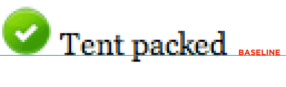
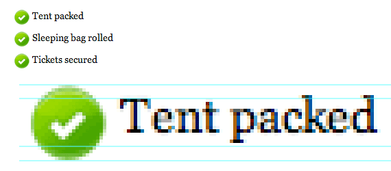
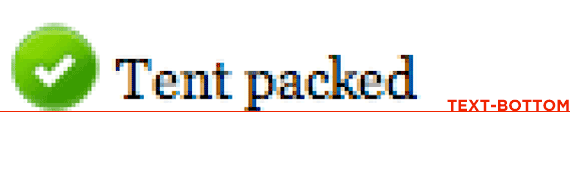

## 一、vertical-align

>用来指定行内元素（inline）或表格单元格（table-cell）元素的垂直对齐方式。

### 1、取值 (对于行内(inline)元素)

大部分取值是相对于父元素来说的：

* **baseline**

   默认值。 元素基线与父元素的基线对齐。
   
   图像将与文本基线处的文本对齐。请注意，字母上的下降点低于基线。图像不与下降点的最低点对齐，这不是基线。
   
   
   
* **middle**

  元素的中心与父元素的基线加上小写x一半的高度值对齐。
  
  
  
* **text-bottom**

  与类型的基线不同，是文本的底部，下降到的地方。图像也可以与此深度对齐：
  
  
 
* **text-top**

  与text-bottom相反，是text-top，是当前font-size的最高点。您也可以与此对齐。请注意，当前字体Georgia可能有一些比这里所示的更高的上升，因此差距很小。
  
  