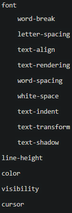

## 一、你用CSS多久了？
>解析：
>这个问题可以让面试官了解求职者使用 CSS 的经验。它还可以告诉面试官该人是否将该技能作为业余爱好或在学术或专业环境中学习。

**面试官想知道些什么：**
* 求职者使用 CSS 的经验
* 对创建网站的兴趣
* 是否持续关注新技术

**参考答案：**
我在高中时就开始用 CSS 了。当时我和一些朋友为我们喜欢的电视节目搭了一个网站。不过这些页面很差劲，因为它们没有统一的风格。每个页面的字体和颜色都不一样。后来我学会了 CSS，这样就可以很轻松的使页面风格统一。

## 二、你最喜欢的 CSS 功能是什么？
>解析：
>求职者最喜欢 CSS 的哪些功能并不重要。通过这个人是否能够熟练的地谈论 CSS，能够看出他 CSS 了解多少。

**面试官想知道些什么：**
* 求职者对 CSS 的经验
* 对 CSS 的了解
* 如何用 CSS 节省时间

**参考答案：**
我非常喜欢用 CSS 改变页面布局这个功能，因为这样可以适配不同的屏幕尺寸。现在有各种尺寸和形状的设备。如果你能正确的使用 CSS，在任何设备上访问你网站的体验都会很好，不管是用 iPhone 还是用 PC 浏览你的网站都没关系。

## 三、你有没有把 CSS 与其他语言结合使用？
>解析：
>Web开发人员通常依赖好几种语言来构建动态网站。通过面试者的答案可以得知他都知道哪些开发语言。如果面试官单独提出某种语言，还可知道面试者对该语言的理解有多深

**面试官想知道些什么：**
* 对前端设计的兴趣
* 其他语言技能
* 是否具有创造性解决问题的能力

**参考答案：**
通常我用 CSS 来创建网站页面的总体布局并进行美化。另外我还将用 HTML 为页面提供一些结构。当我需要向网站添加交互式元素、动画、音乐或其他功能时，更喜欢使用 JavaScript，因为它能够很方便的实现一些逻辑。“

## 四、你能告诉我一个让你学到新 CSS 技术的项目吗？

>解析：
>这个问题鼓励面试者反思他们使用CSS的经历。答案可能会揭示一些事情，例如面试者对 CSS 有多少经验，以及他们如何使用批判性思维来解决困难问题。

**面试官想知道些什么：**
* 对 CSS 的了解
* 使用 CSS 的经验
* 是否具有批判性思维

**参考答案：**

我在大学里做过一个项目，这个项目能帮助图书管理员和工程师团队对内容进行数字化。我的小团队打算把图书馆里收藏的大量手写诗集数字化。花费精力最多的一个功能是：写了一个能够容纳各种大小和形状的诗词稿件的样式。

## 五、你最喜欢的一个项目是什么？

>通过这个问题可以深入了解求职者的经验。答案更多地揭示了求职者的个性而不是编程技巧。

**面试官想知道些什么：**
* 了解 CSS 的好处
* 能够创造性的解决问题
* 面试者如何应对挑战

**参考答案：**
我帮一位朋友写了一个发布文章、照片、音乐和各种媒体的在线杂志，这个项目并不难，几个小时后，他的网站从 OK 变为优秀。它让我想起为什么了解 CSS，JavaScript 和其他常用语言非常重要。如果没有一个好的网站来展示它，你所做的都没有什么意义。

## 六、当你忘记某个 CSS 的功能时，是怎么解决的？

>解析：
>程序员不能把所有东西都放在脑子里，所以当他们能想起特定的功能和术语时，会依赖一些资源。这个问题的答案能够知道求职者有没有可靠的资源，这些资源在未来开展项目时可能会派上用场。

**面试官想知道些什么 **

* 深入了解 CSS 资源
* 在哪里去查找 CSS 功能的资料
* Insider knowledge of CSS
* 是否懂得 CSS 更深层次的知识

**参考答案：**

Mozilla开发者网络，简称 MDN，为我节省了大量的时间。这是一个在线资源，其中包含有 CSS、HTML和JavaScript 的资料。我也喜欢 w3schools.com 上的 CSS 教程。

## 七、你最不喜欢 CSS 的哪些东西？

>解析：
>所有人都有不喜欢的工作。对这个问题的诚实回答可以帮助面试官为求职者提供合适的团队。例如，如果一个人喜欢在 CSS 文件中发现错误，那么你可能希望聘请这个人与一个喜欢专注于大局的创意人一起工作。

**面试官想知道些什么：**
* 了解 CSS 的优缺点
* 了解求职者可以扮演什么角色
* 了解求职者的其他兴趣

**参考答案：**

CSS 使网页设计变得更加容易，但它仍然感觉有点单调乏味。理想情况下，我想用动态语言让用户与网站进行互动。但就目前而言，我很乐意磨练自己的 CSS 技能并向更有经验的人学习。??下，我想用动态语言让用户与网站进行互动。但就目前而言，我很乐意磨练自己的 CSS 技能并向更有经验的人学习。

## 八、display: none; 与 visibility: hidden; 的区别

**它们都能让元素不可见**

**区别：**
* display:none;会让元素完全从渲染树中消失，渲染的时候不占据任何空间；visibilty:hidden；不会让元素渲染树消失，渲染师元素继续占据空间，只是内容不可见。
* display:none；是非继承属性，子孙节点消失由于元素从渲染树消失造成，通过修改子孙节点属性无法显示；visibility:hidden；是继承属性，子孙节点消失由于继承了hidden，通过设置visibilty:visible；可以让子节点显示。
* 修改常规流中元素的display通常会造成文档重排。修改visibility属性只会造成本元素的重绘。
* 读屏器不会读取display:none；元素内容；会读取visibility：hidden元素内容。

## 九、CSS有哪些继承属性

