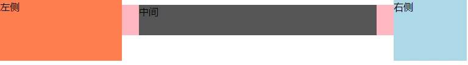

## 一、css实现图片自适应宽高

### 1.1 transform 以及常见的一些问题

#### 1.1.1 transform限制position:fixed的跟随效果

position:fixed 可以让元素不跟随浏览器的滚动条滚动，而且这种跟随连它的兄弟们 position:relative/absolute 都限制不了。

position:fixed遇到 transform就被限制了，会相当于降级变成为position:absolute。

#### 1.1.2 transform改变overflow对absolute元素的限制

##### 1.1.2.1 父级overflow;hidden,子元素 position:absolute，则overflow失效
absolute 绝对定位元素，如果含有overflow不为visible的父级元素，同时，该父级元素以及该元素绝对定位元素之间任何嵌套元素都没position为非static属性的声明，则overflow对该absolute元素不起作用。

```html?linenums
<p style="width:96px; height:96px; border:2px solid #beceeb; overflow:hidden;">
    
</p>
```
.


#### 1.1.3 transform限制absolute的100%宽度大小

##### 1.1.3.1 position:absolute 并且width:100%，此元素相对于 static 定位以外的第一个父元素进行定位和width百分比
```html?linenums
<style>
.container { width: 191px; height: 191px; border: 2px solid #beceeb; }
.container img {  position: absolute; height: 191px; width: 100%; }
</style>
<div class="container">
    
</div>
```
.

##### 1.1.3.2 position:absolute 并且width:100%，父级 transform: scale(1);，不管设不设置position: relative;子元素的宽度会以父级的width为百分比

```html?linenums
<style>
.container { width: 191px; height: 191px; border: 2px solid #beceeb; }
.container img {  position: absolute; height: 191px; width: 100%; }
.transform { -webkit-transform: scale(1); -ms-transform: scale(1); transform: scale(1); }
</style>
<div class="container transform">
    
</div>
```

### 1.2


## 二、区别各种IE浏览器CSS写法（css hack）

### 2.1.1 css hack概念与书写顺序
**什么是CSS hack？**

>由于不同厂商的流览器或某浏览器的不同版本（如IE,Firefox/Safari/Opera/Chrome等），对CSS的支持、解析不一样，导致在不同浏览器的环境中呈现出不一致的页面展现效果。
>这时，我们为了获得统一的页面效果，就需要针对不同的浏览器或不同版本写特定的CSS样式，我们把这个针对不同的浏览器/不同版本写相应的CSS code的过程，叫做CSS hack!


**CSS hack书写顺序**

>一般是将适用范围广、被识别能力强的CSS定义在前面。

### 2.1.2 CSS hack分类

**CSS Hack大致有3种表现形式：**

* CSS属性前缀法
* 选择器前缀法
* IE条件注释法（即HTML头部引用if IE）Hack
   实际项目中CSS Hack大部分是针对IE浏览器不同版本之间的表现差异而引入的。
   
   属性前缀法(即类内部Hack)：例如 IE6能识别下划线" _ "和星号"  *  "，IE7能识别星号"   *   "，但不能识别下划线" _ " ，IE6~IE10都认识"\9"，但firefox前述三个都不能认识。
   
   选择器前缀法(即选择器Hack)：例如 IE6能识别   * html .class{}， IE7能识别*+html .class{}或者*:first-child+html .class{}。
   
   IE条件注释法(即HTML条件注释Hack)：针对所有IE(注：IE10+已经不再支持条件注释)： IE浏览器显示的内容 ，针对IE6及以下版本： 只在IE6-显示的内容 。这类Hack不仅对CSS生效，对写在判断语句里面的所有代码都会生效。
   
**CSS hack方式一：条件注释法**

这种方式是IE浏览器专有的Hack方式，微软官方推荐使用的hack方式。

```js?linenums
//只在IE下生效
<!--[if IE]>
//这段文字只在IE浏览器显示
<![endif]-->


//只在IE6下生效
<!--[if IE 6]>
//这段文字只在IE6浏览器显示
<![endif]-->


//只在IE6以上版本生效
<!--[if gte IE 6]>
//这段文字只在IE6以上(包括)版本IE浏览器显示
<![endif]-->


//只在IE8上不生效
<!--[if ! IE 8]>
//这段文字在非IE8浏览器显示
<![endif]-->


//非IE浏览器生效
<!--[if ! IE]>
//这段文字只在非IE浏览器显示
<![endif]-->
```

**CSS hack方式二：类内属性前缀法**

属性前缀法是在CSS样式属性名前加上一些只有特定浏览器才能识别的hack前缀，以达到预期的页面展现效果

* IE hack 技术

	```css?linenums
	_width: 400px;            /* _是针对IE6*/
	+width: 300px;           /* +是针对IE6、IE7*/
	*width: 400px;            /*  *是针对IE6、IE7*/
	width: 200px\9;          /* \9是针对IE6 IE7 IE8 IE9 IE10*/
	width: 100px\0;          /* \0是针对IE8 IE9 IE10 IE11 */
	```

* 浏览器内核与前缀
	
	
**CSS hack方式三：选择器前缀法**

选择器前缀法是针对一些页面表现不一致或者需要特殊对待的浏览器，在CSS选择器前加上一些只有某些特定浏览器才能识别的前缀进行hack。

目前最常见的是：

*html	*前缀只对IE6生效
*+html	*+前缀只对IE7生效
@media screen\9 {body { background: gray; }}	只对IE6/7生效
@media \0screen {body { background: red; }}	只对IE8有效
@media \0screen\,screen\9 {body { background: blue; }}	只对IE6/7/8有效
@media screen\0 {body { background: green; }}	只对IE8/9/10有效
@media screen and (min-width:0\0) {body { background: gray; }}	只对IE9/10有效
@media screen and (-ms-high-contrast: active), (-ms-high-contrast: none)  {body { background: orange; }}	只对IE10有效

**CSS3选择器结合JavaScript的Hack**

    我们用IE10进行举例：

        由于IE10用户代理字符串（UserAgent）为：Mozilla/5.0 (compatible; MSIE 10.0; Windows NT 6.2; Trident/6.0)，所以我们可以使用Javascript将此属性添加到文档标签中，再运用CSS3基本选择器匹配。
		

```js?linenums
//JavaScript代码:
var htmlObj = document.documentElement;
htmlObj.setAttribute('data-useragent',navigator.userAgent);
htmlObj.setAttribute('data-platform', navigator.platform );
```

```css?linenums
//CSS3匹配代码：
html[data-useragent*='MSIE 10.0'] #id {
        color: #F00;
}
```

### 2.1.3 CSS hack利弊

一般情况下，我们尽量避免使用CSS hack，但是有些情况为了顾及用户体验实现向下兼容，不得已才使用hack。

比如由于IE8及以下版本不支持CSS3,而我们的项目页面使用了大量CSS3新属性在IE9/Firefox/Chrome下正常渲染，这种情况下如果不使用css3pie或htc或条件注释等方法时,可能就得让IE8-的专属hack出马了。

使用hack虽然对页面表现的一致性有好处，但过多的滥用会造成html文档混乱不堪，增加管理和维护的负担。

**各浏览器下Hack的写法**


## 三、纯 CSS 实现多行文字截断

**一行**文字溢出省略号显示：

```css
div {
  white-space: nowrap;
  overflow: hidden;
  text-overflow: ellipsis;
}
```

属性浏览器原生支持，各大浏览器兼容性好，缺点就是只支持单行文本截断，并不支持多行文本截取。


**多行**

```css
div {
  display: -webkit-box;
  overflow: hidden;
  -webkit-line-clamp: 2;
  -webkit-box-orient: vertical;
}
```

从效果上来看，它的优点有：

* 响应式截断，根据不同宽度做出调整
* 文本超出范围才显示省略号，否则不显示省略号
* 浏览器原生实现，所以省略号位置显示刚好

但是缺点也是很直接，因为 -webkit-line-clamp 是一个不规范的属性，它没有出现在 CSS 规范草案中。也就是说只有 webkit 内核的浏览器才支持这个属性，像 Firefox, IE 浏览器统统都不支持这个属性，浏览器兼容性不好。

使用场景：多用于移动端页面，因为移动设备浏览器更多是基于 webkit 内核，除了兼容性不好，实现截断的效果不错。

**定位元素实现多行文本截断**


```css
p {
    position: relative;
    line-height: 18px;
    height: 36px;
    overflow: hidden;
}
p::after {
    content:"...";
    font-weight:bold;
    position:absolute;
    bottom:0;
    right:0;
    padding:0 20px 1px 45px;
    /* 为了展示效果更好 */
    background: -webkit-gradient(linear, left top, right top, from(rgba(255, 255, 255, 0)), to(white), color-stop(50%, white));
    background: -moz-linear-gradient(to right, rgba(255, 255, 255, 0), white 50%, white);
    background: -o-linear-gradient(to right, rgba(255, 255, 255, 0), white 50%, white);
    background: -ms-linear-gradient(to right, rgba(255, 255, 255, 0), white 50%, white);
    background: linear-gradient(to right, rgba(255, 255, 255, 0), white 50%, white);
}
```

实现原理很好理解，就是通过伪元素绝对定位到行尾并遮住文字，再通过 overflow: hidden 隐藏多余文字。


从实现效果来看，它所具备的优点：

* 兼容性好，对各大主流浏览器有好的支持
* 响应式截断，根据不同宽度做出调整


但是它无法识别文字的长短，即文本超出范围才显示省略号，否则不显示省略号。
还有因为是我们人为地在文字末尾添加一个省略号效果，就会导致它跟文字其实没有贴合的很紧密，遇到这种情况可以通过添加 word-break: break-all; 使一个单词能够在换行时进行拆分。

## 四、常用图片的区分、它们的优劣势以及使用场景等

> 图片格式： JPEG/JPG  、 PNG （PNG-24/PNG-8）、GIF 、SVG、BMP、Base64、雪碧图（不属于格式，但属于一种应用形式）、WebP

**图片从类型上分，可以分为 位图 和 矢量图：**
* 位图。又叫点阵图或者像素图，计算机屏幕上的图是由屏幕上的发光点（像素）构成的，每个点用二进制数据来描述其颜色与亮度等信息。因为这些点是离散的，类似于点阵，同时因为多个像素的色彩组合就形成了图片，所以叫这种图为点阵图或者位图。常见的位图有JPG、PNG、GIF等格式。
* 矢量图。又叫向量图，是由一系列计算机指令来描述和记录一幅图，一幅图可以解为点、线、面等组成的子图。生成的矢量图文件存储量很小，特别适用于文字设计、图案设计等，而在前端中比较常用的矢量图有svg等格式

**按压缩划分，可以将图片分为 无损压缩 和 有损压缩：**

* 无损压缩：指对文件本身的压缩，使图片占用的存储空间小，并且不会损害图片的质量。常见无损压缩有PNG等。
* 有损压缩：有损压缩是对图像本身的改变，会对图片质量造成损害，随着压缩次数越来越多，那么图片质量会越来越差。常见有损压缩有JPG等。

最后，究根结底，我们需要知道在计算机中，像素是用二进制来表示的。不同图片格式中像素与二进制位数之间的对应关系是不同的。一个像素对应的二进制位数越多，那么它可以表示的颜色种类就越多，成像效果也就越细腻，文件体积相应也会越大。

一个二进制位表示两种颜色 【 0|1 <——对应——> 黑|白 】，如果一种图片格式对应的二进制位数有 n 个，那么它就可以呈现 2^n 中颜色。例如：
* PNG-8：它有 2^8 种颜色，即 256 种颜色。
* PNG-24：它有 2^24 种颜色，即 1677216 种颜色（1600 万种颜色）。

### 4.1 BMP

取自英文单词 BitMap。Windows 中文版译作 位图，它的文件结构很简单，没有压缩，一个一个像素地记录下来。现在基本没用到了

### 4.2 JPEG

关键字：有损压缩、体积小、加载快、不支持透明

**简要介绍：**

JPEG/JPG 格式，是应用最广泛的图片格式之一，特点如下：
* JPEG/JPG 采用特殊的有损压缩算法，将不易被人眼察觉的图像颜色删除，从而达到较大的压缩比，因此它的压缩文件尺寸较小，下载速度快，成为互联网最广泛使用的格式。
* JPEG/JPG 因为属于有损压缩，所以当压缩级别逐渐增大的时候，图片质量会逐渐损耗，所以压缩要适当。


在合适的场景下，即便我们将图片体积压缩至原有体积的 50% 以下，JPG 仍能保持住 60% 的品质，且因为 JPG 格式以 24 位图存储单个图，可以呈现多达 1600 万种颜色，足以满足大多数场景，

**适用场景：**

* 大的背景图
* 轮播图
* Banner 图

### 4.3 PNG

关键字：无损压缩、质量高、体积大、支持透明

**简要介绍：**

PNG（可移植网络图形格式）是一种无损压缩的高保真的图片格式，它的压缩比高于 GIF，支持图像透明，可以利用 Alpha 通道调节图像透的明度。

PNG 分 PNG-8 和 PNG-24。

* PNG-8：PNG-8 是无损压缩的索引色彩模式。PNG-8 是 GIF 格式很好的替代，虽然不能像 GIF 一样有动画，也不兼容 IE6 等老旧浏览器。PNG-8 最多支持 256 中颜色。
* PNG-24：PNG-24 是无损压缩的直接色彩模式。PNG-24 会比 JPEG、GIF、PNG-8 占用更大的存储空间。PNG-24 可以呈现 1600 万种颜色。

2^8 = 256，2^24 = 1677216

**适用场景：**

普遍场景：
* 小的 Logo，颜色简单且对比强烈的图片或者背景。
* 颜色简单、对比度强的透明小图。

什么时候使用 PNG-8，什么时候使用 PNG-24 呢？

* 理论上，位数最大的就是最好的，直接上 PNG-24；但是实际上，为了避免体积过大的问题，一般在适合使用 PNG 的场景中，优先选择比较小巧的 PNG-8。
* 如何确定是使用 PNG-8 还是 PNG-24，这就看你的 UI 设计师或者负责人能接受那个了，除非你设计功底非常好，要不然不要做这个选择！

### 4.4 GIF

关键字：支持动画

**简要介绍：**

GIF 格式，不仅仅支持静止图片，也可以支持动画，并且支持透明背景图像，适用于多种操作系统，体积很小，网上小动画很多是 GIF 格式。但是色域不太广，只支持 256 种颜色，这意味着颜色种类少。

GIF 格式的压缩率一般在 50% 左右。

**适用场景：** 动图

### 4.5 SVG

关键字：文本文件、体积小、不失真、兼容性好

**简要介绍：**

SVG（可缩放矢量图形）是一种基于 XML 语法的图像格式，是可缩放的矢量图形。与 JPG、PNG、GIF 等位图不同，SVG 可以直接用代码来描绘图像，并通过任意文字处理工具打开 SVG 图像，通过改变部分代码来使图像具有交互功能，并可以随时插入到 HTML 中通过浏览器来观看。


SVG 格式的图片可以任意放大图形显示，并且不会损失图片质量；SVG 格式可编辑和可搜寻；SVG 格式平均来讲，比 JPG 和 GIF 格式文件要小，并且下载也比较快。

SVG 文件通常是极小的，但是当图形的复杂度变高的时候，SVG 文件大小会随之上升，因为 SVG 在渲染的时候需要比像素图更多的计算能力，这也意味着性能的损耗。所以在 Logo 等图上，应尽可能简洁。

**适用场景：**

* SVG loading 效果图：SVG-Loaders
* 转换工具：在线 JPG、PNG 转 SVG 工具
* 矢量图标库：[阿里巴巴矢量图标](https://www.iconfont.cn/)

### 4.6 Base64

关键字：文本文件、依赖编码、小图标解决方案

**简要介绍：**

Base64 并非一种图片格式，而是一种编码方式，它类似于雪碧图，是作为小图标解决方案而存在的。和雪碧图一样，Base64 图片的出现，也是为了减少加载网页图片时对服务器的请求次数，从而提升网页性能。Base64 是作为雪碧图的补充而存在的。

Base64 是一种用于传输 8 Bit 字节码的编码方式，通过对图片进行 Base64 编码，我们可以直接将编码结果写入 HTML 或者写入 CSS，从而减少 HTTP 请求的次数。

**适用场景：**

* 图片的实际尺寸很小。尽可能在图片不超过 2KB 的情况下（可查看掘金的 Base64 图）。
* 图片无法以雪碧图的形式与其他小图结合（合成雪碧图仍是主要的减少 HTTP 请求的途径，Base64 是雪碧图的补充）。
* 图片的更新频率非常低（不需要我们重复编码和修改文件内容，维护成本较低）


为什么大图不使用 Base64？
因为 Base64 编码后，图片大小会膨胀为源文件的 4/3，如果将大图编码到 HTML 或者 CSS 中，这样后者的体积增加，即便减少了 HTTP 请求，也无法弥补庞大的体积带来的性能开销。

### 4.7 WebP

关键字：年轻的全能型选手

**简要介绍：**

2010 年由 Google 提出，转为 Web 开发的一种旨在加快图片加载速度的图片格式，支持有损压缩和无损压缩。

WebP 像 JPEG 一样对图片细节丰富，像 PNG 一样支持透明，像 GIF 一样可以显示动态图片。

官方介绍：与 PNG 相比，WebP 无损图像的尺寸缩小了 26％。在等效的 SSIM 质量指数下，WebP 有损图像比同类 JPEG 图像小 25-34％。 无损 WebP 支持透明度（也称为 alpha 通道），仅需 22％ 的额外字节。对于有损 RGB 压缩可接受的情况，有损 WebP 也支持透明度，与 PNG 相比，通常提供 3 倍的文件大小。

**适用场景：**

由于 WebP 支持情况仅 Chrome、UC 等几家浏览器支持，所以局限性较大，目前暂不考虑使用。


### 4.8 雪碧图

雪碧图，CSS Sprites，听起来就很清爽的一种图片，刚开始的时候 jsliang 以为是大街小巷上卖的 3 块钱瓶装雪碧饮料上的图片，后来知道压根不是同一码事。

雪碧图不属于图片格式，而是一种图片应用形式。但是因为它在前端赫赫有名，经常使用，故此将其记载下来。

雪碧图又叫精灵图，因为 Sprites 的原因叫 “雪碧”，出现的原因是随着网速的提升，同时因为请求次数过多的时候会卡网页，所以我们就将 N 张小图集成到一张大图上，从而提升页面打开的速度。这种多张小图放在一张大图上的操作，就叫做精灵图（雪碧图 - CSS Sprites）

那么，平时如何使用雪碧图呢？

```css
.img{background:url(../images/img.png)  no-repeat;}
.my-head{height:160px;width:120px;background-position:0 0;}
.my-picture{height:292px;width:1253px;background-position:0 -160px;}
```

如上面代码所示，现在网上有非常多的雪碧图制作工具，我们只需要将小图发到工具上去，就可以生成大图，同时获得它的 css/sass 代码，而不需要自己一个一个定位。

> MDN 定义：图像精灵（sprite，意为精灵），被运用于众多使用大量小图标的网页应用之上。它可取图像的一部分来使用，使得使用一个图像文件替代多个小文件成为可能。相较于一个小图标一个图像文件，单独一张图片所需的 HTTP 请求更少，对内存和带宽更加友好。

### 4.9 总结


雪碧图不属于格式，但属于一种应用形式

## 五、css解决display:inline-block;产生的缝隙（间隙）的方法

>原因：display：inline-block;元素的换行造成空白符。


### 5.1 元素不换行

### 5.2 给其父元素设置font-size:0;给其自身设置实际需要的字号大小

**缺点：**
* 有些游览器有设置最小的字体，像opera；

### 5.3 负margin方法

**注意：**
* 这个间隙跟字号的大小有关系，所以间隙是不确定宽度的值。


## 六、三栏布局，两边固定，中间自适应

### 6.1 float实现

>原理：元素浮动后，脱离文档流，后面的元素受浮动影响，设置受影响元素的margin值即可

* 两边固定宽度，中间宽度自适应。
* 利用中间元素的margin值控制两边的间距
* 宽度小于左右部分宽度之和时，右侧部分会被挤下去


```html?linenums
<div class="wrap">
    <div class="left">左侧</div>
    <div class="right">右侧</div>
    <div class="middle">中间</div>
</div>

<style type="text/css">
    .wrap {background: #eee; overflow: hidden; padding: 20px;}  <!-- 生成BFC，计算高度时考虑浮动的元素 -->

    .left {width: 200px; height: 50px; float: left; background: coral;}
    .right {width: 120px; height:  200px; float: right; background: lightblue;}
    .middle {margin-left: 220px; background: lightpink; margin-right: 140px;}
</style>
```

### 6.2 position 实现

> 基于绝对定位的三栏布局：注意绝对定位的元素脱离文档流，相当于最近的已经定位的祖先元素进行定位。无需考虑HTML中结构的顺序。

* 缺点：有顶部对齐问题，需要进行调整，注意中间的高度为整个内容的高度



```html?linenums
<div class="wrap">
    <div class="left">左侧</div>
    <div class="middle">中间</div>
    <div class="right">右侧</div>
</div>

<style type="text/css">
    .wrap {background: lightpink;}
    .left {width: 200px; height: 100px; position: absolute; top: 0; left: 0; background: coral;}
    .right {width: 120px; height: 100px; position: absolute; top:0; right: 0; background: lightblue;}
    .middle {height: 50px; margin: 0 140px 0 220px; background: #555;}
</style>
```

###  6.3 float和BFC配合圣杯布局

> 必须将中间部分的HTML结构写在最前面，三个元素均设置向左浮动。两侧元素宽度固定，中间设置为100%；然后利用左侧元素负的margin值进行偏移，覆盖在中间的宽度之上；右侧的元素同样利用负的margin值进行覆盖

* 存在的问题：不能自适应高度

```html?linenums
<div class="wrap">
    <div class="middle">
        <div class="main">中间</div>
    </div>
    <div class="left">左侧</div>
    <div class="right">右侧</div>
</div>

<style type="text/css">
    .wrap {overflow: hidden;}
    .left {float: left; width: 200px; height: 100px; background: coral; margin-left: -100%;}
    .middle {float: left; width: 100%; height: 100px; background: lightblue;}
    .right {float: left; width: 120px; height: 100px; background: gray; margin-left: -120px;}
    .main {margin: 0 140px 0 220px; background: lightpink;}
</style>
```