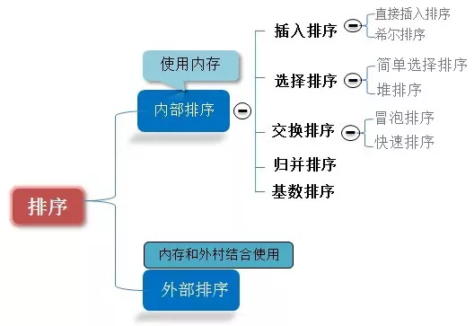
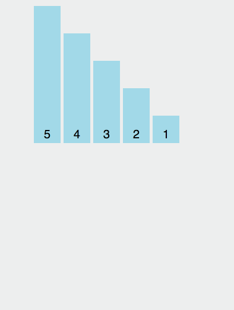
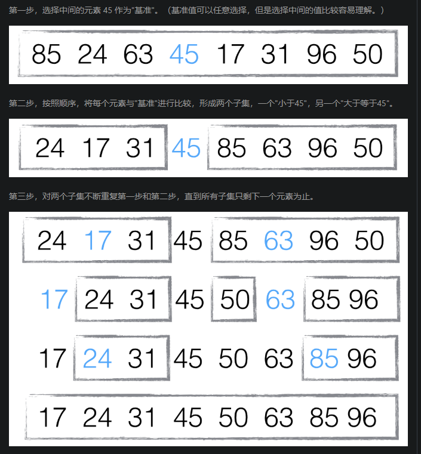
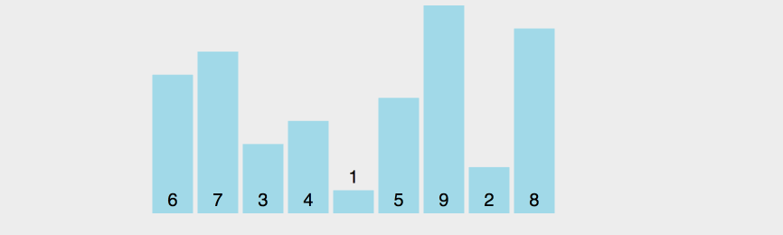

图片名词解释： n: 数据规模 k:“桶”的个数 In-place: 占用常数内存，不占用额外内存 Out-place: 占用额外内存


排序分类：




## 一、插入排序
>将第一个元素视为有序序列，遍历数组，将之后的元素依次插入这个构建的有序序列中。


```javascript?linenums
function insertionSort(arr) {
    for (var i = 1; i < arr.length; i++) {
        var element = arr[i];
        for (var j = i - 1; j >= 0; j--) {
            var tmp = arr[j];
            var order = tmp - element;
            if (order > 0) {
                arr[j + 1] = tmp;
            } else {
                break;
            }
        }
        arr[j + 1] = element; // 由于 j-- 先赋值再运算，所以此时的 j = -1
    }
    return arr;
}

var arr = [6, 5, 4, 3, 2, 1];
console.log(insertionSort(arr));
```


### 1.1 时间复杂度

时间复杂度是指执行算法所需要的计算工作量，它考察当输入值大小趋近无穷时的情况，一般情况下，算法中基本操作重复执行的次数是问题规模 n 的某个函数。

最好情况：数组升序排列，时间复杂度为：O(n)

最坏情况：数组降序排列，时间复杂度为：O(n²)

### 1.2 稳定性

稳定性，是指相同的元素在排序后是否还保持相对的位置。

要注意的是对于不稳定的排序算法，只要举出一个实例，即可说明它的不稳定性；而对于稳定的排序算法，必须对算法进行分析从而得到稳定的特性。

比如 [3, 3, 1]，排序后，还是 [3, 3, 1]，但是其实是第二个 3 在 第一个 3 前，那这就是不稳定的排序算法。

插入排序是稳定的算法。

### 1.3 优势

当数组是快要排序好的状态或者问题规模比较小的时候，插入排序效率更高。这也是为什么 v8 会在数组长度小于等于 10 的时候采用插入排序。

## 二、快速排序

### 2.1 **原理

      选择一个元素作为"基准"
	  小于"基准"的元素，都移到"基准"的左边；大于"基准"的元素，都移到"基准"的右边。
      对"基准"左边和右边的两个子集，不断重复第一步和第二步，直到所有子集只剩下一个元素为止。
	  
	  
### 2.2 示例

以数组 [ 85, 24, 63, 45, 17, 31, 96, 50 ] 为例：



### 2.3 实现

```js?linenums
var quickSort = function(arr) {
　　if (arr.length <= 1) { return arr; }
    // 取数组的中间元素作为基准
　　var pivotIndex = Math.floor(arr.length / 2);
　　var pivot = arr.splice(pivotIndex, 1)[0];

　　var left = [];
　　var right = [];

　　for (var i = 0; i < arr.length; i++){
　　　　if (arr[i] < pivot) {
　　　　　　left.push(arr[i]);
　　　　} else {
　　　　　　right.push(arr[i]);
　　　　}
　　}
　　return quickSort(left).concat([pivot], quickSort(right));
};

//例如：quickSort([6,7,45,1,8,4,66,55])  
//结果： [1, 4, 6, 7, 8, 45, 55, 66]
```

### 2.4 图示



在这张示意图里，基准的取值规则是取最左边的元素，黄色代表当前的基准，绿色代表小于基准的元素，紫色代表大于基准的元素。

我们会发现，绿色的元素会紧挨在基准的右边，紫色的元素会被移到后面，然后交换基准和绿色的最后一个元素，此时，基准处于正确的位置，即前面的元素都小于基准值，后面的元素都大于基准值。然后再对前面的和后面的多个元素取基准，做排序。

### 2.5 in-place 实现

```js?linenums
function quickSort(arr) {
    // 交换元素
    function swap(arr, a, b) {
        var temp = arr[a];
        arr[a] = arr[b];
        arr[b] = temp;
    }

    function partition(arr, left, right) {// [6, 7, 3, 4, 1, 5, 9, 2, 8] , 0, 8
        var pivot = arr[left];
        var storeIndex = left;

        for (var i = left + 1; i <= right; i++) {
            if (arr[i] < pivot) {
                swap(arr, ++storeIndex, i);
            }
        }

        swap(arr, left, storeIndex);

        return storeIndex;
    }

    function sort(arr, left, right) { 
        if (left < right) {
            var storeIndex = partition(arr, left, right);
            sort(arr, left, storeIndex - 1);
            sort(arr, storeIndex + 1, right);
        }
    }

    sort(arr, 0, arr.length - 1); 

    return arr;
}

console.log(quickSort([6, 7, 3, 4, 1, 5, 9, 2, 8]))
```

### 2.6 综合因素

#### 2.6.1 稳定性

**快速排序是不稳定的排序。**如果要证明一个排序是不稳定的，你只用举出一个实例就行。

例如： 

	就以数组 [1, 2, 3, 3, 4, 5] 为例，因为基准的选择不确定，假如选定了第三个元素(也就是第一个 3) 为基准，所有小于 3 的元素在前面，大于等于 3 的在后面，排序的结果没有问题。可是如果选择了第四个元素(也就是第二个 3 )，小于 3 的在基准前面，大于等于 3 的在基准后面，第一个 3 就会被移动到 第二个 3 后面，所以快速排序是不稳定的排序。
	
#### 2.6.2 时间复杂度

快速排序的时间复杂度最好为 O(nlogn)，可是为什么是 nlogn 呢？来一个并不严谨的证明：

在最佳情况下，每一次都平分整个数组。假设数组有 n 个元素，其递归的深度就为 log2n + 1，时间复杂度为 O(n)[(log2n + 1)]，因为时间复杂度考察当输入值大小趋近无穷时的情况，所以会忽略低阶项，时间复杂度为：o(nlog2n)。

如果一个程序的运行时间是对数级的，则随着 n 的增大程序会渐渐慢下来。如果底数是 10，lg1000 等于 3，如果 n 为 1000000，lgn 等于 6，仅为之前的两倍。如果底数为 2，log21000 的值约为 10，log21000000 的值约为 19，约为之前的两倍。我们可以发现任意底数的一个对数函数其实都相差一个常数倍而已。所以我们认为 O(logn)已经可以表达所有底数的对数了，所以时间复杂度最后为： O(nlogn)。

而在最差情况下，如果对一个已经排序好的数组，每次选择基准元素时总是选择第一个元素或者最后一个元素，那么每次都会有一个子集是空的，递归的层数将达到 n，最后导致算法的时间复杂度退化为 O(n²)。

这也充分说明了一个基准的选择是多么的重要，而 v8 为了提高性能，就对基准的选择做了很多优化。

## 三、冒泡排序（Bubble Sort）

### 3.1 算法描述

* 比较相邻的元素。如果第一个比第二个大，就交换位置。
* 对每一对相邻元素作同样的工作，从开始第一对到结尾的最后一对，这样在最后的元素应该会是最大的数。
* 针对所有的元素重复以上的步骤，除了最后一个。
* 重复上面步骤，直到排序完成。

### 3.2 实现

```js?linenums
function bubbleSort(arr) {
    var len = arr.length;
    for (var i = 0; i < len; i++) {
        for (var j = 0; j < len - 1 - i; j++) {
            if (arr[j] > arr[j+1]) {        //相邻元素两两对比
                var temp = arr[j+1];        //元素交换
                arr[j+1] = arr[j];
                arr[j] = temp;
            }
        }
    }
    return arr;
}
var arr=[3,44,38,5,47,15,36,26,27,2,46,4,19,50,48];
console.log(bubbleSort(arr));//[2, 3, 4, 5, 15, 19, 26, 27, 36, 38, 44, 46, 47, 48, 50]
```

改进冒泡排序： 设置一标志性变量pos,用于记录每趟排序中最后一次进行交换的位置。由于pos位置之后的记录均已交换到位,故在进行下一趟排序时只要扫描到pos位置即可。

```js?linenums
function bubbleSort2(arr) {
    console.time('改进后冒泡排序耗时');
    var i = arr.length-1;  //初始时,最后位置保持不变
    while ( i> 0) {
        var pos= 0; //每趟开始时,无记录交换
        for (var j= 0; j< i; j++)
            if (arr[j]> arr[j+1]) {
                pos= j; //记录交换的位置
                var tmp = arr[j]; arr[j]=arr[j+1];arr[j+1]=tmp;
            }
        i= pos; //为下一趟排序作准备
     }
     console.timeEnd('改进后冒泡排序耗时');
     return arr;
}
var arr=[3,44,38,5,47,15,36,26,27,2,46,4,19,50,48];
console.log(bubbleSort2(arr));//[2, 3, 4, 5, 15, 19, 26, 27, 36, 38, 44, 46, 47, 48, 50]
```


## 四、选择排序

## 五、希尔排序

## 六、归并排序

## 七、堆排序

## 八、计数排序

## 九、桶排序

## 10、基数排序

