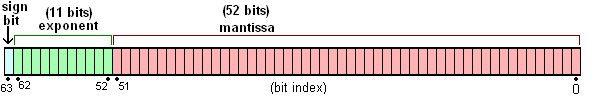
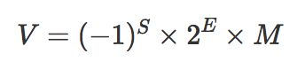
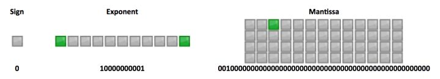
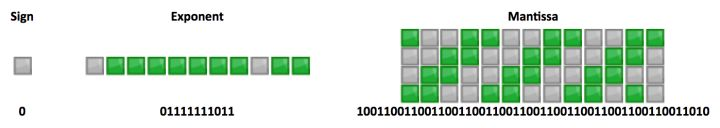

原文地址：[https://zhuanlan.zhihu.com/p/30703042](https://zhuanlan.zhihu.com/p/30703042)

>JavaScript 浮点数运算时经常遇到会 0.000000001 和 0.999999999 这样奇怪的结果，如 0.1+0.2=0.30000000000000004、1-0.9=0.09999999999999998，很多人知道这是浮点数误差问题，但具体原因就说不清楚了。

## 一、浮点数的存储

首先要搞清楚 JavaScript 如何存储小数。和其它语言如 Java 和 Python 不同，JavaScript 中所有数字包括整数和小数都只有一种类型 — Number。它的实现遵循 IEEE 754 标准，使用 64 位固定长度来表示，也就是标准的 double 双精度浮点数（相关的还有float 32位单精度）。计算机组成原理中有过详细介绍，这里就不多介绍了。
>注：大多数语言中的小数默认都是遵循 IEEE 754 的 float 浮点数，包括 Java、Ruby、Python，本文中的浮点数问题同样存在。

这样的存储结构优点是可以归一化处理整数和小数，节省存储空间。

64位比特又可分为三个部分：
* 符号位S：第 1 位是正负数符号位（sign），0代表正数，1代表负数
* 指数位E：中间的 11 位存储指数（exponent），用来表示次方数
* 尾数位M：最后的 52 位是尾数（mantissa），超出的部分自动进一舍零



实际数字就可以用以下公式来计算：
注意以上的公式遵循科学计数法的规范，在十进制中 0<M<10，到二进制就是 0<M<2。也就是说整数部分只能是1，所以可以被舍去，只保留后面的小数部分。如 4.5 转成二进制就是 100.1，科学计数法表示是 1.001 * 2^2，舍去1后 M = 001。E是一个无符号整数，因为长度是11位，取值范围是 0~2047。但是科学计数法中的指数是可以为负数的，所以约定减去一个中间数 1023，[0,102 ] 表示为负，[1024,2047] 表示为正。如 4.5 的指数 E = 1025，尾数 M = 001。

最终的公式变成：



所以 4.5 最终表示为（M=001、E=1025）：



下面再以 0.1 为例解释浮点误差的原因，0.1 转成二进制表示为 0.0001100110011001100(1100循环)，1.100110011001100x2^-4，所以 E=-4+1023=1019；M 舍去首位的1，得到 100110011...。最终就是：


转化成十进制后为 0.100000000000000005551115123126，因此就出现了浮点误差。


计算机 只认识 0 和 1，计算机 是先转为 二进制 后 再 计算 ，计算完成后 再转为 十进制。


例如：

* 为什么 0.1+0.2=0.30000000000000004？

  ```js
    // 0.1 和 0.2 都转化成二进制后再进行运算
	0.00011001100110011001100110011001100110011001100110011010 +
	0.0011001100110011001100110011001100110011001100110011010 =
	0.0100110011001100110011001100110011001100110011001100111
	// 转成十进制正好是 0.30000000000000004
  ```
  
 * 为什么 x=0.1 能得到 0.1？

	恭喜你到了看山不是山的境界。因为 mantissa 固定长度是 52 位，再加上省略的一位，最多可以表示的数是 2^53=9007199254740992，对应科学计数尾数是 9.007199254740992，这也是 JS 最多能表示的精度。它的长度是 16，所以可以近似使用 toPrecision(16) 来做精度运算，超过的精度会自动做凑整处理。于是就有：
	
	```js 
	0.10000000000000000555.toPrecision(16)
	// 返回 0.1000000000000000，去掉末尾的零后正好为 0.1

	// 但你看到的 `0.1` 实际上并不是 `0.1`。不信你可用更高的精度试试：
	0.1.toPrecision(21) = 0.100000000000000005551
	```