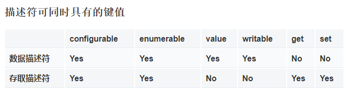

该Object构造函数会为给定值的对象包装程序。如果值为null或undefined，则它将创建并返回一个空对象，否则，它将返回与给定值对应的Type对象。如果值已经是一个对象，它将返回该值。

## 1. Object.length
值为1


## 2. Object.prototype (原型对象 prototype)
Javascript中所有的对象都是Object的实例，并继承Object.prototype的属性和方法，有些属性是隐藏的。


该Object.prototype属性表示Object原型对象

注意：
  * 在函数对象中存在原型对象prototype，在普通对象里没有prototype，但存在 __ proto __  ;
 * 或者说 使用function定义的对象与使用new操作符生程的对象之间有一个重要的区别，这个区别在function定义的对象有一个prototype属性，使用new生成的对象没有prototype属性，存在 **__ proto __**；

```js?linenums
var o =new Object();    
console.log(o.__proto__);
console.log(o.prototype);//undefined

var fn = function(){} 
console.log(fn.prototype);//Object {constructor: function}
var f1 = new fn();
console.log(f1.__proto__);
console.log(f1.__proto__===fn.prototype);//true
```

JavaScript中的几乎所有对象都是**Object**; 典型对象继承属性（包括方法）**Object.prototype**，尽管这些属性可能被遮蔽（也称为被覆盖）。然而，Object可能是故意创建的，这不是真的（例如，通过**Object.create(null)）**，或者可能被改变以使其不再是真的（例如，有**Object.setPrototypeOf**）。

**所有Object对象**都可以通过原型链看到对原型对象的更改，除非沿着原型链进一步覆盖受这些更改影响的属性和方法。这为覆盖或扩展对象行为提供了一种非常强大但有潜在危险的机制。

## 3、原型链

那么__proto__是什么？每个对象都会在其内部初始化一个属性，就是__proto__。
普通对象中的__proto__是什么呢？ **Object的本质函数对象**，是通过new Function()创建，所以Object.__ proto __ 指向Function.prototype。同理，Function也是函数对象，因此Function.__ proto__ 同样指向Function.prototype。 Object.prototype对象也有__proto__属性，但它比较特殊，为null。这个由__proto__串起来的直到Object.prototype.__ proto__为null的链就是原型链。

```js?linenums
console.log(Object.__proto__ === Function.prototype);//true
console.log(Function.__proto__===Function.prototype);//true
console.log(Object.prototype.__proto__);//null
```

当我们访问一个对象的属性 时，如果这个对象内部不存在这个属性，那么他就会去__proto__里找这个属性，这个__proto__又会有自己的__proto__，于是就这样 一直找下去，也就是我们平时所说的原型链的概念。参考下面的例子：

```js?linenums
var Fn = function(){};
Fn.prototype.Hello = function(){
        console.log("Hello World");
    }
var f1 = new Fn();
f1.Hello();//Hello World
```

首先var f1=new fn(),f1是Fn的实例，可以得出f1.__ proto__=Fn.prototype。当我们调用f1.hello()时，首先f1中没有Hello这个属性，于是，它会到他的__proto__中去找，也就是Fn.prototype，而我们在上面定义了 Fn.prototype.Hello=function(){}; 于是，就找到了对应的方法。


从一个更复杂的例子中看原型链的原理：

```js?linenums
var Person = function() {};
Person.prototype.Name = function() {
    console.log("person name");
}
Person.prototype.Sex = "male or female";

var Younger = function() {};
Younger.prototype = new Person();
Younger.prototype.Age = function() {
    console.log("14-28")
};
Younger.prototype.Sex = "female";

var Ann = new Younger();
Ann.Name(); //person name
console.log(Ann.Age()); //14-28
console.log(Ann.Sex); //female
```
对上述代码，我们可以进行如下分析：
var Younger = function() {} === >：Younger.__ proto__=Person.prototype,
Younger.prototype = new Person()=== >:Younger.prototype.__ proto__ = Person.prototype,
var Ann = new Younger()=== >Ann.__ proto__=Younger.prototype,
综上可得：
Ann.__ proto__.__ proto__ = Person.prototype

Ann本身没有Name()方法，于是从Ann.__ proto__(Younger.prototype)中找,仍没有找到于是在向上一层Ann.__ proto__.__ proto__(Person.prototype)中寻找，最终在Person.prototype中找到对应的方法并调用。
同理，Ann本身并没有Age()方法，但在Ann.__ proto__(Younger.prototype)存在。
对于Ann.Sex,在Ann.__ proto__(Younger.prototype)中已经能够找到，便不再向上寻找，因此输出是female。

## 4、构造函数 （constructor）

多数情况下，此属性用于定义一个构造函数，并使用new和继承原型链进一步调用它。

所有对象都会从它的原型上继承一个 constructor 属性：

```js?linenums
var o = {};
o.constructor === Object; // true

var o = new Object;
o.constructor === Object; // true

var a = [];
a.constructor === Array; // true

var a = new Array;
a.constructor === Array // true

var n = new Number(3);
n.constructor === Number; // true
```

## 5、方法

### 5.1、Object.assign() 浅拷贝 拷贝的是属性值

用于将所有可枚举属性的值从一个或多个源对象复制到目标对象。它将返回目标对象。

```js?linenums
const object1 = {
  a: 1,
  b: 2,
  c: 3
};

const object2 = Object.assign({c: 4, d: 5}, object1);

console.log(object2.c, object2.d);
// expected output: 3 5
```

### 5.2、Object.create() 

创建一个新对象，使用现有的对象来提供新创建的对象的__proto__。 

**语法**

Object.create(proto, [propertiesObject])

**参数**

proto ： 新创建对象的原型对象。

propertiesObject： 可选。如果没有指定为 undefined，则是要添加到新创建对象的可枚举属性（即其自身定义的属性，而不是其原型链上的枚举属性）对象的属性描述符以及相应的属性名称。这些属性对应Object.defineProperties()的第二个参数。

**返回值**

一个新对象，带着指定的原型对象和属性。

### 5.3、Object.defineProperties()

直接在一个对象上定义新的属性或修改现有属性，并返回该对象。

#### 5.3.1、语法

**Object.defineProperties(obj, props)**

__参数__

**obj** 在其上定义或修改属性的对象。

**props**：

要定义其可枚举属性或修改的属性描述符的对象。对象中存在的属性描述符主要有两种：数据描述符和访问器描述符（更多详情，请参阅Object.defineProperty()）。描述符具有以下键：

* **configurable**， true 当且仅当该属性描述符的类型可以被改变并且该属性可以从对应对象中删除。默认为 false
* **enumerable**，true 当且仅当在枚举相应对象上的属性时该属性显现。默认为 false
* **value**，与属性关联的值。可以是任何有效的JavaScript值（数字，对象，函数等）。默认为 undefined.
* **writable**，true当且仅当与该属性相关联的值可以改变时。默认为 false
* **get**，作为该属性的 getter 函数，如果没有 getter 则为undefined。函数返回值将被用作属性的值。默认为 undefined
* **set**，作为属性的 setter 函数，如果没有 setter 则为undefined。函数将仅接受参数赋值给该属性的新值。默认为 undefined

#### 5.3.2、描述

```js?linenums
var obj = {};
Object.defineProperties(obj, {
  'property1': {
    value: true,
    writable: true
  },
  'property2': {
    value: 'Hello',
    writable: false
  }
  // etc. etc.
});
```

### 5.4、Object.defineProperty()

直接在一个对象上定义一个新属性，或者修改一个对象的现有属性， 并返回这个对象。

#### 5.4.1、语法
Object.defineProperty(obj, prop, descriptor)

**参数**

obj：要在其上定义属性的对象
prop： 要定义或修改的属性的名称。
descriptor： 将被定义或修改的属性描述符。

**返回值**

被传递给函数的对象。

#### 5.4.2、属性描述符

对象里目前存在的属性描述符有两种主要形式：**数据描述符**和**存取描述符**。
**数据描述符**是一个具有值的属性，该值可能是可写的，也可能不是可写的。
**存取描述符**是由getter-setter函数对描述的属性。描述符必须是这两种形式之一；不能同时是两者。

**数据描述符和存取描述符**均具有以下可选键值：

* **configurable**，当且仅当该属性的 configurable 为 true 时，该属性描述符才能够被改变，同时该属性也能从对应的对象上被删除。默认为 false。
* **enumerable**，当且仅当该属性的enumerable为true时，该属性才能够出现在对象的枚举属性中。默认为 false。


**数据描述符**同时具有以下可选键值：

* **value**，该属性对应的值。可以是任何有效的 JavaScript 值（数值，对象，函数等）。默认为 undefined。
* **writable**，当且仅当该属性的writable为true时，value才能被赋值运算符改变。默认为 false。

**存取描述符**同时具有以下可选键值：

* **get**，一个给属性提供 getter 的方法，如果没有 getter 则为 undefined。当访问该属性时，该方法会被执行，方法执行时没有参数传入，但是会传入this对象（由于继承关系，这里的this并不一定是定义该属性的对象）。默认为 undefined。
* **set**，一个给属性提供 setter 的方法，如果没有 setter 则为 undefined。当属性值修改时，触发执行该方法。该方法将接受唯一参数，即该属性新的参数值。默认为 undefined。



```js?linenums
// 使用 __proto__
var obj = {};
var descriptor = Object.create(null); // 没有继承的属性
// 默认没有 enumerable，没有 configurable，没有 writable
descriptor.value = 'static';
Object.defineProperty(obj, 'key', descriptor);

// 显式
Object.defineProperty(obj, "key", {
  enumerable: false,
  configurable: false,
  writable: false,
  value: "static"
});

// 循环使用同一对象
function withValue(value) {
  var d = withValue.d || (
    withValue.d = {
      enumerable: false,
      writable: false,
      configurable: false,
      value: null
    }
  );
  d.value = value;
  return d;
}
// ... 并且 ...
Object.defineProperty(obj, "key", withValue("static"));

// 如果 freeze 可用, 防止代码添加或删除对象原型的属性
// （value, get, set, enumerable, writable, configurable）
(Object.freeze||Object)(Object.prototype);
```

```js?linenums
var o = {}; // 创建一个新对象

// 在对象中添加一个属性与数据描述符的示例
Object.defineProperty(o, "a", {
  value : 37,
  writable : true,
  enumerable : true,
  configurable : true
});

// 对象o拥有了属性a，值为37

// 在对象中添加一个属性与存取描述符的示例
var bValue;
Object.defineProperty(o, "b", {
  get : function(){
    return bValue;
  },
  set : function(newValue){
    bValue = newValue;
  },
  enumerable : true,
  configurable : true
});

o.b = 38;
// 对象o拥有了属性b，值为38

// o.b的值现在总是与bValue相同，除非重新定义o.b

// 数据描述符和存取描述符不能混合使用
Object.defineProperty(o, "conflict", {
  value: 0x9f91102, 
  get: function() { 
    return 0xdeadbeef; 
  } 
});
// throws a TypeError: value appears only in data descriptors, get appears only in accessor descriptors
```