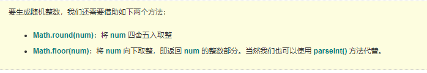

## 一、追加当前目录下的css到页面上

例如：

```js
!function(){
  var cropperObj = {
    version: '1.4.1',
    getPath: function() {
      var e = document.currentScript ? document.currentScript.src: function() {
        for (var e, t = document.scripts,i = t.length - 1,n = i; n > 0; n--) {
          if ("interactive" === t[n].readyState) {
            e = t[n].src;
            break;
          }
        }
        return e || t[i].src;
      }();
      return e.substring(0, e.lastIndexOf("/") + 1);
    }
  };
  var path =  cropperObj.getPath();
  var link = document.createElement("link");
  link.rel = "stylesheet";
  link.href = path + 'cropper.css?v='+cropperObj.version;
  var head = document.getElementsByTagName("head")[0];
  head.appendChild(link);
}();
```

## 二、时间格式转换

```js
/**
 * 时间转换
 * fmt  例如：yyyy-MM-dd hh:mm:ss
 **/
exports.getDate = function(val, fmt) {
    var date = '';
    if (!val) {
        date = new Date();
    } else if (val) {
        date = new Date(val);
    }
    var o = {
        "M+": date.getMonth() + 1, //月份
        "d+": date.getDate(), //日
        "h+": date.getHours(), //小时
        "m+": date.getMinutes(), //分
        "s+": date.getSeconds(), //秒
        "q+": Math.floor((date.getMonth() + 3) / 3), //季度
        "S": date.getMilliseconds() //毫秒
    };
    if (/(y+)/.test(fmt))
        fmt = fmt.replace(RegExp.$1, (date.getFullYear() + "").substr(4 - RegExp.$1.length));
    for (var k in o)
        if (new RegExp("(" + k + ")").test(fmt))
            fmt = fmt.replace(RegExp.$1, (RegExp.$1.length == 1) ? (o[k]) : (("00" + o[k]).substr(("" + o[k]).length)));
    return fmt;
};
```

## 三、根据长度截取先使用字符串，超长部分追加…

```js
/**参数说明：
 * 根据长度截取先使用字符串，超长部分追加…
 * str 对象字符串
 * len 目标字节长度
 * 返回值： 处理结果字符串
 */
exports.cutString = function(str, len) {
    if (!str) {
       return '';
    }
    if (len) {//截取长度时，去掉标签字符
        //去除标签字符
        str = str.replace(/(<|&lt;)\/?.+?(>|&gt;)/g,"")
            .replace(/(&nbsp;|nbsp;|&amp;|amp;|&quot;|quot;)/ig,"")
            .replace(/ /g,"");
    } else {//完整html时
        //字符转为html标签
        var arrEntities={'lt':'<','gt':'>','nbsp':' ','amp':'&','quot':'"'};
        str =  str.replace(/&(lt|gt|nbsp|amp|quot);/ig,function(all,t){return arrEntities[t];});
    }

    if (str.length * 2 <= len) {
        return str;
    }

    var strlen = 0;
    var s = "";
    for (var i = 0; i < str.length; i++) {
        s = s + str.charAt(i);
        if (str.charCodeAt(i) > 128) {
            strlen = strlen + 2;
            if (strlen >= len) {
                return s.substring(0, s.length - 1) + "...";
            }
        } else {
            strlen = strlen + 1;
            if (strlen >= len) {
                return s.substring(0, s.length - 2) + "...";
            }
        }
    }
    return s;
};
```

## 四、保留2位小数

```js
/**
 * 保留两位小数的方法
 * @param {*} num 传入的数字
 **/
exports.toDecimal2 = function(num) {
    var f = parseFloat(num);
    if (isNaN(f)) {
        return false;
    }
    var f = (Math.round(num * 100) / 100).toFixed(2);
    var s = f.toString();
    var rs = s.indexOf('.');
    if (rs < 0) {
        rs = s.length;
        s += '.';
    }
    while (s.length <= rs + 2) {
        s += '0';
    }
    return s;
}
```

## 五、获取一周的时间

```js
// 获取一周的日期
exports.getWeek = function(datevalue) {
    var week = [];
    var weekName = [
        {num:0,name: '星期一'},
        {num:1,name: '星期二'},
        {num:2,name: '星期三'},
        {num:3,name: '星期四'},
        {num:4,name: '星期五'},
        {num:5,name: '星期六'},
        {num:6,name: '星期天'},
    ];
    var index = 0;
    for (var i = -3 ; i < 4; i++) {
        if(datevalue) {
            var stamp = new Date(datevalue);
        } else {
            var stamp = new Date();
        }
        stamp.setDate(stamp.getDate() + i);
        
        week[index] = {
            date: stamp.getFullYear() +'-',
        };
        
        if(stamp.getMonth() < 9 && stamp.getMonth() >= 0) {
            week[index].date = week[index].date+'0'+(stamp.getMonth()+1)+'-';
        } else {
            week[index].date = week[index].date+(stamp.getMonth()+1)+'-';
        }
        
        if(stamp.getDate() < 10 && stamp.getDate() > 0) {
            week[index].date = week[index].date+'0'+stamp.getDate();
        } else {
            week[index].date = week[index].date+stamp.getDate();
        }
        
        weekName.forEach(function (item) {
            if(item.num == stamp.getDay()) {
                week[index].weekDate = item.name;
            }
        })
        index++;
    }
    return week;
}

```

六、判断类型

Object.prototype.toString.call();

```js?linenums
var a = 1;
Object.prototype.toString.call(a);
//"[object Number]"
var a = function() {};
Object.prototype.toString.call(a);
//"[object Function]"
var a = 'dd';
Object.prototype.toString.call(a);
//"[object String]"
var a = null;
Object.prototype.toString.call(a);
//"[object Null]"
var a = undefined;
Object.prototype.toString.call(a);
//"[object Undefined]"
var a = [1,1];
Object.prototype.toString.call(a);
//"[object Array]"
var a = {};
Object.prototype.toString.call(a);
//"[object Object]"
//var a = /$s/;
Object.prototype.toString.call(a);
//"[object RegExp]"
var a = new Date();
Object.prototype.toString.call(a);
//"[object Date]"
var a = true;
Object.prototype.toString.call(a);
//"[object Boolean]"


//判断json
var a = '{"name":"dd"}';
if (typeof str == 'string') {
   var obj=JSON.parse(a);
   if (Object.prototype.toString.call(obj).split(' ') == 'Object') {
        return true;//json
  }
}
```

```js?linenums
function getClass (a) {
  const str = Object.prototype.toString.call(a)
  return /^\[object (.*)\]$/.exec(str)[1]
}
```

## 六、是否安装flash

```js?linenums
function flashChecker() {
    var hasFlash = 0;　　　　 //是否安装了flash
    var flashVersion = 0;　　 //flash版本
    if(document.all) {
        var swf = new ActiveXObject('ShockwaveFlash.ShockwaveFlash');
        if(swf) {
            hasFlash = 1;
            VSwf = swf.GetVariable("$version");
            flashVersion = parseInt(VSwf.split(" ")[1].split(",")[0]);
        }
    } else {
        if(navigator.plugins && navigator.plugins.length > 0) {
            var swf = navigator.plugins["Shockwave Flash"];
            if(swf) {
                hasFlash = 1;
                var words = swf.description.split(" ");
                for(var i = 0; i < words.length; ++i) {
                    if(isNaN(parseInt(words[i]))) continue;
                    flashVersion = parseInt(words[i]);
                }
            }
        }
    }
    return { f: hasFlash, v: flashVersion };
}

var fls = flashChecker();
var s = "";
if(!fls.f) {
    if (confirm("您的浏览器未安装Flash插件，现在安装？")) {
        window.location.href = "http://get.adobe.com/cn/flashplayer/";
    }
}
```

## 七、生成随机数的方法汇总

### 7.1、随机浮点数的生成

####  7.1.1）、生成 [ 0, 1 ) 范围内的随机数（大于等于0，小于1）

使用 random() 方法可以返回一个介于 0 ~ 1 之间的伪随机数（包括 0，不包括 1）,  **Math.random()**

####  7.1.2）、生成 [ n, m ) 范围内的随机数（大于等于n，小于m）,**Math.random()*(m-n)+n**


```js?linenums
//下面生成 [10,15) 范围内的随机浮点数。
var random1 = Math.random()*(15-10)+10;
var random2 = Math.random()*(15-10)+10;
var random3 = Math.random()*(15-10)+10;
console.log(random1);
console.log(random2);
console.log(random3);
```

####  7.1.3）、生成 [n,m]、(n,m)、(n,m] 范围内的随机数

```js?linenums
//取得[n,m]范围随机数
function fullClose(n,m) {
   var result = Math.random()*(m+1-n)+n;
   while(result>m) {
       result = Math.random()*(m+1-n)+n;
   }
   return result;
}

 
//取得(n,m)范围随机数
function fullOpen(n,m) {
   var result = Math.random()*(m-n)+n;
   while(result == n) {
       result = Math.random()*(m-n)+n;
   }
   return result;
}
 
//取得(n,m]范围随机数
function leftOpen(n,m) {
   var result = Math.random()*(m-n+1)+n-1;
   while(result<n) {
       result = Math.random()*(m-n+1)+n-1;
   }
   return result;
}
```

### 7.2、随机整数的生成

#### 7.2.1）、随机生成 0、1 这两个整数
.

**随机生成 0、1 这两个整数**

Math.round(Math.random())

```js?linenums
var random1 = Math.round(Math.random());
var random2 = Math.round(Math.random());
var random3 = Math.round(Math.random());
console.log(random1);
console.log(random2);
console.log(random3);
```

**生成 [ 0, n ) 范围内的随机整数（大于等于0，小于n）**

// 0 到 n-1 
Math.floor(Math.random()*n)

```js?linenums
var random1 = Math.floor(Math.random()*5);
var random2 = Math.floor(Math.random()*5);
var random3 = Math.floor(Math.random()*5);
console.log(random1);
console.log(random2);
console.log(random3);
```

**生成 [ 1, n ] 范围内的随机整数（大于等于1，小于等于n）**

// 1 到 n 的随机整数
Math.floor(Math.random()*n)+1

```js?linenums
// 1 到 5 的随机整数（包括 1 和 5）。
var random1 = Math.floor(Math.random()*5)+1;
var random2 = Math.floor(Math.random()*5)+1;
var random3 = Math.floor(Math.random()*5)+1;
console.log(random1);
console.log(random2);
console.log(random3);
```

**生成 [ min, max ] 范围内的随机整数（大于等于min，小于等于max）**

//生成一个最小值为 min，最大值为 max 的随机整数。

Math.floor(Math.random()*(max-min+1))+min;

parseInt(Math.random()*(max-min+1)+min,10);

```js?linenums
//生成几个 5 到 10 的随机整数
var random1 = Math.floor(Math.random()*(10-5+1))+5;
var random2 = Math.floor(Math.random()*(10-5+1))+5;
var random3 = Math.floor(Math.random()*(10-5+1))+5;
console.log(random1);
console.log(random2);
console.log(random3);
```

### 7.3、随机字符串的生成

#### 7.3.1、生成指定位数的纯数字字符串

```js?linenums
//生成n位数字字符串
function randomNum(n){
  var res = "";
  for(var i=0;i<n;i++){
    res += Math.floor(Math.random()*10);
  }
  return res;
}
 
//测试
console.log(randomNum(3))
console.log(randomNum(5))
console.log(randomNum(7))
```

#### 7.3.2、生成指定位数的数字字母混合的字符串

```js?linenums
//生成n位数字字母混合字符串
function generateMixed(n) {
  var chars = ['0','1','2','3','4','5','6','7','8','9',
              'A','B','C','D','E','F','G','H','I','J','K','L','M',
              'N','O','P','Q','R','S','T','U','V','W','X','Y','Z'];
  var res = "";
  for(var i = 0; i < n ; i++) {
     var id = Math.floor(Math.random()*36);
     res += chars[id];
  }
  return res;
}
 
//测试
console.log(generateMixed(3))
console.log(generateMixed(5))
console.log(generateMixed(7))
```

## 八、去除空格的方法（去掉前后空格）

### 8.1 String.prototype.trim = function() {    return this.replace(/^\s\s*/, '').replace(/\s\s*$/, '');  } 

### 8.2  String.prototype.trim = function() {    return this.replace(/^\s+/, '').replace(/\s+$/, '');  }

### 8.3 String.prototype.trim = function() {    return  this.replace(/^\s+|\s+$/g, '');  }

### 8.4 String.prototype.trim = function() {    var str = this;    str = str.match(/\S+(?:\s+\S+)*/);    return str ? str[0] : '';  }

### 8.5 String.prototype.trim = function() {    return this.replace(/^\s*(\S*(\s+\S+)*)\s*$/, '$1');  }

### 8.6 String.prototype.trim = function() {    return this.replace(/^\s*(\S*(?:\s+\S+)*)\s*$/, '$1');  }

### 8.7 String.prototype.trim = function() {    return this.replace(/^\s*((?:[\S\s]*\S)?)\s*$/, '$1');  }


## 九、 时间差格式

```js?linenums
function getTimediff(t, n) {
    var lastTime = new Date(t).getTime();
    var nowTime = new Date(n).getTime();
    var timediff = parseInt((lastTime - nowTime) / 1000);
    if (timediff > 0) {
        var d = Math.floor(timediff / 3600 / 24);
        var h = Math.floor((timediff - d * 24 * 3600) / 3600);
        var m = Math.floor((timediff - d * 24 * 3600 - h * 3600) / 60);
        var s = Math.floor((timediff - d * 24 * 3600 - h * 3600 - m * 60));
        if (d < 10 && d >= 0) {
            d = "0" + d;
        };
        if (h < 10 && h >= 0) {
            h = "0" + h;
        };
        if (m < 10 && m >= 0) {
            m = "0" + m;
        };
        if (s < 10 && s >= 0) {
            s = "0" + s;
        };
        return {
            d: d,
            h: h,
            m: m,
            s: s
        };
    } else {
        return false;
    }
}
```

## 十、判断浏览器以及版本

```js?linenums
function n() {
    var e, t, n = navigator.userAgent.toLowerCase(),
        r = {};
    
    try {
        if (t = n.match(/(?:newsarticle|safari|chrome|msie|micromessenger)[\/: ]([\d.]+)/),
            t = t ? t[1] : "0",
            r = {
                version: t,
                safari: /version.+safari/.test(n) || /safari[\/ ]+([\d.]+)/.test(n),
                chrome: /chrome\/([\d.]+)/.test(n) || /crios\/([\d.]+)/.test(n),
                ie: /msie/.test(n) || /trident/.test(n),
                tt: /newsarticle/.test(n),
                uc: /ucbrowser\/([\d.]+)/.test(n),
                qq: /qqbrowser/.test(n),
                wx: /micromessenger/.test(n),
                facebook: /fban/.test(n),
                twitter: /twitter/.test(n)
            },
            e = r.version.split(".")[0],
            r.uc)
            return "UC_" + (e = n.match(/ucbrowser\/([\d.]+)/)[1]);
        if (r.qq)
            return "QQ_" + (e = n.match(/qqbrowser\/([\d.]+)/)[1]);
        if (r.tt)
            return "toutiao_" + (e = n.match(/newsarticle\/([\d.]+)/)[1]);
        if (r.chrome)
            return "chrome_" + (e = n.match(/chrome\/([\d.]+)/)[1]);
        if (r.wx)
            return "weixin_" + (e = n.match(/micromessenger\/([\d.]+)/)[1]);
        if (r.safari) {
            if (n.match(/android/))
                return "Webkit_" + n.match(/webkit\/([\d.]+)/)[1];
            try {
                n.match(/(?:version)[\/: ]([\d.]+)/) && (e = n.match(/(?:version)[\/: ]([\d.]+)/)[1])
            } catch (e) { }
            return "safari_" + e
        }
        if (r.ie)
            return n.indexOf("rv:11") > -1 && (e = "11"),
                "IE_" + e;
        if (r.facebook)
            return "facebook";
        if (r.twitter)
            return "twitter"
    } catch (e) {
        return "unkonw"
    }
    return "unkonw"
}
```

## 十一、深复制方法，支持字符 复制，引用中的 数据  对象 复制

```js?linenums
/**方法功能：
 * 深复制方法，支持字符 复制，引用中的 数据  对象 复制
 * 参数：
 * obj：需要拷贝的数据
 * */
 function cloneData (obj) {
	  var buf;
	  if (obj instanceof Array) {
		buf = [];
		var i = obj.length;
		while (i--) {
		  buf[i] = this.cloneData(obj[i]);
		}
		return buf;
	  } else if (obj instanceof Object) {
		buf = {};
		for (var k in obj) {
		  buf[k] = this.cloneData(obj[k]);
		}
		return buf;
	  } else {
		return obj;
	  }
}
```

## 十二、获取一个随机字符串

```js?linenums
 /**方法功能：
 * 获取一个随机字符串
 * 参数：
 * number：返回字符串长度
 * */
function getRandomString(number) {
	var string = "qwertyuiopasdfghjklzxcvbnm123456789QWERTYUIOPLKJHGFDSAZXCVBNM";
  	var tempString = "";
  	for (var i = 0; i < number; i++) {
		var randomNum = parseInt(Math.random() * string.length);
		tempString += string[randomNum];
 	}
  	var date = new Date().getTime();
  	return "random" + tempString + date;
}
```

## 十三、检测浏览器是不是ie 浏览器

```js?linenums
/**
 * 检测浏览器是不是ie 浏览器
 * */
IEVersion: function () {
  var userAgent = navigator.userAgent; //取得浏览器的userAgent字符串
  var isIE = userAgent.indexOf("compatible") > -1 && userAgent.indexOf("MSIE") > -1; //判断是否IE<11浏览器
  var isEdge = userAgent.indexOf("Edge") > -1 && !isIE; //判断是否IE的Edge浏览器
  var isIE11 = userAgent.indexOf('Trident') > -1 && userAgent.indexOf("rv:11.0") > -1;
  if (isIE) {
	var reIE = new RegExp("MSIE (\\d+\\.\\d+);");
	reIE.test(userAgent);
	var fIEVersion = parseFloat(RegExp["$1"]);
	if (fIEVersion == 7) {
	  return 7;
	} else if (fIEVersion == 8) {
	  return 8;
	} else if (fIEVersion == 9) {
	  return 9;
	} else if (fIEVersion == 10) {
	  return 10;
	} else {
	  return 6;//IE版本<=7
	}
  } else if (isEdge) {
	return 'edge';//edge
  } else if (isIE11) {
	return 11; //IE11
  } else {
	return -1;//不是ie浏览器
  }
}
```

## 十四、判断两个参数是否值相等

```js?linenums
/**
 * 判断两个参数是否值相等
 * @param a
 * @param b
 * @returns {boolean}
 */
isValueEqual(a, b) {
  let toString = Object.prototype.toString;

  function isFunction(obj) {
	return toString.call(obj) === '[object Function]'
  }

  function eq(a, b, aStack, bStack) {

	// === 结果为 true 的区别出 +0 和 -0
	if (a === b) return a !== 0 || 1 / a === 1 / b;

	// typeof null 的结果为 object ，这里做判断，是为了让有 null 的情况尽早退出函数
	if (a == null || b == null) return false;

	// 判断 NaN
	if (a !== a) return b !== b;

	// 判断参数 a 类型，如果是基本类型，在这里可以直接返回 false
	let type = typeof a;
	if (type !== 'function' && type !== 'object' && typeof b != 'object') return false;

	// 更复杂的对象使用 deepEq 函数进行深度比较
	return deepEq(a, b, aStack, bStack);
  }

  function deepEq(a, b, aStack, bStack) {

	// a 和 b 的内部属性 [[class]] 相同时 返回 true
	let className = toString.call(a);
	if (className !== toString.call(b)) return false;

	switch (className) {
	  case '[object RegExp]':
	  case '[object String]':
		return '' + a === '' + b;
	  case '[object Number]':
		if (+a !== +a) return +b !== +b;
		return +a === 0 ? 1 / +a === 1 / b : +a === +b;
	  case '[object Date]':
	  case '[object Boolean]':
		return +a === +b;
	}

	let areArrays = className === '[object Array]';
	// 不是数组
	if (!areArrays) {
	  // 过滤掉两个函数的情况
	  if (typeof a != 'object' || typeof b != 'object') return false;

	  let aCtor = a.constructor;
	  let bCtor = b.constructor;
	  // aCtor 和 bCtor 必须都存在并且都不是 Object 构造函数的情况下，aCtor 不等于 bCtor， 那这两个对象就真的不相等啦
	  if (aCtor !== bCtor && !(isFunction(aCtor) && aCtor instanceof aCtor && isFunction(bCtor) && bCtor instanceof bCtor) && ('constructor' in a && 'constructor' in b)) {
		return false;
	  }
	}


	aStack = aStack || [];
	bStack = bStack || [];
	let length = aStack.length;

	// 检查是否有循环引用的部分
	while (length--) {
	  if (aStack[length] === a) {
		return bStack[length] === b;
	  }
	}

	aStack.push(a);
	bStack.push(b);

	// 数组判断
	if (areArrays) {

	  let length = a.length;
	  if (length !== b.length) return false;

	  while (length--) {
		if (!eq(a[length], b[length], aStack, bStack)) return false;
	  }
	}
	// 对象判断
	else {

	  let keys = Object.keys(a),
		  key;
	  length = keys.length;

	  if (Object.keys(b).length !== length) return false;
	  while (length--) {

		key = keys[length];
		if (!(b.hasOwnProperty(key) && eq(a[key], b[key], aStack, bStack))) return false;
	  }
	}

	aStack.pop();
	bStack.pop();
	return true;
  }

  return eq(a, b)
}
```