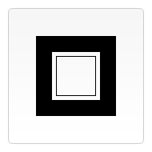
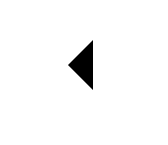

>< canvas >标签只有两个属性——width 和 height。

* Document.getElementById() 方法获取HTML < canvas > 元素的引用。
* HTMLCanvasElement.getContext() 方法获取这个元素的context——图像稍后将在此被渲染。
* fillStyle 属性设置style样式。
* fillRect() 方法（x,y,width,height),起点位置和宽高。

```js?linenums
const canvas = document.getElementById('canvas');
const ctx = canvas.getContext('2d');

ctx.fillStyle = 'green';
ctx.fillRect(10, 10, 150, 100);
```

**检查支持性:**

```js?linenums
var canvas = document.getElementById('tutorial');

if (canvas.getContext){
  var ctx = canvas.getContext('2d');
  // drawing code here
} else {
  // canvas-unsupported code here
}
```

## 1、绘制形状

### 1.1 绘制矩形

>不同于SVG，HTML中的元素canvas只支持一种原生的图形绘制：**矩形**。

* 绘制一个填充的矩形。fillRect(x, y, width, height)
* 绘制一个矩形的边框。strokeRect(x, y, width, height)
* 清除指定矩形区域，让清除部分完全透明。clearRect(x, y, width, height)

```js?linenums
function draw() {
  var canvas = document.getElementById('canvas');
  if (canvas.getContext) {
    var ctx = canvas.getContext('2d');

    ctx.fillRect(25, 25, 100, 100);
    ctx.clearRect(45, 45, 60, 60);
    ctx.strokeRect(50, 50, 50, 50);
  }
}
```



**注解：**fillRect()函数绘制了一个边长为100px的黑色正方形。clearRect()函数从正方形的中心开始擦除了一个60 * 60px的正方形，接着strokeRect()在清除区域内生成一个50 * 50的正方形边框。


### 1.2 绘制路径

>图形的基本元素是路径。路径是通过不同颜色和宽度的线段或曲线相连形成的不同形状的点的集合。一个路径，甚至一个子路径，都是闭合的。使用路径绘制图形需要一些额外的步骤。
>* 首先，你需要创建路径起始点。
>* 然后你使用画图命令去画出路径。
>* 之后你把路径封闭。
>* 一旦路径生成，你就能通过描边或填充路径区域来渲染图形。

**以下是所要用到的函数：**
* beginPath()。新建一条路径，生成之后，图形绘制命令被指向到路径上生成路径。
* closePath()。闭合路径之后图形绘制命令又重新指向到上下文中。
* stroke()。通过线条来绘制图形轮廓。
* fill()。通过填充路径的内容区域生成实心的图形。

**注意：**
* 当前路径为空，即调用beginPath()之后，或者canvas刚建的时候，第一条路径构造命令通常被视为是moveTo（），无论实际上是什么。出于这个原因，你几乎总是要在设置路径之后专门指定你的起始位置。
* 当你调用fill()函数时，所有没有闭合的形状都会自动闭合，所以你不需要调用closePath()函数。但是调用stroke()时不会自动闭合。

```js?linenums
//绘制一个三角形
function draw() {
  var canvas = document.getElementById('canvas');
  if (canvas.getContext) {
    var ctx = canvas.getContext('2d');

    ctx.beginPath();
    ctx.moveTo(75, 50);
    ctx.lineTo(100, 75);
    ctx.lineTo(100, 25);
    ctx.fill();
  }
}
```
