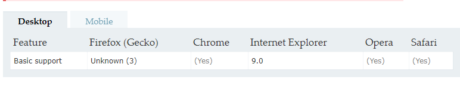

## 一、readyState

一个==docment==的Document.readyState属性描述了文档的加载状态。

可以判断 docment 、js 、css等是否加载完成

**redayState**有以下几个值：
* **loading** / 加载中
* **interactive**  / 互动
     文档已经完成加载，文档已被解析，但是诸如图像，样式和框架之类的子资源仍在加载。
* **complete**  /  完成
     T文档和所有子资源都已完成加载。状态表示load事件即将被触发。
	 
	 
当这个属性的值发生变化时，某个对象上的==readstatechange==事件将被触发。
例如：
```js?linenums
// 模拟 load/onload 事件
document.onreadystatechange = function () {
  if (document.readyState === "complete") {
    initApplication();
  }
}
```

## 二、 document.currentScript

返回其所包含的脚本中正在被执行的 ==< script >== 元素.

**浏览器兼容性**


## 三、 document.characterSet

只读属性返回当前文档的字符编码。该字符编码是用于渲染此文档的字符集，可能与该页面指定的编码不同

例如： 返回当前文档的字符集,比如"ISO-8859-1" 或者 "UTF-8"

## 四、ParentNode
### 1、属性
#### 1）、ParentNode.childElementCount

只读属性返回一个无符号长整型数字，表示给定元素的子元素数。

**浏览器兼容性**




例如： 

```js?linenums
//兼容性写法
function GetChildCount () {
	var container = document.getElementById ("container");

	var childCount = 0;
	//如果支持childElementCount属性
	if ('childElementCount' in container) {
		childCount = container.childElementCount;
	} else {
		//如果支持children属性,IE6/7/8
		//译者注:没有判断nodeType是否为1,可能包含注释节点.
		if (container.children) {
			childCount = container.children.length;
		} else {  //,如果都不支持,Firefox 3.5之前版本
			var child = container.firstChild;
			while (child) {
				if (child.nodeType == 1 /*Node.ELEMENT_NODE*/) {
					childCount++;
				}
				child = child.nextSibling;
			}
		}
	}

	alert ("The number of child elements is " + childCount);
}
```
#### 2）、children 

是一个只读属性，返回 一个Node的子elements ，是一个动态更新的 **HTMLCollection**。

#### 3）、firstElementChild 

 只读属性，返回对象的第一个孩子 Element, 如果没有子元素，则为null。
 
 **兼容性**
 
 
 
 **Polyfill for IE8, IE9 and Safari**
 
 ```js
 // Overwrites native 'firstElementChild' prototype.
// Adds Document & DocumentFragment support for IE9 & Safari.
// Returns array instead of HTMLCollection.
;(function(constructor) {
    if (constructor &&
        constructor.prototype &&
        constructor.prototype.firstElementChild == null) {
        Object.defineProperty(constructor.prototype, 'firstElementChild', {
            get: function() {
                var node, nodes = this.childNodes, i = 0;
                while (node = nodes[i++]) {
                    if (node.nodeType === 1) {
                        return node;
                    }
                }
                return null;
            }
        });
    }
})(window.Node || window.Element);
 ```
 
#### 4）、lastElementChild  
 只读属性返回对象的最后一个孩子Element ，如果没有子元素，则返回null。
 
 ### 2、方法
 
 #### 1）、append() 和 appendChild()
 
在 ParentNode的最后一个子节点之后插入一组 Node 对象或 DOMString 对象。
被插入的 DOMString 对象等价为 Text 节点。

parentNode.append()是还在试用期的方法，，有兼容问题。

 与parentNode.appendChild()的区别在于：
* ParentNode.append()允许追加DOMString对象，而 Node.appendChild() 只接受 Node 对象。
* ParentNode.append() 没有返回值，而 Node.appendChild() 返回追加的 Node 对象.
* ParentNode.append() 可以追加几个节点和字符串，而 Node.appendChild() 只能追加一个节点。

注意：DOMString 是一个UTF-16字符串。由于JavaScript已经使用了这样的字符串，所以DOMString 直接映射到 一个String。

#### 2）、prepend()

可以在父节点的第一个子节点之前插入一系列Node对象或者DOMString对象。DOMstring会被当作Text节点对待。

ParentNode.prepend是还在试用期的方法，，有兼容问题。

#### 3）、querySelectorAll()

返回一个 NodeList 表示元素的列表，把当前的元素作为根与指定的选择器组相匹配。

**浏览器兼容性**

[1] Internet Explorer 8 只支持 CSS2 选择器。

##### （1）、**NodeList** 
NodeList 对象是一个节点的集合，是由**Node.childNodes** 和  **document.querySelectorAll** 返回的。

属性：length, NodeList 对象中包含的节点个数。
方法：item返回NodeList对象中指定索引的节点，如果索引越界，则返回null。可以用for遍历集合
转数组的话 ： Array.from(NodeList)
 ## 五、hasOwnProperty 
 
 判断属性是否存在