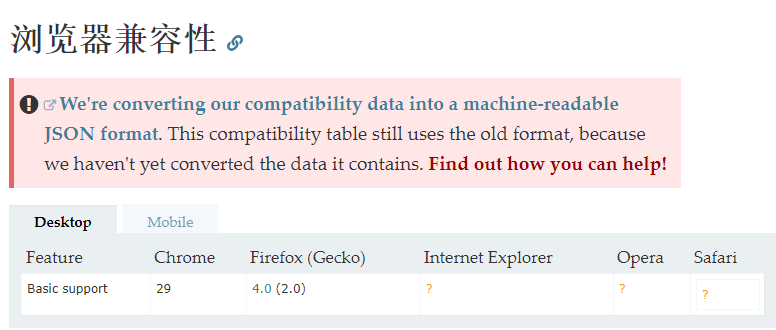
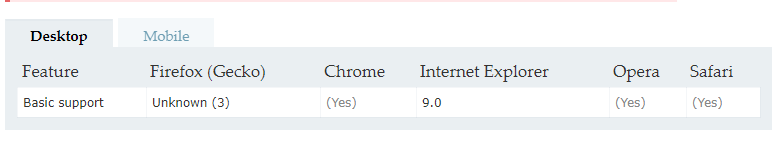

## 一、readyState

一个==docment==的Document.readyState属性描述了文档的加载状态。

可以判断 docment 、js 、css等是否加载完成

**redayState**有以下几个值：
* **loading** / 加载中
* **interactive**  / 互动
     文档已经完成加载，文档已被解析，但是诸如图像，样式和框架之类的子资源仍在加载。
* **complete**  /  完成
     T文档和所有子资源都已完成加载。状态表示load事件即将被触发。
	 
	 
当这个属性的值发生变化时，某个对象上的==readstatechange==事件将被触发。
例如：
```js?linenums
// 模拟 load/onload 事件
document.onreadystatechange = function () {
  if (document.readyState === "complete") {
    initApplication();
  }
}
```

## 二、 document.currentScript

返回其所包含的脚本中正在被执行的 ==< script >== 元素.

**浏览器兼容性**



## 三、 document.characterSet

只读属性返回当前文档的字符编码。该字符编码是用于渲染此文档的字符集，可能与该页面指定的编码不同

例如： 返回当前文档的字符集,比如"ISO-8859-1" 或者 "UTF-8"

## 四、childElementCount

只读属性返回一个无符号长整型数字，表示给定元素的子元素数。

**浏览器兼容性**




例如： 

```js?linenums
//兼容性写法
function GetChildCount () {
	var container = document.getElementById ("container");

	var childCount = 0;
	//如果支持childElementCount属性
	if ('childElementCount' in container) {
		childCount = container.childElementCount;
	} else {
		//如果支持children属性,IE6/7/8
		//译者注:没有判断nodeType是否为1,可能包含注释节点.
		if (container.children) {
			childCount = container.children.length;
		} else {  //,如果都不支持,Firefox 3.5之前版本
			var child = container.firstChild;
			while (child) {
				if (child.nodeType == 1 /*Node.ELEMENT_NODE*/) {
					childCount++;
				}
				child = child.nextSibling;
			}
		}
	}

	alert ("The number of child elements is " + childCount);
}
```
## 五、children 

是一个只读属性，返回 一个Node的子elements ，是一个动态更新的 **HTMLCollection**。