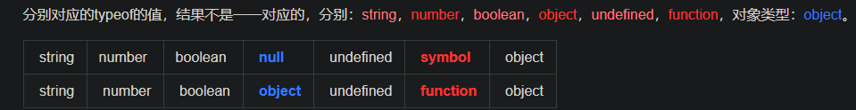

>基本类型：String、Number、Boolean、Symbol、Undefined、Null 
>引用类型：Object 。 引用类型除 Object 外，还包括 Function 、Array、RegExp、Date 等等。


> 基本类型   也称 简单类型， 由于其占据空间固定，是简单的数据段，为了便于提升变量查询速度，将其存储在  **栈** 中，即   **按值访问**。
> 引用类型   也称 复杂类型，由于其值的大小会改变，所以不能将其存放在 栈 中 ，否则会降低变量查询速度，因此，其值存储在 **堆（heap）** 中，而存储在变量处的值，是一个指针，指向存储对象的内存处，即 **按址访问**。
## 一、typeof
typeof是最经常用到的判断类型的。

```js
typeof('saucxs')    //'string'
typeof 'saucxs'   //'string'
typeof function(){console.log('saucxs')}   //'function'
typeof ['saucxs','songEagle',1,2,'a']    //'object'
typeof {name: 'saucxs'}    //'object'
typeof 1   //'number'
typeof undefined     //'undefined'
typeof null    //'object'
typeof /^\d/   //'object'
typeof Symbol   // 'function'
```



**注意：typeof 可以检测函数类型**

但是在object下还有很多细分内部属性：Array，Function，Date，RegExp，Error等。

```js
var date = new Date();
var error = new Error();
console.log(typeof date); // object
console.log(typeof error); // object
```