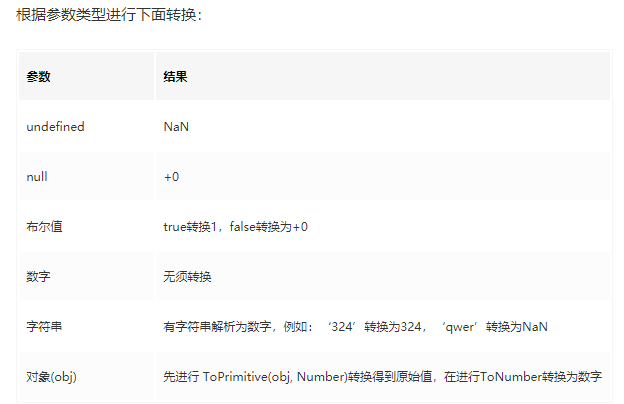
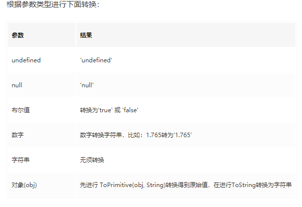
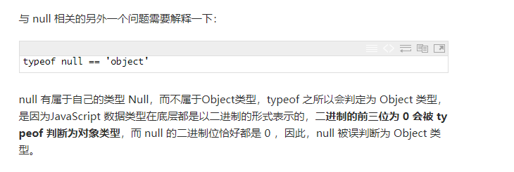

## 一、你所忽略的js隐式转换

### 1、js数据类型
>js中有7种数据类型，可以分为两类：原始类型、对象类型。
>基础类型（原始值）：
>Undefined、Null、String、Number、Boolean、Symbol（es6）
>复杂类型（对象值）：
>Object

### 2、三种隐式转换类型

>涉及隐式转换最多的两个运算符 + 和 ==。

隐式转换中主要涉及到三种转换：

* 1、将值转为原始值，ToPrimitive()。
* 2、将值转为数字，ToNumber()。
* 3、将值转为字符串，ToString()。

#### 2.1、通过ToPrimitive将值转换为原始值。
js引擎内部的抽象操作ToPrimitive有这这样的签名：
```js
ToPrimitive(input, PreferredType?)
```

input 是要转换的值，PreferredType是可选参数，可以是Number或String类型。他只是一个转换标志，转化后的结果并不一定是这个参数所值的类型，但转换结果一定是一个原始值（或报错）。

##### 2.1.1如果PreferredType被标记为Number，则会进行下面的操作流程来转换输入的值。
```tex?linenums
1、如果输入的值已经是一个原始值，则直接返回它
2、否则，如果输入的值是一个对象，则调用该对象的valueOf()方法，
   如果valueOf()方法的返回值是一个原始值，则返回这个原始值。
3、否则，调用这个对象的toString()方法，如果toString()方法返回的是一个原始值，则返回这个原始值。
4、否则，抛出TypeError异常。
```
##### 2.1.2、如果PreferredType被标记为String，则会进行下面的操作流程来转换输入的值。

```tex?linenums
1、如果输入的值已经是一个原始值，则直接返回它
2、否则，调用这个对象的toString()方法，如果toString()方法返回的是一个原始值，则返回这个原始值。
3、否则，如果输入的值是一个对象，则调用该对象的valueOf()方法，
   如果valueOf()方法的返回值是一个原始值，则返回这个原始值。
4、否则，抛出TypeError异常。
```

既然PreferredType是可选参数，那么如果没有这个参数时，怎么转换呢？PreferredType的值会按照这样的规则来自动设置：

```tex?linenums
1、该对象为Date类型，则PreferredType被设置为String
2、否则，PreferredType被设置为Number
```

##### 2.1.3、valueOf方法和toString方法解析
对于js的常见内置对象：Date, Array, Math, Number, Boolean, String, Array, RegExp, Function。

1、Number、Boolean、String这三种构造函数生成的基础值的对象形式，通过valueOf转换后会变成相应的原始值。如：

```js?linenums
var num = new Number('123');
num.valueOf(); // 123

var str = new String('12df');
str.valueOf(); // '12df'

var bool = new Boolean('fd');
bool.valueOf(); // true
```
2、Date这种特殊的对象，其原型Date.prototype上内置的valueOf函数将日期转换为日期的毫秒的形式的数值。

```js?linenums
var a = new Date();
a.valueOf(); // 1515143895500
```

3、除此之外返回的都为this，即对象本身：

```js?linenums
var a = new Array();
a.valueOf() === a; // true

var b = new Object({});
b.valueOf() === b; // true
```
再来看看toString函数，其转换结果是什么？对于js的常见内置对象：Date, Array, Math, Number, Boolean, String, Array, RegExp, Function。


1、Number、Boolean、String、Array、Date、RegExp、Function这几种构造函数生成的对象，通过toString转换后会变成相应的字符串的形式，因为这些构造函数上封装了自己的toString方法。如：

```js?linenums
Number.prototype.hasOwnProperty('toString'); // true
Boolean.prototype.hasOwnProperty('toString'); // true
String.prototype.hasOwnProperty('toString'); // true
Array.prototype.hasOwnProperty('toString'); // true
Date.prototype.hasOwnProperty('toString'); // true
RegExp.prototype.hasOwnProperty('toString'); // true
Function.prototype.hasOwnProperty('toString'); // true

var num = new Number('123sd');
num.toString(); // 'NaN'

var str = new String('12df');
str.toString(); // '12df'

var bool = new Boolean('fd');
bool.toString(); // 'true'

var arr = new Array(1,2);
arr.toString(); // '1,2'

var d = new Date();
d.toString(); // "Wed Oct 11 2017 08:00:00 GMT+0800 (中国标准时间)"

var func = function () {}
func.toString(); // "function () {}"
```

除这些对象及其实例化对象之外，其他对象返回的都是该对象的类型都是继承的Object.prototype.toString方法。

```js?linenums
var obj = new Object({});
obj.toString(); // "[object Object]"

Math.toString(); // "[object Math]"
```

valueOf函数会将Number、String、Boolean基础类型的对象类型值转换成 基础类型，Date类型转换为毫秒数，其它的返回对象本身，而toString方法会将所有对象转换为字符串。显然对于大部分对象转换，valueOf转换更合理些，因为并没有规定转换类型，应该尽可能保持原有值，而不应该想toString方法一样，一股脑将其转换为字符串。

所以对于没有指定PreferredType类型时，先进行valueOf方法转换更好，故将PreferredType设置为Number类型。

而对于Date类型，其进行valueOf转换为毫秒数的number类型。在进行隐式转换时，没有指定将其转换为number类型时，将其转换为那么大的number类型的值显然没有多大意义。（不管是在+运算符还是==运算符）还不如转换为字符串格式的日期，所以默认Date类型会优先进行toString转换。故有以上的规则：

PreferredType没有设置时，Date类型的对象，PreferredType默认设置为String，其他类型对象PreferredType默认设置为Number。

#### 2.2、通过ToNumber将值转换为数字



#### 2.3、通过ToString将值转换为字符串


例子：

```js
({} + {}) = ?
两个对象的值进行+运算符，肯定要先进行隐式转换为原始类型才能进行计算。
1、进行ToPrimitive转换，由于没有指定PreferredType类型，{}会使默认值为Number，进行ToPrimitive(input, Number)运算。
2、所以会执行valueOf方法，({}).valueOf(),返回的还是{}对象，不是原始值。
3、继续执行toString方法，({}).toString(),返回"[object Object]"，是原始值。
故得到最终的结果，"[object Object]" + "[object Object]" = "[object Object][object Object]"
```

```js?linenums
2 * {} = ?
1、首先*运算符只能对number类型进行运算，故第一步就是对{}进行ToNumber类型转换。
2、由于{}是对象类型，故先进行原始类型转换，ToPrimitive(input, Number)运算。
3、所以会执行valueOf方法，({}).valueOf(),返回的还是{}对象，不是原始值。
4、继续执行toString方法，({}).toString(),返回"[object Object]"，是原始值。
5、转换为原始值后再进行ToNumber运算，"[object Object]"就转换为NaN。
故最终的结果为 2 * NaN = NaN
```

### 3、== 运算符隐式转换

== 运算符的规则规律性不是那么强，按照下面流程来执行,es5文档

>比较运算 x==y, 其中 x 和 y 是值，返回 true 或者 false。这样的比较按如下方式进行：
>1、若 Type(x) 与 Type(y) 相同， 则
> * 1* 若 Type(x) 为 undefined， 返回 true。
> * 2* 若 Type(x) 为 null， 返回 true。
> * 3* 若 Type(x) 为 Number， 则
        (1)、若 x 为 NaN， 返回 false。
        (2)、若 y 为 NaN， 返回 false。
        (3)、若 x 与 y 为相等数值， 返回 true。
        (4)、若 x 为 +0 且 y 为 −0， 返回 true。
        (5)、若 x 为 −0 且 y 为 +0， 返回 true。
        (6)、返回 false。
> *  4* 若 Type(x) 为 String, 则当 x 和 y 为完全相同的字符序列（长度相等且相同字符在相同位置）时返回 true。 否则， 返回 false。
> *  5* 若 Type(x) 为 Boolean, 当 x 和 y 为同为 true 或者同为 false 时返回 true。 否则， 返回 false。
> *  6*  当 x 和 y 为引用同一对象时返回 true。否则，返回 false。
> 
>2、若 x 为 null 且 y 为 undefined， 返回 true。
>3、若 x 为 undefined 且 y 为 null， 返回 true。
>4、若 Type(x) 为 Number 且 Type(y) 为 String，返回比较 x == ToNumber(y) 的结果。
>5、若 Type(x) 为 String 且 Type(y) 为 Number，返回比较 ToNumber(x) == y 的结果。
>6、若 Type(x) 为 Boolean， 返回比较 ToNumber(x) == y 的结果。
>7、若 Type(y) 为 Boolean， 返回比较 x == ToNumber(y) 的结果。
>8、若 Type(x) 为 String 或 Number，且 Type(y) 为 Object，返回比较 x == ToPrimitive(y) 的结果。
>9、若 Type(x) 为 Object 且 Type(y) 为 String 或 Number， 返回比较 ToPrimitive(x) == y 的结果。
>10、返回 false。


### 4、对象转换为原始值的步骤
所有对象都继承了两个转换方法:toString()和valueOf。

**toString()** 的作用是返回这个对象的字符串。

```js 
console.log(({x:0,y:1}).toString());//输出"[object object]"
console.log([1,2,3].toString());//输出1,2,3
console.log((function(x){f(x);}).toString());//输出"function(x){f(x);}"
console.log(new Date(2017,1,14).toString());//输出Tue Feb 14 2017 00:00:00 GMT+0800 (中国标准时间)
var pattern=/\d+/g;
console.log(pattern.toString());///\d+/g
```

**valueOf()** 方法的任务并未详细定义:如果存在任意的原始值,它就默认将对象转换为它的原始值。

对象时复合值而且大多数对象无法真正表示一个原始值,因此默认valueOf()方法简单地返回对象本身,而不是返回一个原始值。

**数组、函数、正则** 表达式都继承了这个默认方法,调用这些类型实例的valueOf()方法只是返回对象本身。

**日期类** 对象的valueOf()方法一个它的内部表示,从1970年1月1日以来总的毫秒数。

```js?linenums
console.log(({x:0,y:1}).valueOf());//输出Object {x: 0, y: 1}

console.log([1,2,3].valueOf());//输出 [1, 2, 3]

console.log((function(x){f(x);}).valueOf());//输出function (x){f(x);}

var d=new Date(2017,1,14);
console.log(d.valueOf());//1487001600000

var n=new Number(1); 
console.log(n.valueOf());//输出1

var b=new Boolean(false);
console.log(b.valueOf());//输出false

var str=new String("str");
console.log(str.valueOf());//输出str

```

**需要注意的特殊转换:**

```js?linenums
var n=new Number("a"); 
console.log(n.valueOf());//NaN

var b=new Boolean("str");
console.log(b.valueOf());//输出true
```

**总的而言,** 在JavaScript中 **对象到字符串的转换** 经过如下步骤: 

* 1、如果对象具有toString()方法,则调用这个方法。如果返回一个原始值,JavaScript将这个值转换字符串,并返回这个字符串的结果。 
* 2、如果对象没有toString()方法或者这个方法并不是返回一个原始值,那么JavaScript会调用valueOf()方法。如果存在这个方法,JavaScript调用它。如果返回值是原始值,将这个值转换为字符串,然后返回。
* 3、如果无法从toString()和valueOf()获得一个原始值,此时就会抛出一个类型错误。

**在对象到数字的转换过程中**：
* 1、它首先尝试调用valueOf()方法。 
* 2、如果对象具有valueOf()方法,并返回一个原始值,则JavaScript将这个原始值转换为数字,并返回这个数字。 
* 3、否则,对象尝试去调用toString()方法,返回一个原始值,则JavaScript返回这个值。 
* 4、如果无法从valueOf()和toString()获得一个原始值,此时就会抛出一个类型错误。

注意


## 二、数值转换

>有三个函数可以把非数字转换为数值： **Number()** 和 **parseInt()** 和 **parseFloat()**。
>Number()，即可以用于任何数据类型。
>parseInt() 和 parseFloat()，则专门用于把字符串转换为数值。

### 1、Number()
**Number()**函数的转换规则如下：

* 如果是Boolean值，true和false将分别被转换为 1 和 0；
* 如果是数字值，只是简单的传入和返回。
* 如果是null值，返回0；
* 如果是undefined，返回NaN。
* 如果是字符串，遵循下列规则：
* * 如果字符串中只包含数字（包括前面带﹢或者 - 号的情况）、则将其转换为十进制数值，即'1'会变成 1， '123' 会变成 123，而 '011' 会变成 11（注意：前面的0会被忽略）。
* * 如果字符串中包含有效的浮点数格式，如：‘1.1’则将其转换为对应的浮点数数值（同样，也会忽略前导零）；
* * 如果字符串中包含有效的十六进制格式，例如"0xf",则将其转换为相同大小的十进制整数值；
* * 如果字符串是空的（不包含任何字符），则将其转换为0；
* * 如果字符串中包含除上述格式之外的字符，则将其转换为NaN。
* 如果是对象，则调用对象的valueOf()方法，然后依照前面的规则转换返回的值。如果转换的结果是NaN，则调用对象的toString()方法，然后再依照前面的规则转换返回的字符串值。

### 2、parseInt()

在转换字符串时，更多的是看其是否符合数值模式。
* 1、它会忽略字符串前面的空格直到找到第一个非空格字符。
* 2、如果第一个字符不是数字字符或者负号，parseInt()就会返回NaN;也就是说，用parseInt()转换空字符串会返回NaN（Number()对空字符串会返回0）。
* 3、如果第一个字符是数字字符，parseInt()会继续解析第二个字符，直到解析完所有后续字符或者遇到了一个非数字字符。例如，‘123blue’会被转换为 123，因为“blue“ 会被忽略。类似的 ”22.5“会被转换为 22 ，因为小数点并不是有有效的数字字符。
* 4、parseInt() 也能够识别各种整数格式（十进制、八进制、十六进制）。例如： parseInt('0xA')；//10(十六进制)
* 5、可以有第二个参数。转换是 第二个参数的意思是 以第二个参数为基数转换为10进制。
    例如： parseInt('AF',16);//175
	
	
### 3、parseFloat()

从第一个字符开始解析每个字符，一直解析到字符串末尾或者解析到遇到一个无效的浮点数数字字符为止。也就是说第一个小数点是有效的，第二个则无效，则因此它后面的字符串将被忽略。

可以识别所有的浮点数格式，也包括十进制整数格式。但十六进制的字符串则始终被解析为 0 ；parseFloat()只解析十进制数值。

## 三、转换为字符串

**toString()**

数值、布尔值、对象和字符串值都有toString（）方法，但 null 和 undefined 值没有这个方法。

也可以接受参数，可以输出二进制、八进制、十六进制。

**toString()** 函数遵循下列转换规则：

* 如果值为toString()方法，则调用该方法（没有参数）并返回相应的结果。
* 如果值为null，则返回 null;
* 如果值为undefined，则返回undefined。

## 四、原始值 (primitive values)

>除 Object 以外的所有类型都是不可变的（值本身无法被改变）。例如，与 C 语言不同，JavaScript 中字符串是不可变的（译注：如，JavaScript 中对字符串的操作一定返回了一个新字符串，原始字符串并没有被改变）。我们称这些类型的值为“原始值”。

### 1、 布尔类型

表示一个逻辑实体，可以有两个值：true 和 false。

### 2、Null 类型

只有一个值，null 

### 3、Undefined类型

一个没有被赋值的变量会有个默认的值 undefined。

### 4、数字类型

根据 ECMAScript 标准，JavaScript 中只有一种数字类型：基于 IEEE 754 标准的双精度 64 位二进制格式的值（-(263 -1) 到 263 -1）。）。它并没有为整数给出一种特定的类型。除了能够表示浮点数外，还有一些带符号的值：+Infinity，-Infinity 和 NaN (非数值，Not-a-Number)。你可以使用常量 Number.MAX_VALUE 和 Number.MIN_VALUE。

### 5、字符串类型

JavaScript的字符串类型用于表示文本数据。它是一组16位的无符号整数值的“元素”。在字符串中的每个元素占据了字符串的位置。第一个元素的索引为0，下一个是索引1，依此类推。字符串的长度是它的元素的数量。

## 五、Js 变量声明提升和函数声明提升

>Js代码分为两个阶段：编译阶段和执行阶段
>Js代码的编译阶段会找到所有的声明，并用合适的作用域将它们关联起来，这是词法作用域的核心内容
>包括变量声明(var a)和函数声明(function a(){})在内的所有声明都会在代码被执行前的编译阶段首先被处理

>只有声明操作会被提升，赋值和逻辑操作会被留在原地等待执行

### 1、变量声明

>变量声明看成两个部分分别是声明操作(var a)和赋值操作(a=2)

>声明操作在编译阶段进行，声明操作会被提升到执行环境的顶部，值是undefined(表示未初始化)
>赋值操作会被留在原地等待执行阶段

```js?linenums
function foo() {
   console.log(a); //undefined
   var a = 10;
   console.log(a); //10
}
foo();
//相当于
function foo() {
  var a;
   console.log(a); //undefined
   a = 10;
   console.log(a); //10
}
foo();
```

```js?linenums
var foo = 2;
function foo() {
   console.log(a); //undefined
   var a = 10;
   console.log(a); //10
}
console.log(foo);// 2

//注意：函数的提升会先于变量。

//相当于

function foo() {
   console.log(a); //undefined
   var a = 10;
   console.log(a); //10
}
var foo = 2; //最开始 foo 是函数 ，之后foo被覆盖
console.log(foo);// 2
```

### 2、函数声明

>定义函数有两种方式：函数声明和函数表达式
>函数声明提升会在编译阶段把声明和函数体整体都提前到执行环境顶部，所以我们可以在函数声明之前调用这个函数
>函数表达式，其实就是变量声明的一种，声明操作会被提升到执行环境顶部，并赋值undefined。赋值操作被留在原地等到执行

```js?linenums
a();//This is a function body  函数声明提升

function a() {
    console.log('This is a function body');
}
```

#### 1.函数声明提升优于变量声明提升

```js?linenums
a();// 1

var a;
function a() {
    console.log(1);
}
a = function() {
    console.log(2);
}

a();//2

//相当于 

function a() {
    console.log(1);
}
a();
a = function() {
    console.log(2);
}
a();

```

var a ; 属于重复声明，被忽略掉了。然而后续的函数声明还是会覆盖之前的函数声明。如下：

```js?linenums
a();//3

var a;
function a() {
    console.log(1);
}
a = function() {
    console.log(2);
}
function a() {
    console.log(3);
}
a();//2
```

## 六、解决弹出的窗口window.open会被浏览器阻止的问题

### 6.1 原因
 	当浏览器检测到非用户操作产生的新弹出窗口，则会对其进行阻止。因为浏览器认为这不是用户希望看到的页面。
 	在chrome的安全机制里面，非用户触发的window.open方法，是会被拦截的。
	
### 6.2 会被拦截的情况

```js?linenums
var btn = $('#btn');
btn.click(function () {
    $.ajax({
        url: 'ooxx',
        success: function (url) {
            //会被拦截
            window.open(url);
        }
    })
});

//用户没有直接出发window.open，而是发出一个ajax请求，window.open方法被放在了ajax的回调函数里，这样的情况是会被拦截的
```
  ### 6.3 解决办法
  
  ```js
var btn = $('#btn');
btn.click(function () {
    //打开一个不被拦截的新窗口
    var newWindow = window.open();
    $.ajax({
        url: 'ooxx',
        success: function (url) {
            //修改新窗口的url
            newWindow.location.href = url;
        }
    })
});
  ```