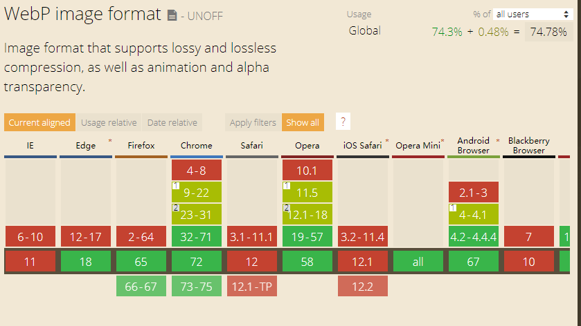
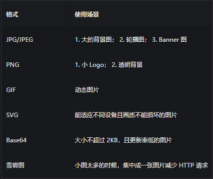
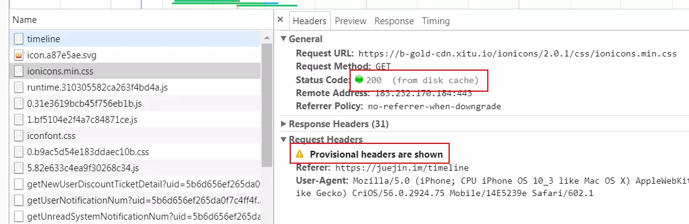
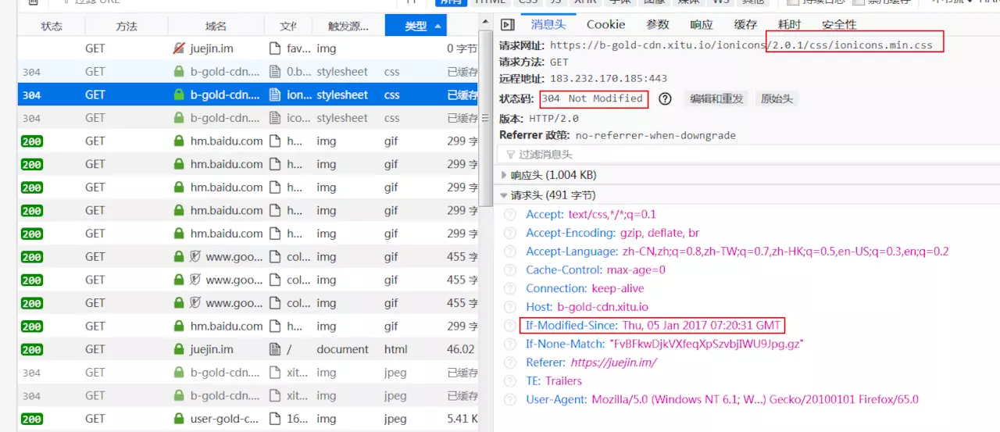
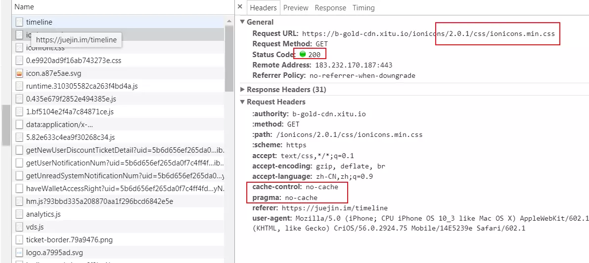
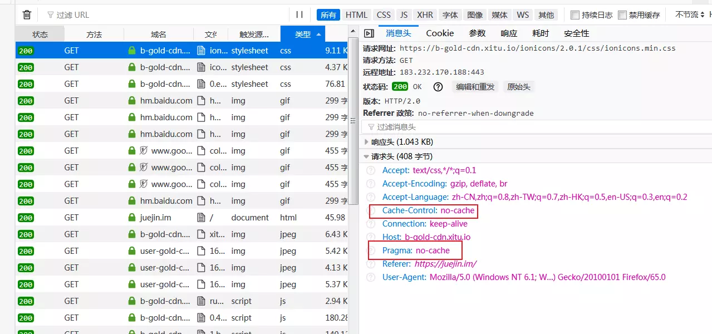

## 一、你所忽略的js隐式转换

### 1、js数据类型
>js中有7种数据类型，可以分为两类：原始类型、对象类型。
>基础类型（原始值）：
>Undefined、Null、String、Number、Boolean、Symbol（es6）
>复杂类型（对象值）：
>Object

### 2、三种隐式转换类型

>涉及隐式转换最多的两个运算符 + 和 ==。

隐式转换中主要涉及到三种转换：

* 1、将值转为原始值，ToPrimitive()。
* 2、将值转为数字，ToNumber()。
* 3、将值转为字符串，ToString()。

#### 2.1、通过ToPrimitive将值转换为原始值。
js引擎内部的抽象操作ToPrimitive有这这样的签名：
```js
ToPrimitive(input, PreferredType?)
```

input 是要转换的值，PreferredType是可选参数，可以是Number或String类型。他只是一个转换标志，转化后的结果并不一定是这个参数所值的类型，但转换结果一定是一个原始值（或报错）。

##### 2.1.1如果PreferredType被标记为Number，则会进行下面的操作流程来转换输入的值。
```tex?linenums
1、如果输入的值已经是一个原始值，则直接返回它
2、否则，如果输入的值是一个对象，则调用该对象的valueOf()方法，
   如果valueOf()方法的返回值是一个原始值，则返回这个原始值。
3、否则，调用这个对象的toString()方法，如果toString()方法返回的是一个原始值，则返回这个原始值。
4、否则，抛出TypeError异常。
```
##### 2.1.2、如果PreferredType被标记为String，则会进行下面的操作流程来转换输入的值。

```tex?linenums
1、如果输入的值已经是一个原始值，则直接返回它
2、否则，调用这个对象的toString()方法，如果toString()方法返回的是一个原始值，则返回这个原始值。
3、否则，如果输入的值是一个对象，则调用该对象的valueOf()方法，
   如果valueOf()方法的返回值是一个原始值，则返回这个原始值。
4、否则，抛出TypeError异常。
```

既然PreferredType是可选参数，那么如果没有这个参数时，怎么转换呢？PreferredType的值会按照这样的规则来自动设置：

```tex?linenums
1、该对象为Date类型，则PreferredType被设置为String
2、否则，PreferredType被设置为Number
```

##### 2.1.3、valueOf方法和toString方法解析
对于js的常见内置对象：Date, Array, Math, Number, Boolean, String, Array, RegExp, Function。

1、Number、Boolean、String这三种构造函数生成的基础值的对象形式，通过valueOf转换后会变成相应的原始值。如：

```js?linenums
var num = new Number('123');
num.valueOf(); // 123

var str = new String('12df');
str.valueOf(); // '12df'

var bool = new Boolean('fd');
bool.valueOf(); // true
```
2、Date这种特殊的对象，其原型Date.prototype上内置的valueOf函数将日期转换为日期的毫秒的形式的数值。

```js?linenums
var a = new Date();
a.valueOf(); // 1515143895500
```

3、除此之外返回的都为this，即对象本身：

```js?linenums
var a = new Array();
a.valueOf() === a; // true

var b = new Object({});
b.valueOf() === b; // true
```
再来看看toString函数，其转换结果是什么？对于js的常见内置对象：Date, Array, Math, Number, Boolean, String, Array, RegExp, Function。


1、Number、Boolean、String、Array、Date、RegExp、Function这几种构造函数生成的对象，通过toString转换后会变成相应的字符串的形式，因为这些构造函数上封装了自己的toString方法。如：

```js?linenums
Number.prototype.hasOwnProperty('toString'); // true
Boolean.prototype.hasOwnProperty('toString'); // true
String.prototype.hasOwnProperty('toString'); // true
Array.prototype.hasOwnProperty('toString'); // true
Date.prototype.hasOwnProperty('toString'); // true
RegExp.prototype.hasOwnProperty('toString'); // true
Function.prototype.hasOwnProperty('toString'); // true

var num = new Number('123sd');
num.toString(); // 'NaN'

var str = new String('12df');
str.toString(); // '12df'

var bool = new Boolean('fd');
bool.toString(); // 'true'

var arr = new Array(1,2);
arr.toString(); // '1,2'

var d = new Date();
d.toString(); // "Wed Oct 11 2017 08:00:00 GMT+0800 (中国标准时间)"

var func = function () {}
func.toString(); // "function () {}"
```

除这些对象及其实例化对象之外，其他对象返回的都是该对象的类型都是继承的Object.prototype.toString方法。

```js?linenums
var obj = new Object({});
obj.toString(); // "[object Object]"

Math.toString(); // "[object Math]"
```

valueOf函数会将Number、String、Boolean基础类型的对象类型值转换成 基础类型，Date类型转换为毫秒数，其它的返回对象本身，而toString方法会将所有对象转换为字符串。显然对于大部分对象转换，valueOf转换更合理些，因为并没有规定转换类型，应该尽可能保持原有值，而不应该想toString方法一样，一股脑将其转换为字符串。

所以对于没有指定PreferredType类型时，先进行valueOf方法转换更好，故将PreferredType设置为Number类型。

而对于Date类型，其进行valueOf转换为毫秒数的number类型。在进行隐式转换时，没有指定将其转换为number类型时，将其转换为那么大的number类型的值显然没有多大意义。（不管是在+运算符还是==运算符）还不如转换为字符串格式的日期，所以默认Date类型会优先进行toString转换。故有以上的规则：

PreferredType没有设置时，Date类型的对象，PreferredType默认设置为String，其他类型对象PreferredType默认设置为Number。

#### 2.2、通过ToNumber将值转换为数字


#### 2.3、通过ToString将值转换为字符串


例子：

```js
({} + {}) = ?
两个对象的值进行+运算符，肯定要先进行隐式转换为原始类型才能进行计算。
1、进行ToPrimitive转换，由于没有指定PreferredType类型，{}会使默认值为Number，进行ToPrimitive(input, Number)运算。
2、所以会执行valueOf方法，({}).valueOf(),返回的还是{}对象，不是原始值。
3、继续执行toString方法，({}).toString(),返回"[object Object]"，是原始值。
故得到最终的结果，"[object Object]" + "[object Object]" = "[object Object][object Object]"
```

```js?linenums
2 * {} = ?
1、首先*运算符只能对number类型进行运算，故第一步就是对{}进行ToNumber类型转换。
2、由于{}是对象类型，故先进行原始类型转换，ToPrimitive(input, Number)运算。
3、所以会执行valueOf方法，({}).valueOf(),返回的还是{}对象，不是原始值。
4、继续执行toString方法，({}).toString(),返回"[object Object]"，是原始值。
5、转换为原始值后再进行ToNumber运算，"[object Object]"就转换为NaN。
故最终的结果为 2 * NaN = NaN
```

### 3、== 运算符隐式转换

== 运算符的规则规律性不是那么强，按照下面流程来执行,es5文档

>比较运算 x==y, 其中 x 和 y 是值，返回 true 或者 false。这样的比较按如下方式进行：
>1、若 Type(x) 与 Type(y) 相同， 则
> * 1* 若 Type(x) 为 undefined， 返回 true。
> * 2* 若 Type(x) 为 null， 返回 true。
> * 3* 若 Type(x) 为 Number， 则
        (1)、若 x 为 NaN， 返回 false。
        (2)、若 y 为 NaN， 返回 false。
        (3)、若 x 与 y 为相等数值， 返回 true。
        (4)、若 x 为 +0 且 y 为 −0， 返回 true。
        (5)、若 x 为 −0 且 y 为 +0， 返回 true。
        (6)、返回 false。
> *  4* 若 Type(x) 为 String, 则当 x 和 y 为完全相同的字符序列（长度相等且相同字符在相同位置）时返回 true。 否则， 返回 false。
> *  5* 若 Type(x) 为 Boolean, 当 x 和 y 为同为 true 或者同为 false 时返回 true。 否则， 返回 false。
> *  6*  当 x 和 y 为引用同一对象时返回 true。否则，返回 false。
> 
>2、若 x 为 null 且 y 为 undefined，返回 true。
>3、若 x 为 undefined 且 y 为 null，返回 true。
>4、若 Type(x) 为 Number 且 Type(y) 为 String，返回比较 x == ToNumber(y) 的结果。
>5、若 Type(x) 为 String 且 Type(y) 为 Number，返回比较 ToNumber(x) == y 的结果。
>6、若 Type(x) 为 Boolean， 返回比较 ToNumber(x) == y 的结果。
>7、若 Type(y) 为 Boolean， 返回比较 x == ToNumber(y) 的结果。
>8、若 Type(x) 为 String 或 Number，且 Type(y) 为 Object，返回比较 x == ToPrimitive(y) 的结果。
>9、若 Type(x) 为 Object 且 Type(y) 为 String 或 Number， 返回比较 ToPrimitive(x) == y 的结果。
>10、返回 false。


### 4、对象转换为原始值的步骤
所有对象都继承了两个转换方法:toString()和valueOf。

**toString()** 的作用是返回这个对象的字符串。

```js 
console.log(({x:0,y:1}).toString());//输出"[object object]"
console.log([1,2,3].toString());//输出1,2,3
console.log((function(x){f(x);}).toString());//输出"function(x){f(x);}"
console.log(new Date(2017,1,14).toString());//输出Tue Feb 14 2017 00:00:00 GMT+0800 (中国标准时间)
var pattern=/\d+/g;
console.log(pattern.toString());///\d+/g
```

**valueOf()** 方法的任务并未详细定义:如果存在任意的原始值,它就默认将对象转换为它的原始值。

对象时复合值而且大多数对象无法真正表示一个原始值,因此默认valueOf()方法简单地返回对象本身,而不是返回一个原始值。

**数组、函数、正则** 表达式都继承了这个默认方法,调用这些类型实例的valueOf()方法只是返回对象本身。

**日期类** 对象的valueOf()方法一个它的内部表示,从1970年1月1日以来总的毫秒数。

```js?linenums
console.log(({x:0,y:1}).valueOf());//输出Object {x: 0, y: 1}

console.log([1,2,3].valueOf());//输出 [1, 2, 3]

console.log((function(x){f(x);}).valueOf());//输出function (x){f(x);}

var d=new Date(2017,1,14);
console.log(d.valueOf());//1487001600000

var n=new Number(1); 
console.log(n.valueOf());//输出1

var b=new Boolean(false);
console.log(b.valueOf());//输出false

var str=new String("str");
console.log(str.valueOf());//输出str

```

**需要注意的特殊转换:**

```js?linenums
var n=new Number("a"); 
console.log(n.valueOf());//NaN

var b=new Boolean("str");
console.log(b.valueOf());//输出true
```

**总的而言,** 在JavaScript中 **对象到字符串的转换** 经过如下步骤: 

* 1、如果对象具有toString()方法,则调用这个方法。如果返回一个原始值,JavaScript将这个值转换字符串,并返回这个字符串的结果。 
* 2、如果对象没有toString()方法或者这个方法并不是返回一个原始值,那么JavaScript会调用valueOf()方法。如果存在这个方法,JavaScript调用它。如果返回值是原始值,将这个值转换为字符串,然后返回。
* 3、如果无法从toString()和valueOf()获得一个原始值,此时就会抛出一个类型错误。

**在对象到数字的转换过程中**：
* 1、它首先尝试调用valueOf()方法。 
* 2、如果对象具有valueOf()方法,并返回一个原始值,则JavaScript将这个原始值转换为数字,并返回这个数字。 
* 3、否则,对象尝试去调用toString()方法,返回一个原始值,则JavaScript返回这个值。 
* 4、如果无法从valueOf()和toString()获得一个原始值,此时就会抛出一个类型错误。

注意


## 二、数值转换

>有三个函数可以把非数字转换为数值： **Number()** 和 **parseInt()** 和 **parseFloat()**。
>Number()，即可以用于任何数据类型。
>parseInt() 和 parseFloat()，则专门用于把字符串转换为数值。

### 1、Number()
**Number()**函数的转换规则如下：

* 如果是Boolean值，true和false将分别被转换为 1 和 0；
* 如果是数字值，只是简单的传入和返回。
* 如果是null值，返回0；
* 如果是undefined，返回NaN。
* 如果是字符串，遵循下列规则：
* * 如果字符串中只包含数字（包括前面带﹢或者 - 号的情况）、则将其转换为十进制数值，即'1'会变成 1， '123' 会变成 123，而 '011' 会变成 11（注意：前面的0会被忽略）。
* * 如果字符串中包含有效的浮点数格式，如：‘1.1’则将其转换为对应的浮点数数值（同样，也会忽略前导零）；
* * 如果字符串中包含有效的十六进制格式，例如"0xf",则将其转换为相同大小的十进制整数值；
* * 如果字符串是空的（不包含任何字符），则将其转换为0；
* * 如果字符串中包含除上述格式之外的字符，则将其转换为NaN。
* 如果是对象，则调用对象的valueOf()方法，然后依照前面的规则转换返回的值。如果转换的结果是NaN，则调用对象的toString()方法，然后再依照前面的规则转换返回的字符串值。

### 2、parseInt()

在转换字符串时，更多的是看其是否符合数值模式。
* 1、它会忽略字符串前面的空格直到找到第一个非空格字符。
* 2、如果第一个字符不是数字字符或者负号，parseInt()就会返回NaN;也就是说，用parseInt()转换空字符串会返回NaN（Number()对空字符串会返回0）。
* 3、如果第一个字符是数字字符，parseInt()会继续解析第二个字符，直到解析完所有后续字符或者遇到了一个非数字字符。例如，‘123blue’会被转换为 123，因为“blue“ 会被忽略。类似的 ”22.5“会被转换为 22 ，因为小数点并不是有有效的数字字符。
* 4、parseInt() 也能够识别各种整数格式（十进制、八进制、十六进制）。例如： parseInt('0xA')；//10(十六进制)
* 5、可以有第二个参数。转换是 第二个参数的意思是 以第二个参数为基数转换为10进制。
    例如： parseInt('AF',16);//175
	
	
### 3、parseFloat()

从第一个字符开始解析每个字符，一直解析到字符串末尾或者解析到遇到一个无效的浮点数数字字符为止。也就是说第一个小数点是有效的，第二个则无效，则因此它后面的字符串将被忽略。

可以识别所有的浮点数格式，也包括十进制整数格式。但十六进制的字符串则始终被解析为 0 ；parseFloat()只解析十进制数值。

## 三、转换为字符串

**toString()**

数值、布尔值、对象和字符串值都有toString（）方法，但 null 和 undefined 值没有这个方法。

也可以接受参数，可以输出二进制、八进制、十六进制。

**toString()** 函数遵循下列转换规则：

* 如果值为toString()方法，则调用该方法（没有参数）并返回相应的结果。
* 如果值为null，则返回 null;
* 如果值为undefined，则返回undefined。

## 四、原始值 (primitive values)

>除 Object 以外的所有类型都是不可变的（值本身无法被改变）。例如，与 C 语言不同，JavaScript 中字符串是不可变的（译注：如，JavaScript 中对字符串的操作一定返回了一个新字符串，原始字符串并没有被改变）。我们称这些类型的值为“原始值”。

### 1、 布尔类型

表示一个逻辑实体，可以有两个值：true 和 false。

### 2、Null 类型

只有一个值，null 

### 3、Undefined类型

一个没有被赋值的变量会有个默认的值 undefined。

### 4、数字类型

根据 ECMAScript 标准，JavaScript 中只有一种数字类型：基于 IEEE 754 标准的双精度 64 位二进制格式的值（-(263 -1) 到 263 -1）。）。它并没有为整数给出一种特定的类型。除了能够表示浮点数外，还有一些带符号的值：+Infinity，-Infinity 和 NaN (非数值，Not-a-Number)。你可以使用常量 Number.MAX_VALUE 和 Number.MIN_VALUE。

### 5、字符串类型

JavaScript的字符串类型用于表示文本数据。它是一组16位的无符号整数值的“元素”。在字符串中的每个元素占据了字符串的位置。第一个元素的索引为0，下一个是索引1，依此类推。字符串的长度是它的元素的数量。

## 五、Js 变量声明提升和函数声明提升

>Js代码分为两个阶段：编译阶段和执行阶段
>Js代码的编译阶段会找到所有的声明，并用合适的作用域将它们关联起来，这是词法作用域的核心内容
>包括变量声明(var a)和函数声明(function a(){})在内的所有声明都会在代码被执行前的编译阶段首先被处理

>只有声明操作会被提升，赋值和逻辑操作会被留在原地等待执行

### 1、变量声明

>变量声明看成两个部分分别是声明操作(var a)和赋值操作(a=2)

>声明操作在编译阶段进行，声明操作会被提升到执行环境的顶部，值是undefined(表示未初始化)
>赋值操作会被留在原地等待执行阶段

```js?linenums
function foo() {
   console.log(a); //undefined
   var a = 10;
   console.log(a); //10
}
foo();
//相当于
function foo() {
  var a;
   console.log(a); //undefined
   a = 10;
   console.log(a); //10
}
foo();
```

```js?linenums
var foo = 2;
function foo() {
   console.log(a); //undefined
   var a = 10;
   console.log(a); //10
}
console.log(foo);// 2

//注意：函数的提升会先于变量。

//相当于

function foo() {
   console.log(a); //undefined
   var a = 10;
   console.log(a); //10
}
var foo = 2; //最开始 foo 是函数 ，之后foo被覆盖
console.log(foo);// 2
```

### 2、函数声明

>定义函数有两种方式：函数声明和函数表达式
>函数声明提升会在编译阶段把声明和函数体整体都提前到执行环境顶部，所以我们可以在函数声明之前调用这个函数
>函数表达式，其实就是变量声明的一种，声明操作会被提升到执行环境顶部，并赋值undefined。赋值操作被留在原地等到执行

```js?linenums
a();//This is a function body  函数声明提升

function a() {
    console.log('This is a function body');
}
```

#### 1.函数声明提升优于变量声明提升

```js?linenums
a();// 1

var a;
function a() {
    console.log(1);
}
a = function() {
    console.log(2);
}

a();//2

//相当于 

function a() {
    console.log(1);
}
a();
a = function() {
    console.log(2);
}
a();

```

var a ; 属于重复声明，被忽略掉了。然而后续的函数声明还是会覆盖之前的函数声明。如下：

```js?linenums
a();//3

var a;
function a() {
    console.log(1);
}
a = function() {
    console.log(2);
}
function a() {
    console.log(3);
}
a();//2
```

## 六、解决弹出的窗口window.open会被浏览器阻止的问题

### 6.1 原因
 	当浏览器检测到非用户操作产生的新弹出窗口，则会对其进行阻止。因为浏览器认为这不是用户希望看到的页面。
 	在chrome的安全机制里面，非用户触发的window.open方法，是会被拦截的。
	
### 6.2 会被拦截的情况

```js?linenums
var btn = $('#btn');
btn.click(function () {
    $.ajax({
        url: 'ooxx',
        success: function (url) {
            //会被拦截
            window.open(url);
        }
    })
});

//用户没有直接出发window.open，而是发出一个ajax请求，window.open方法被放在了ajax的回调函数里，这样的情况是会被拦截的
```
  ### 6.3 解决办法
  
  ```js
var btn = $('#btn');
btn.click(function () {
    //打开一个不被拦截的新窗口
    var newWindow = window.open();
    $.ajax({
        url: 'ooxx',
        success: function (url) {
            //修改新窗口的url
            newWindow.location.href = url;
        }
    })
});
  ```
  
  **优化**
  
  ```js
var btn = $('#btn');
btn.click(function () {
    //打开一个不被拦截的新窗口
　var adPopup = window.open('about:blank', '_blank','width='+window.screen.width+',height='+window.screen.height+', ...');
    $.ajax({
        url: 'ooxx',
		type:'post',
		dataType:'json',
        success: function (url) {
            //修改新窗口的url
		   adPopup.blur();
		   adPopup.opener.focus();
		   adPopup.location = url;
        }
    })
});
  ```
  
## 七、js中的this详解

>8种情况：
> 1、全局环境调用下的this
> 2、事件处理函数中的this
> 3、对象方法内的this
> 4、构造函数中的this
> 5、原型链上函数中的this
> 6、getter和setter中的this
> 7、箭头函数中的this
> 8、call, apply, bind的用法


 ### 7.1 全局环境调用
 
 全局就是window这个对象
 
 ```js
 function fn1() {
 	console.log(this);
 }
 fn1();//window
 
 //相当于
 window.fn1();
```

全局下使用var声明的变量，都会隐式的被创建为windo对象的属性和方法。所以，到一个函数被调用而没有前缀的时候(也就是说不是通过"."符号来调用)，这其实就是全局对象window在调用它。因此，此时函数内部的this是指向window对象的。再来看个变化版本。

```js?linenums
let o = {
    name: 'abc',
    fn: function() {
        console.log( this.name);
    }
}

let fn2 = o.fn;
fn2();  // undefined
```

是的，虽然fn2拿到的是对象o里面的一个方法，但是，万变不离其宗，在执行fn2()的时候，仍然是没有前缀的，那是谁在调用fn2的？当然是window对象。所以这里的this也指向window。

#### 7.1.1 严格模式和非严格模式的区别

全局对象window调用的函数，内部的this就是指向window，但是有些问题需要注意。严格模式和非严格模式区别（‘use strict’）。在这个情况下，this的指向是有区别的。

非严格模式下如上已经说过了，指的是window对象，而严格模式下的全局调用，this指向的是undefined。

```js?linenums
'use strict'
function fn1() {
   console.log(this);
}
fn1();//undefined
```
### 7.2  事件处理函数中的this

js中对于事件的处理是采用异步回调的方式，对一个元素绑定一个回调函数，当事件触发的时候去执行这个函数。而对于回调函数的绑定，有下面几种情况：

* 元素标签内绑定
* 动态绑定
* 事件监听

#### 7.2.1 元素内绑定

```html?linenums
<div id="div1" onclick="console.log( this )"></div>
```

点击元素div1后，我们发现控制台打印的是"<div id="div1" onclick="console.log( this )">"，可以知道的是，元素内联所执行的语句中的this，指向的是元素本身。但是，有一个特例，来改动一下方式。

```html?linenums
<div id="div1" onclick="(function () {console.log( this )}()"></div>
```

这个个时候是一个匿名自执行函数，匿名自执行函数中的this，就不是指向元素本身了，而是window对象！我们可以这样理解，匿名自执行函数有独立的作用域，相当于是window在调用它。

#### 7.2.2 动态绑定

```js?linenums
let div1 = document.getElementById("div1");

div1.onclick = function() {
    console.log( this );    // div1
}
```

这是通过动态绑定的方式，给元素添加了事件，这种情况下，当回调函数执行的时候，是元素div1在调用它，所以此时函数内部的this，是指向元素div1的。

#### 7.2.3 事件监听

```js?linenums
let div1 = document.getElementById("div1");

div1.addEventListener("click", function() {
    console.log( this );    // div1
}, false);
```

同样的，通过事件监听器的方式绑定的回调函数，内部的this也是指向div1。

所以我们可以总结一下得知：事件处理函数中的this，指向的是触发这个事件的元素。

### 7.3  对象方法中的this

在JavaScript中，对象是可以有属性和方法的，这个方法，其实就是函数。既然是函数，那么内部肯定也会有this，作为对象方法中的this，到底是指的什么呢？看个简单的例子。

```js?linenums
var name = 'aaa';
let obj = {
    name: 'jack',
    fn: function() {
        console.log( this.name );
    }
}

let f1 = obj.fn;

obj.fn();   // jack
f1();       // aaa
```

作为对象的方法调用的函数，它内部的this，就指向这个对象。在这个例子中，当通过obj.fn()的形式调用fn函数的时候，它内部的this指的就是obj这个对象了。
。至于第二种情况，先把obj.fn赋值给f1，然后通过执行f1来执行函数的情况,这个时候，其实是window对象在调用f1,因此它内部的this就是指向window对象，因而打印的就是'aaa'。


如果是一个对象中嵌套着比较深的方法，它内部的this又是什么呢？

```js?linenums
let person = {
    name: 'jack',
    eat: {
        name: 'apple',
        fn1: function() {
            console.log( this.name );
        },
        obj: {
            name: 'grape',
            fn2: function() {
                console.log( this.name );
            }
        }
    }
}

person.eat.fn1();       // apple
person.eat.obj.fn2();   // grape
```

这里遵守一个就近原则：如果是通过对象方法的方式调用函数，则函数内部的this指向离它最近一级的那个对象。

### 7.4 构造函数中的this

构造函数其实就是普通的函数，只是它内部一般都书写了许多this，可以通过new的方式调用来生成实例，所以我们一般都用首字母大写的方式，来区分构造函数和一般的函数。构造函数，是JavaScript中书写面向对象的重要方式。

```js?linenums
function Fn1(name) {
    this.name = name;
}

let n1 = new Fn1('abc');
n1.name; // abc
```

这是一个非常简单的构造函数书写方式，以及对构造函数的调用。构造函数中的this，以及new调用的这种方式，其实都是为了能够创造实例服务的，否则也就没有意义了。那么，构造函数中的this也就很清楚了：它指向构造函数所创造的实例。当通过new方法调用构造函数的时候，构造函数内部的this就指向这实例，并将相应的属性和方法"生成"给这个实例。通过这个方法，生成的实例才能够获取属性和方法。
凡事总有例外嘛，构造函数中有这样一种例外，我们看看。

```js?linenums
function Fn1(name) {
    this.name = name;
    return null;
}

function Fn2(name) {
    this.name = name;
    return {a: '123'};
}

let f1 = new Fn1("ttt");
console.log( f1 );  // {name: "ttt"}

let f2 = new Fn2("ggg");
console.log( f2 );  // {a: "123"}
```

f1是通过new Fn1创建的一个实例，这没有问题。但f2为什么不是我们所想的结果呢？
当构造函数内部return的是一个对象类型的数据的时候，通过new所得到的，就是构造函数return出来的那个对象；当构造函数内部return的是基本类型数据(数字，字符串，布尔值，undefined,null)，那么对于创建实例没有影响。


### 7.5 原型链函数中的this

原型链函数中个this，其实跟构造函数中的this一样，也是指向创建的那个实例。

```js?linenums
function Fn() {
    this.name = '878978'
}

Fn.prototype.sum = function() {
    console.log(this)
    return this;
}

let f5 = new Fn();
let f6 = new Fn();

console.log( f5 === f5.sum() );     // true
console.log( f6 === f6.sum() );     // true
```

### 7.6  getter和setter中的this

我们知道，JavaScript中getter和setter是作为对对象属性读取和修改的一种劫持。可以分别在读取和设置对象相应属性的时候触发。

```js?linenums
let obj = {
    n: 1,
    m: 2,
    get sum() {
        console.log(this.n, this.m);
        return '正在尝试访问sum...';
    },
    set sum(k) {
        this.m = k;
        return '正在设置obj属性sum...';
    }
}

obj.sum;   // 1,2
obj.sum = 5;  // 正在设置obj属性sum..
```

getter和setter中的this，规则跟作为对象方法调用时候函数内部的this指向是一样的，它指的就是这个对象本身。


#### 7.7 箭头函数中的this

由于箭头函数不绑定this， 它会捕获其所在（即定义的位置）上下文的this值， 作为自己的this值，
* 所以 call() / apply() / bind() 方法对于箭头函数来说只是传入参数，对它的 this 毫无影响。
* 考虑到 this 是词法层面上的，严格模式中与 this 相关的规则都将被忽略。（可以忽略是否在严格模式下的影响）


箭头函数是ES6中新推出的一种函数简写方法，跟ES5函数最大的区别，就要数它的this规则了。在ES5的函数中，this都是在函数调用的时候，才能确定具体的this指向。而箭头函数，其实是没有this的，但是它内部的这个所谓this，在箭头函数书写的时候，就已经绑定了(绑定父级的this)，并且无法改变。看个例子。

```js?linenums
let div1 = document.getElementById("div");

div1.onclick = function() {
    setTimeout(() => {
        console.log( this );    // div1
    }, 500);
}
```

setTimeout中所绑定的回调函数，其实是window在调用它，所以它内部的this指向的是window。
但是，当回调函数是箭头函数的写法的时候，内部的this竟然是div1！这在箭头函数书写的时候，就已经决定了它内部的this指向，就是它父级的this。而它父级函数作用域中的this，其实就是元素div1。作为对象方法的箭头函数，其实也是类似的道理。

```js?linenums
var name = 'aaa';
let obj = {
    name: 'jack',
    fn1: () => {
        console.log( this.name );
    }
}

obj.fn1();  // aaa
```

没错，还是那句话，当我们写下箭头函数的时候，它内部的this就已经确定了，并且无法修改(call, apply, bind)。这个例子中，箭头函数最近的父级作用域显然是全局环境window，因此它的this就指向window。

因为箭头函数可以捕获其所在上下文的this值 所以

```js?linenums
function Person() {  
    this.age = 0;  
    setInterval(() => {
        // 回调里面的 `this` 变量就指向了期望的那个对象了
        this.age++;
    }, 3000);
}

var p = new Person();
```

call等的绑定情况下：

```js?linenums
var obj2 = {
    id: 2333,
    test: () => console.log(this)
}
obj2.test();//window
obj2.test.call(obj2);//window
```

### 7.8 call, apply, bind的用法

#### 7.8.1 call

call方法可以实现对函数的立即调用，并且显示的指定函数内部的this以及传参。

```js?linenums
let obj = {
    color: 'green'
}

function Fn() {
    console.log( this.color );
}

Fn();   // undefined

Fn.call(obj);   // green
```

call可以实现对函数的立即调用，并且改变函数内部的this指向。上面的例子中，直接调用函数Fn的时候，它内部的this指向window对象，因此打印的是undefined；当通过call指定函数内部的this指向obj的时候，它就能获取到obj上的属性和方法了。call调用还能实现调用时候的传参，请看。

```js?linenums
let obj = {
    color: 'blue'
}

function Fn(height, width) {
    console.log(`the tree is ${this.color}, and the tall is ${height}, width is ${width}`);
}

Fn.call(obj, 20, 3);   // the tree is blue, and the tall is 20, width is 3
```

#### 7.8.2 apply

apply的作用和call是一模一样的，都是实现对函数内部this的改变，唯一的区别就是传参的方式不一样：call是通过一个一个参数的方式传递参数，而apply是通过数组的形式传递多个参数。

```js?linenums
let obj = {
    color: 'orange'
}

function Fn(height, width) {
    console.log(`the tree is ${this.color}, and the tall is ${height}, width is ${width}`);
}

Fn.apply(obj, [16, 7]);   // the tree is orange, and the tall is 16, width is 7
```

#### 7.8.3 bind

call和apply都是实现对函数的立即调用，并且改变函数内部this的指向，如果说我只想改变函数内部的this，而不执行函数，该怎么办？这个时候，就需要用到bind。

```js?linenums
let person = {
    name: 'jack'
}

function Person() {
    console.log(this.name);
}

let p1 = Person.bind(person);
p1();   // 'jack'
```

当一个函数执行完bind方法后，会返回一个新的函数，而这个新的函数跟原函数相比，内部的this指向被显示的改变了。但是不会立即执行新的函数，而是在你需要的时候才去调用。
但是有一点需要注意，返回的新函数p1，它内部的this就无法再改变了。接着上面的例子。

```js?linenums
let animal = {
    name: 'animal'
}

let p2 = p1.bind();
p2();   // 'jack'
```

p2的this依然是指向obj,而非animal。

## 八、常用图片的区分、它们的优劣势以及使用场景等

> 图片格式： JPEG/JPG  、 PNG （PNG-24/PNG-8）、GIF 、SVG、BMP、Base64、雪碧图（不属于格式，但属于一种应用形式）、WebP

**图片从类型上分，可以分为 位图 和 矢量图：**
* 位图。又叫点阵图或者像素图，计算机屏幕上的图是由屏幕上的发光点（像素）构成的，每个点用二进制数据来描述其颜色与亮度等信息。因为这些点是离散的，类似于点阵，同时因为多个像素的色彩组合就形成了图片，所以叫这种图为点阵图或者位图。常见的位图有JPG、PNG、GIF等格式。
* 矢量图。又叫向量图，是由一系列计算机指令来描述和记录一幅图，一幅图可以解为点、线、面等组成的子图。生成的矢量图文件存储量很小，特别适用于文字设计、图案设计等，而在前端中比较常用的矢量图有svg等格式

**按压缩划分，可以将图片分为 无损压缩 和 有损压缩：**

* 无损压缩：指对文件本身的压缩，使图片占用的存储空间小，并且不会损害图片的质量。常见无损压缩有PNG等。
* 有损压缩：有损压缩是对图像本身的改变，会对图片质量造成损害，随着压缩次数越来越多，那么图片质量会越来越差。常见有损压缩有JPG等。

最后，究根结底，我们需要知道在计算机中，像素是用二进制来表示的。不同图片格式中像素与二进制位数之间的对应关系是不同的。一个像素对应的二进制位数越多，那么它可以表示的颜色种类就越多，成像效果也就越细腻，文件体积相应也会越大。

一个二进制位表示两种颜色 【 0|1 <——对应——> 黑|白 】，如果一种图片格式对应的二进制位数有 n 个，那么它就可以呈现 2^n 中颜色。例如：
* PNG-8：它有 2^8 种颜色，即 256 种颜色。
* PNG-24：它有 2^24 种颜色，即 1677216 种颜色（1600 万种颜色）。

### 8.1 BMP

取自英文单词 BitMap。Windows 中文版译作 位图，它的文件结构很简单，没有压缩，一个一个像素地记录下来。现在基本没用到了

### 8.2 JPEG

关键字：有损压缩、体积小、加载快、不支持透明

**简要介绍：**

JPEG/JPG 格式，是应用最广泛的图片格式之一，特点如下：
* JPEG/JPG 采用特殊的有损压缩算法，将不易被人眼察觉的图像颜色删除，从而达到较大的压缩比，因此它的压缩文件尺寸较小，下载速度快，成为互联网最广泛使用的格式。
* JPEG/JPG 因为属于有损压缩，所以当压缩级别逐渐增大的时候，图片质量会逐渐损耗，所以压缩要适当。


在合适的场景下，即便我们将图片体积压缩至原有体积的 50% 以下，JPG 仍能保持住 60% 的品质，且因为 JPG 格式以 24 位图存储单个图，可以呈现多达 1600 万种颜色，足以满足大多数场景，

**适用场景：**

* 大的背景图
* 轮播图
* Banner 图

### 8.3 PNG

关键字：无损压缩、质量高、体积大、支持透明

**简要介绍：**

PNG（可移植网络图形格式）是一种无损压缩的高保真的图片格式，它的压缩比高于 GIF，支持图像透明，可以利用 Alpha 通道调节图像透的明度。

PNG 分 PNG-8 和 PNG-24。

* PNG-8：PNG-8 是无损压缩的索引色彩模式。PNG-8 是 GIF 格式很好的替代，虽然不能像 GIF 一样有动画，也不兼容 IE6 等老旧浏览器。PNG-8 最多支持 256 中颜色。
* PNG-24：PNG-24 是无损压缩的直接色彩模式。PNG-24 会比 JPEG、GIF、PNG-8 占用更大的存储空间。PNG-24 可以呈现 1600 万种颜色。

2^8 = 256，2^24 = 1677216

**适用场景：**

普遍场景：
* 小的 Logo，颜色简单且对比强烈的图片或者背景。
* 颜色简单、对比度强的透明小图。

什么时候使用 PNG-8，什么时候使用 PNG-24 呢？

* 理论上，位数最大的就是最好的，直接上 PNG-24；但是实际上，为了避免体积过大的问题，一般在适合使用 PNG 的场景中，优先选择比较小巧的 PNG-8。
* 如何确定是使用 PNG-8 还是 PNG-24，这就看你的 UI 设计师或者负责人能接受那个了，除非你设计功底非常好，要不然不要做这个选择！

### 8.4 GIF

关键字：支持动画

**简要介绍：**

GIF 格式，不仅仅支持静止图片，也可以支持动画，并且支持透明背景图像，适用于多种操作系统，体积很小，网上小动画很多是 GIF 格式。但是色域不太广，只支持 256 种颜色，这意味着颜色种类少。

GIF 格式的压缩率一般在 50% 左右。

**适用场景：** 动图

### 8.5 SVG

关键字：文本文件、体积小、不失真、兼容性好

**简要介绍：**

SVG（可缩放矢量图形）是一种基于 XML 语法的图像格式，是可缩放的矢量图形。与 JPG、PNG、GIF 等位图不同，SVG 可以直接用代码来描绘图像，并通过任意文字处理工具打开 SVG 图像，通过改变部分代码来使图像具有交互功能，并可以随时插入到 HTML 中通过浏览器来观看。


SVG 格式的图片可以任意放大图形显示，并且不会损失图片质量；SVG 格式可编辑和可搜寻；SVG 格式平均来讲，比 JPG 和 GIF 格式文件要小，并且下载也比较快。

SVG 文件通常是极小的，但是当图形的复杂度变高的时候，SVG 文件大小会随之上升，因为 SVG 在渲染的时候需要比像素图更多的计算能力，这也意味着性能的损耗。所以在 Logo 等图上，应尽可能简洁。

**适用场景：**

* SVG loading 效果图：SVG-Loaders
* 转换工具：在线 JPG、PNG 转 SVG 工具
* 矢量图标库：[阿里巴巴矢量图标](https://www.iconfont.cn/)

### 8.6 Base64

关键字：文本文件、依赖编码、小图标解决方案

**简要介绍：**

Base64 并非一种图片格式，而是一种编码方式，它类似于雪碧图，是作为小图标解决方案而存在的。和雪碧图一样，Base64 图片的出现，也是为了减少加载网页图片时对服务器的请求次数，从而提升网页性能。Base64 是作为雪碧图的补充而存在的。

Base64 是一种用于传输 8 Bit 字节码的编码方式，通过对图片进行 Base64 编码，我们可以直接将编码结果写入 HTML 或者写入 CSS，从而减少 HTTP 请求的次数。

**适用场景：**

* 图片的实际尺寸很小。尽可能在图片不超过 2KB 的情况下（可查看掘金的 Base64 图）。
* 图片无法以雪碧图的形式与其他小图结合（合成雪碧图仍是主要的减少 HTTP 请求的途径，Base64 是雪碧图的补充）。
* 图片的更新频率非常低（不需要我们重复编码和修改文件内容，维护成本较低）


为什么大图不使用 Base64？
因为 Base64 编码后，图片大小会膨胀为源文件的 4/3，如果将大图编码到 HTML 或者 CSS 中，这样后者的体积增加，即便减少了 HTTP 请求，也无法弥补庞大的体积带来的性能开销。

### 8.7 WebP

关键字：年轻的全能型选手

**简要介绍：**

2010 年由 Google 提出，转为 Web 开发的一种旨在加快图片加载速度的图片格式，支持有损压缩和无损压缩。

WebP 像 JPEG 一样对图片细节丰富，像 PNG 一样支持透明，像 GIF 一样可以显示动态图片。

官方介绍：与 PNG 相比，WebP 无损图像的尺寸缩小了 26％。在等效的 SSIM 质量指数下，WebP 有损图像比同类 JPEG 图像小 25-34％。 无损 WebP 支持透明度（也称为 alpha 通道），仅需 22％ 的额外字节。对于有损 RGB 压缩可接受的情况，有损 WebP 也支持透明度，与 PNG 相比，通常提供 3 倍的文件大小。

**适用场景：**

由于 WebP 支持情况仅 Chrome、UC 等几家浏览器支持，所以局限性较大，目前暂不考虑使用。




### 8.8 雪碧图

雪碧图，CSS Sprites，听起来就很清爽的一种图片，刚开始的时候 jsliang 以为是大街小巷上卖的 3 块钱瓶装雪碧饮料上的图片，后来知道压根不是同一码事。

雪碧图不属于图片格式，而是一种图片应用形式。但是因为它在前端赫赫有名，经常使用，故此将其记载下来。

雪碧图又叫精灵图，因为 Sprites 的原因叫 “雪碧”，出现的原因是随着网速的提升，同时因为请求次数过多的时候会卡网页，所以我们就将 N 张小图集成到一张大图上，从而提升页面打开的速度。这种多张小图放在一张大图上的操作，就叫做精灵图（雪碧图 - CSS Sprites）

那么，平时如何使用雪碧图呢？

```css
.img{background:url(../images/img.png)  no-repeat;}
.my-head{height:160px;width:120px;background-position:0 0;}
.my-picture{height:292px;width:1253px;background-position:0 -160px;}
```

如上面代码所示，现在网上有非常多的雪碧图制作工具，我们只需要将小图发到工具上去，就可以生成大图，同时获得它的 css/sass 代码，而不需要自己一个一个定位。

> MDN 定义：图像精灵（sprite，意为精灵），被运用于众多使用大量小图标的网页应用之上。它可取图像的一部分来使用，使得使用一个图像文件替代多个小文件成为可能。相较于一个小图标一个图像文件，单独一张图片所需的 HTTP 请求更少，对内存和带宽更加友好。

### 8.9 总结



雪碧图不属于格式，但属于一种应用形式

## 九、解决$.ajax()在IE10以下失效的问题

```js?linenums
$.ajax({
    url: ***,
    type: GET,
    data: data,
    success: function (data) { **** }
});
```
在chrome、Firefox和IE9以上的都正常发送请求，IE10以下没有发送请求。

**解决思路**

$.ajax()中把错误信息显示出来
```js?linenums
$.ajax({
    url: ***,
    type: GET,
    data: data,
    success: function (data) { **** }
        error: function (a, b, c) {alert(c);}
});
```

原来是 No Transport错误

网上说是涉及到跨站脚本攻击，所以不让提交。

**解决**

>jQuery.support.cors = true;

>在$.ajax()前加上下面这句话（jQuery.support.cors = true;），这是对cors协议的一种实现，CORS是W3C中额度一项新特性，能让jQuery支持跨域请求。

注意：实际开发环境中是不可以加上jQuery.support.cors = true;这句话的。

## 十、F5 与 Ctrl+F5的区别

F5 和 Ctrl+F5 使用的频率很高，可是在使用的时候有没有想过 F5 和 Ctrl+F5 的区别是什么？ 这篇文章会将 F5 和 Ctrl+F5 刷新页面的原理讲清楚。通过这篇小文，即便是对浏览器缓存机制加深一点点的认知，也是有所裨益的。

* 一个页面第一次打开的时候，所有的资源都是从服务器请求的，status都是200.

* 接下来我们按一下 F5，看看效果；
		发现静态资源的 Size 都是 from disk cache；说明此时的静态资源是从缓存中取的。具体为什么 Size 是 from disk cache 我先按下不表。我先来说说 size 选项的 4 种情况。

*  Ctrl+F5，看看效果：
   发现 Size 显示的又是资源自身的大小，说明 Ctrl+F5 后的资源又是重新从服务器中请求得到的。

**size 选项的 4 种情况：**
* 资源的大小
* from disk cache
	表示此资源是取自磁盘，不会请求服务器。已经在之前的某个时间加载过该资源，但是此资源不会随着该页面的关闭而释放掉，因为是存在硬盘当中的，下次打开仍会 from disk cache。
* from memory cache
	表示此资源是取自内存，不会请求服务器。已经加载过该资源且缓存在内存当中；关闭该页面此资源就被内存释放掉了，再次打开相同页面时不会出现 from memory cache 的情况。
	
* from ServiceWorker
  此资源是取自 from ServiceWorker。
  
 **资源本身大小数值**
 
 当 http 状态为 200 是实实在在从浏览器获取的资源，当 http 状态为 304 时该数字是与服务端通信报文的大小，并不是该资源本身的大小，该资源是从本地获取的。
 
### 10.1 按下 F5

在 chrome 浏览器中按 F5 后，看到资源的请求头中有 provisional headers are show 字样。这是为什么呢？

>原因：未与服务端正确通信。该文件是从缓存中获取的并未进行通信，所以详细标头并不会显示。强缓存 from disk cache 或者 from memory cache ，都不会正确的显示请求头。

下面看看按 F5 后在 **firefox** 浏览器中的表现。



从图中可以看出返回的状态码是 304 Not Modified。
>这是因为按 F5 进行页面刷新时请求头会添加 If-Modified-Since 字段，如果资源未过期，命中缓存，服务器就直接返回 304 状态码，客户端直接使用本地的资源。


可以看出 chrome 和 firefox 在按下 F5 后，其内部使用的缓存机制不同。firefox 使用的是协商缓存，而 chrome 使用的是强缓存。

### 10.2 Ctrl+F5



我们发现在请求头中多了两个 Cache-Control:no-cache，Pragma:no-cache 参数，这两个参数什么意思呢？

在请求头中的 Cache-Control:no-cache 表示客户端不接受本地缓存的资源，需要到源服务器进行资源请求，其实可以使用缓存服务器的资源，不过需要到源服务器进行验证，验证通过就可以将缓存服务器的资源返回给客户端。

那么在 **firefox** 中的表现是怎样的呢？



请求头中同样多了两个 Cache-Control:no-cache，Pragma:no-cache 参数。

可以看出 chrome 和 firefox 在按下 Ctrl+F5 后，都不会使用本地缓存，并且对缓存服务器的资源会再验证。