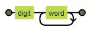
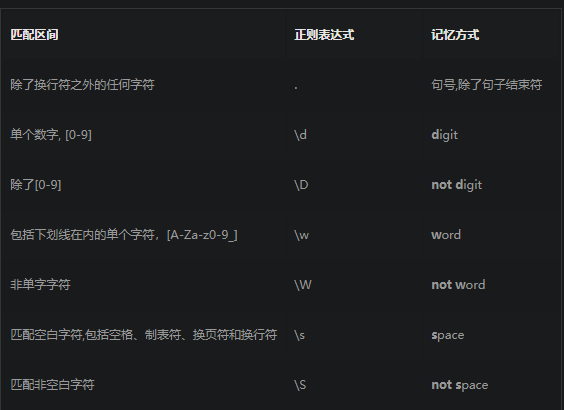
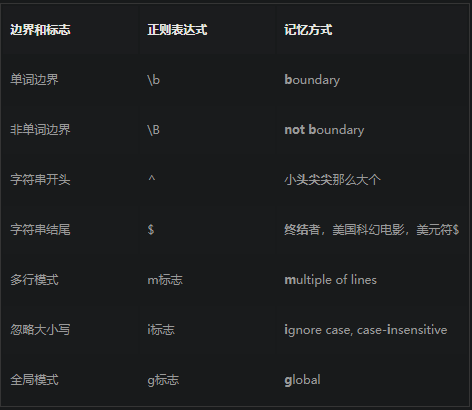
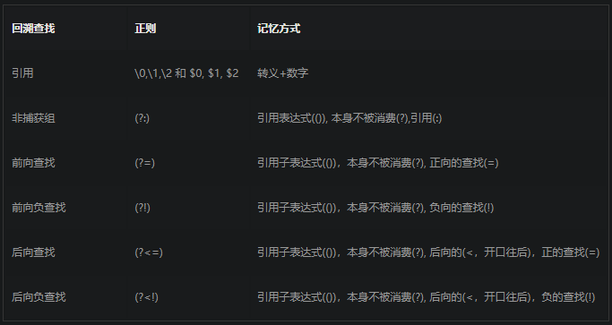

> 正则表达式(Regular Expression)其实就是一门工具，目的是为了字符串模式匹配，从而实现搜索和替换功能。


如/\d\w+/这个正则生成的状态机图:
	
	
## 一、从字符出发

分为：字符 和 元字符

### 1.1  单个字符

最简单的正则表达式可以由简单的数字和字母组成，没有特殊的语义，纯粹就是一一对应的关系。


		
### 1.2  多个字符

单个字符的映射关系是一对一的，即正则表达式的被用来筛选匹配的字符只有一个。而这显然是不够的，只要引入集合区间和通配符的方式就可以实现一对多的匹配了。

在正则表达式里，集合的定义方式是使用中括号 [ 和 ] 。如/[123]/这个正则就能同时匹配1,2,3三个字符。那如果我想匹配所有的数字怎么办呢？从0写到9显然太过低效，所以元字符-就可以用来表示区间范围，利用/[0-9]/就能匹配所有的数字, /[a-z]/则可以匹配所有的英文小写字母。



## 二、循环与重复

### 2.1       0 | 1  
>元字符 “ ？”  代表了匹配  一个字符或0个字符 。 

```tex?linenums
如果你要匹配 color  和  colour 这两个单词，就需要同时保证 u 这个字符是否出现都被匹配到。
所以你的正则表达式应该是这样的： /colou?r/。
```

### 2.2        >=0

>元字符 * 用来表示匹配0个字符或者无数个字符。通常用来过滤某些可有可无的字符串

### 2.3        >=1

>元字符  +  适用于匹配同个字符出现1次或者多次的情况
 
### 2.4        特定次数

>在某些情况下，我们需要匹配特定的重复次数，元字符 {  和  }  用来给重复匹配设置精确的区间范围。


 ```tex
如果 'a'我想匹配3次，那么我就使用 /a{3}/ 这个正则，或者说 ‘a’我想匹配至少两次就用  /a{2,}这个正则
 ```
 
 >以下是完整的语法：
 >  -   {x}：x次
 >  -   {min,max}：介于min次到max次之间
 >  -   {min,} ：  至少min次
 >  -   {0，max} :  至多max次

下图所示：


##  三、位置边界

>位置边界的匹配

### 3.1  单词边界
> 边界正则表达式  \b  , boundary的首字母


```tex?linenums
例如：The cat scattered his food all over the room.  匹配 cat 单词

如果只是使用/cat/这个正则，就会同时匹配到cat和scattered这两处文本。

写成/\bcat\b/这样就能匹配到cat这个单词了。
```
### 3.2  字符串边界

> 开头： 元字符^用来匹配字符串的开头
> 结尾： 字符$用来匹配字符串的末尾

```tex?linenums
I am scq000.
I am scq000.
I am scq000.

正则 /^I am scq000\.$/m
```

注意： 
* m 是 multiple line 的首字母，多行
* i    忽略大小写
* g   找到所有符合的匹配

最后，总结一下：



## 四、子表达式

从简单到复杂的正则表达式演变通常要采用分组、回溯引用和逻辑处理的思想。


### 4.1 分组： （  ）

>所有 **（**  和 **）**  元字符所包含的正则表达式被分为一组，每一个分组都是一个子表达式，它也是构成高级正则表达式的基础。
>如果只是使用简单的(regex)匹配语法本质上和不分组是一样的，如果要发挥它强大的作用，往往要结合   回溯引用   的方式。

### 4.2 回溯引用


回溯引用（backreference）：  指的是模式的后面部分引用前面已经匹配到的子字符串。
你可以把它想象成是变量，回溯引用的语法像   \1 ,  \2 , ...... , 其中  **\1**  表示引用的第一个子表达式，**\2** 表示引用的第二个子表达式，以此类推。 而 **\0** 则表示整个表达式。

```js?linenums
var str = 'abc abc 123';
str.replace(/(ab)c/g,'$1g');
//得到结果 'abg abg 123'
```


```js?linenums
var str = 'scq000'.
str.replace(/(scq00)(?:0)/, '$1,$2')
// 返回scq00,$2
// 由于使用了非捕获正则，所以第二个引用没有值，这里直接替换为$2
```

```js?linenums

"010-123-4567".replace(/(\d{3})(-)(\d{3})(-)(\d{4})/,"($1)$2$3$5");
//"(010)-1234567"

010-123-4567".replace(/(\d{3})(-)(\d{3})(-)(\d{4})/,"($1)$2$3$4$5");
//"(010)-123-4567"

"010-123-4567".replace(/(\d{3})(-)(\d{3})(-)(\d{4})/,"($1)$2$3.$5");
//"(010)-123.4567"
```

#### 4.2.1  前向查找

>  前向查找(lookahead)是用来限制后缀的。
>  凡是以 （?=regex） 包含的子表达式在匹配过程中都会用来限制前面的表达式的匹配。

```tex?linenums
例如： happy  happily  

获取happ开头的副词，那么久就可以用  happ(?=ily) 来匹配。如果我想过滤所有以 happ 开头的副词，那么也可以采用负前向查找的正则  happ(?!ily) ， 就会匹配到 happy 单词的 happ 前缀。

```

####  4.2.1 后向查找

>后向查找(lookbehind)    是通过指定一个子表达式，然后从符合这个子表达式的位置出发开始查找符合规则的字串。
>  (?<=regex) 是 后向查找。regex指代的子表达式会作为限制项进行匹配，匹配到这个子表达式后，就会继续向后查找。
>  另外一种限制匹配是利用(?<!regex) 语法，这里称为负后向查找。

```tex
例如：  apple 和 people 都包含 ple 这个后缀，那么如果我只想找到apple的ple？

/(?<=app)ple/

```

