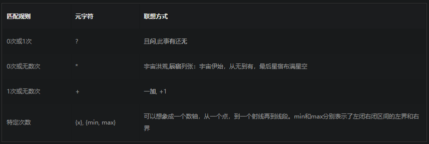

> 正则表达式(Regular Expression)其实就是一门工具，目的是为了字符串模式匹配，从而实现搜索和替换功能。


如/\d\w+/这个正则生成的状态机图:
	
	
## 一、从字符出发

分为：字符 和 元字符

### 1.1  单个字符

最简单的正则表达式可以由简单的数字和字母组成，没有特殊的语义，纯粹就是一一对应的关系。


		
### 1.2  多个字符

单个字符的映射关系是一对一的，即正则表达式的被用来筛选匹配的字符只有一个。而这显然是不够的，只要引入集合区间和通配符的方式就可以实现一对多的匹配了。

在正则表达式里，集合的定义方式是使用中括号 [ 和 ] 。如/[123]/这个正则就能同时匹配1,2,3三个字符。那如果我想匹配所有的数字怎么办呢？从0写到9显然太过低效，所以元字符-就可以用来表示区间范围，利用/[0-9]/就能匹配所有的数字, /[a-z]/则可以匹配所有的英文小写字母。


## 二、循环与重复

### 2.1       0 | 1  
>元字符 “ ？”  代表了匹配  一个字符或0个字符 。 

```tex?linenums
如果你要匹配 color  和  colour 这两个单词，就需要同时保证 u 这个字符是否出现都被匹配到。
所以你的正则表达式应该是这样的： /colou?r/。
```

### 2.2        >=0

>元字符 * 用来表示匹配0个字符或者无数个字符。通常用来过滤某些可有可无的字符串

### 2.3        >=1

>元字符  +  适用于匹配同个字符出现1次或者多次的情况
 
### 2.4        特定次数

>在某些情况下，我们需要匹配特定的重复次数，元字符 {  和  }  用来给重复匹配设置精确的区间范围。


 ```tex
如果 'a'我想匹配3次，那么我就使用 /a{3}/ 这个正则，或者说 ‘a’我想匹配至少两次就用  /a{2,}这个正则
 ```
 
 >以下是完整的语法：
 >  -   {x}：x次
 >  -   {min,max}：介于min次到max次之间
 >  -   {min,} ：  至少min次
 >  -   {0，max} :  至多max次

下图所示：




##  三、位置边界

>位置边界的匹配

### 3.1  单词边界
> 边界正则表达式  \b  , boundary的首字母


```tex?linenums
例如：The cat scattered his food all over the room.  匹配 cat 单词

如果只是使用/cat/这个正则，就会同时匹配到cat和scattered这两处文本。

写成/\bcat\b/这样就能匹配到cat这个单词了。
```
### 3.2  字符串边界

> 开头： 元字符^用来匹配字符串的开头
> 结尾： 字符$用来匹配字符串的末尾

```tex?linenums
I am scq000.
I am scq000.
I am scq000.

正则 /^I am scq000\.$/m
```

注意： 
* m 是 multiple line 的首字母，多行
* i    忽略大小写
* g   找到所有符合的匹配

最后，总结一下：


