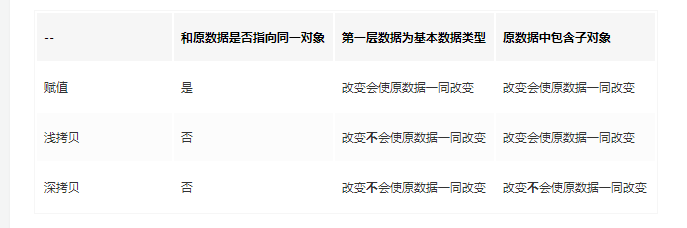

## 堆和栈的区别
其实深拷贝和浅拷贝的主要区别就是其在内存中的存储类型不同。

堆和栈都是内存中划分出来用来存储的区域。

>栈（stack）为自动分配的内存空间，它由系统自动释放；而堆（heap）则是动态分配的内存，大小不定也不会自动释放。

## 基本数据类型
基本数据类型主要是：undefined，boolean，number，string，null。

**基本数据类型存放在栈中**

存放在栈内存中的简单数据段，数据大小确定，内存空间大小可以分配，是直接按值存放的，所以可以直接访问。

**基本数据类型值不可变**

基本数据类型的值是不可变的，动态修改了基本数据类型的值，它的原始值也是不会改变的，例如

```js?linenums
    var str = "abc";

    console.log(str[1]="f");    // f

    console.log(str);           // abc
```

**基本类型的比较是值的比较**

基本类型的比较是值的比较，只要它们的值相等就认为他们是相等的，例如：

```js?linenums
 	 var a = 1;
    var b = 1;
    console.log(a === b);//true
```

比较的时候最好使用严格等，因为 == 是会进行类型转换的，比如：

```js?linenums
	var a = 1;
    var b = true;
    console.log(a == b);//true
```

## 引用类型

**引用类型存放在堆中**

引用类型（object）是存放在堆内存中的，变量实际上是一个存放在栈内存的指针，这个指针指向堆内存中的地址。每个空间大小不一样，要根据情况开进行特定的分配，例如。

```js?linenums
var person1 = {name:'jozo'};
var person2 = {name:'xiaom'};
var person3 = {name:'xiaoq'};
```


**引用类型值可变**

引用类型是可以直接改变其值的，例如：

```js?linenums
    var a = [1,2,3];
    a[1] = 5;
    console.log(a[1]); // 5
```

**引用类型的比较是引用的比较**

所以每次我们对 js 中的引用类型进行操作的时候，都是操作其对象的引用（保存在栈内存中的指针），所以比较两个引用类型，是看其的引用是否指向同一个对象。例如：

```js?linenums
    var a = [1,2,3];
    var b = [1,2,3];
    console.log(a === b); // false
```

虽然变量 a 和变量 b 都是表示一个内容为 1，2，3 的数组，但是其在内存中的位置不一样，也就是说变量 a 和变量 b 指向的不是同一个对象，所以他们是不相等的。


## 传值与传址

了解了基本数据类型与引用类型的区别之后，我们就应该能明白传值与传址的区别了。
在我们进行赋值操作的时候，基本数据类型的赋值（=）是在内存中新开辟一段栈内存，然后再把再将值赋值到新的栈中。例如：

```js?linenums
var a = 10;
var b = a;

a ++ ;
console.log(a); // 11
console.log(b); // 10
```


所以说，基本类型的赋值的两个变量是两个独立相互不影响的变量。

是引用类型的赋值是传址。只是改变指针的指向，例如，也就是说引用类型的赋值是对象保存在栈中的地址的赋值，这样的话两个变量就指向同一个对象，因此两者之间操作互相有影响。例如：

```js?linenums
var a = {}; // a保存了一个空对象的实例
var b = a;  // a和b都指向了这个空对象

a.name = 'jozo';
console.log(a.name); // 'jozo'
console.log(b.name); // 'jozo'

b.age = 22;
console.log(b.age);// 22
console.log(a.age);// 22

console.log(a == b);// true
```


## 浅拷贝

**赋值（=）和浅拷贝的区别**

深拷贝：将 B 对象拷贝到 A 对象中，包括 B 里面的子对象，

浅拷贝：将 B 对象拷贝到 A 对象中，但不包括 B 里面的子对象



## 深拷贝

深拷贝是对对象以及对象的所有子对象进行拷贝。


## 方法（浅拷贝）
### 1. Object.assign() 
es5源码：
```js?linenums
 if (typeof Object.assign != 'function') {
  (function () {
	Object.assign = function (target) {
	 'use strict';
	 if (target === undefined || target === null) {
	   throw new TypeError('Cannot convert undefined or null to object');
	 }
	
	 var output = Object(target);
	 for (var index = 1; index < arguments.length; index++) {
	   var source = arguments[index];
	   if (source !== undefined && source !== null) {
	     for (var nextKey in source) {
	       if (source.hasOwnProperty(nextKey)) {
	         output[nextKey] = source[nextKey];
	       }
	     }
	   }
	 }
	 return output;
	};
})();
}
```
Object.assign方法用于对象的合并，将源对象（ source ）的所有可枚举属性，复制到目标对象（ target ）。
```js?linenums
var target = { a: 1 };
var source1 = { b: 2 };
var source2 = { c: 3 };
Object.assign(target, source1, source2);
target // {a:1, b:2, c:3}
```

Object.assign方法的第一个参数是目标对象，后面的参数都是源对象。

注意，如果目标对象与源对象有同名属性，或多个源对象有同名属性，则后面的属性会覆盖前面的属性。

```js?linenums
var target = { a: 1, b: 1 };
var source1 = { b: 2, c: 2 };
var source2 = { c: 3 };
Object.assign(target, source1, source2);
target // {a:1, b:2, c:3}
```

如果只有一个参数，Object.assign会直接返回该参数。
```js?linenums
var obj = {a: 1};
Object.assign(obj) === obj // true
```

如果该参数不是对象，则会先转成对象，然后返回。
```js?linenums
typeof Object.assign(2) // "object"
```

由于undefined和null无法转成对象，所以如果它们作为参数，就会报错。
```js?linenums
Object.assign(undefined) //  报错
Object.assign(null) //  报错
```

如果非对象参数出现在源对象的位置（即非首参数），那么处理规则有所不同。首先，这些参数都会转成对象，如果无法转成对象，就会跳过。这意味着，如果undefined和null不在首参数，就不会报错。

```js?linenums
let obj = {a: 1};
Object.assign(obj, undefined) === obj // true
Object.assign(obj, null) === obj // true
```

其他类型的值（即数值、字符串和布尔值）不在首参数，也不会报错。但是，除了字符串会以数组形式，拷贝入目标对象，其他值都不会产生效果。

```js?linenums
var v1 = 'abc';
var v2 = true;
var v3 = 10;
var obj = Object.assign({}, v1, v2, v3);
console.log(obj); // { "0": "a", "1": "b", "2": "c" }
```

注意点：
*  Object.assign方法实行的是浅拷贝，而不是深拷贝。也就是说，如果源对象某个属性的值是对象，那么目标对象拷贝得到的是这个对象的引用。Object.assign()与解构一样，只能深拷贝一级的对象。
```js?linenums
var obj1 = {a: {b: 1}};
var obj2 = Object.assign({}, obj1);
obj1.a.b = 2;
obj2.a.b // 2
```
* 对于这种嵌套的对象，一旦遇到同名属性，Object.assign的处理方法是替换，而不是添加。
```js?linenums
var target = { a: { b: 'c', d: 'e' } }
var source = { a: { b: 'hello' } }
Object.assign(target, source)
// { a: { b: 'hello' } }
```
### 2. 自定义浅拷贝方法

```js?linenums
// 浅拷贝实现，仅供参考
function shallowClone(source) {
    if (!source || typeof source !== 'object') {
        throw new Error('error arguments');
    }
    var targetObj = source.constructor === Array ? [] : {};
    for (var keys in source) {
        if (source.hasOwnProperty(keys)) {
            targetObj[keys] = source[keys];
        }
    }
    return targetObj;
}
```

## 方法 （深拷贝）：

### 1. JSON字符串
使用JSON字符串进行深拷贝，多层嵌套对象也可以进行深拷贝
```js?linenums
var a = {a:'123',b:{c:'333'}}
var b = JSON.parse(JSON.stringify(a));
b.a = 'yyy'
b.b.c =222;
console.log(a.a); // 123
console.log(a.b.c); // 333
```
可以封装如下函数

```js?linenums
var cloneObj = function(obj){
    var str, newobj = obj.constructor === Array ? [] : {};
    if(typeof obj !== 'object'){
        return;
    } else if(window.JSON){
        str = JSON.stringify(obj), //系列化对象
        newobj = JSON.parse(str); //还原
    } else {
        for(var i in obj){
            newobj[i] = typeof obj[i] === 'object' ? 
            cloneObj(obj[i]) : obj[i]; 
        }
    }
    return newobj;
};
```
### 2.

```js?linenums
**方法功能：
* 深复制方法，支持字符 复制，引用中的 数据  对象 复制
* 参数：
* obj：需要拷贝的数据
* */
function cloneData(obj) {
  var buf;
  if (obj instanceof Array) {
	buf = [];
	var i = obj.length;
	while (i--) {
	  buf[i] = this.cloneData(obj[i]);
	}
	return buf;
  } else if (obj instanceof Object) {
	buf = {};
	for (var k in obj) {
	  buf[k] = this.cloneData(obj[k]);
	}
	return buf;
  } else {
	return obj;
  }
}
```
### 3. jQuery.extend()方法源码实现
源码：
```js?linenums
jQuery.extend = jQuery.fn.extend = function() { //给jQuery对象和jQuery原型对象都添加了extend扩展方法
  var options, name, src, copy, copyIsArray, clone, target = arguments[0] || {},
  i = 1,
  length = arguments.length,
  deep = false;
  //以上其中的变量：options是一个缓存变量，用来缓存arguments[i]，name是用来接收将要被扩展对象的key，src改变之前target对象上每个key对应的value。
  //copy传入对象上每个key对应的value，copyIsArray判定copy是否为一个数组，clone深拷贝中用来临时存对象或数组的src。

  // 处理深拷贝的情况
  if (typeof target === "boolean") {
    deep = target;
    target = arguments[1] || {};
    //跳过布尔值和目标 
    i++;
  }

  // 控制当target不是object或者function的情况
  if (typeof target !== "object" && !jQuery.isFunction(target)) {
    target = {};
  }

  // 当参数列表长度等于i的时候，扩展jQuery对象自身。
  if (length === i) {
    target = this; --i;
  }
  for (; i < length; i++) {
    if ((options = arguments[i]) != null) {
      // 扩展基础对象
      for (name in options) {
        src = target[name];	
        copy = options[name];

        // 防止永无止境的循环，这里举个例子，
            // 如 var a = {name : b};
            // var b = {name : a}
            // var c = $.extend(a, b);
            // console.log(c);
            // 如果没有这个判断变成可以无限展开的对象
            // 加上这句判断结果是 {name: undefined}
        if (target === copy) {
          continue;
        }
        if (deep && copy && (jQuery.isPlainObject(copy) || (copyIsArray = jQuery.isArray(copy)))) {
          if (copyIsArray) {
            copyIsArray = false;
            clone = src && jQuery.isArray(src) ? src: []; // 如果src存在且是数组的话就让clone副本等于src否则等于空数组。
          } else {
            clone = src && jQuery.isPlainObject(src) ? src: {}; // 如果src存在且是对象的话就让clone副本等于src否则等于空数组。
          }
          // 递归拷贝
          target[name] = jQuery.extend(deep, clone, copy);
        } else if (copy !== undefined) {
          target[name] = copy; // 若原对象存在name属性，则直接覆盖掉；若不存在，则创建新的属性。
        }
      }
    }
  }
  // 返回修改的对象
  return target;
};
```

jQuery的extend方法使用基本的递归思路实现了浅拷贝和深拷贝，但是这个方法也无法处理源对象内部循环引用，例如：

```js?linenums
var a = {"name":"aaa"};
var b = {"name":"bbb"};
a.child = b;
b.parent = a;
$.extend(true,{},a);//直接报了栈溢出。Uncaught RangeError: Maximum call stack size exceeded
```
### 3. 自定义深拷贝方法

```js?linenums
// 递归实现一个深拷贝
function deepClone(source){
   if(!source || typeof source !== 'object'){
     throw new Error('error arguments', 'shallowClone');
   }
   var targetObj = source.constructor === Array ? [] : {};
   for(var keys in source){
      if(source.hasOwnProperty(keys)){
         if(source[keys] && typeof source[keys] === 'object'){
           targetObj[keys] = source[keys].constructor === Array ? [] : {};
           targetObj[keys] = deepClone(source[keys]);
         }else{
           targetObj[keys] = source[keys];
         }
      } 
   }
   return targetObj;
}
// test example
var o1 = {
  arr: [1, 2, 3],
  obj: {
    key: 'value'
  },
  func: function(){
    return 1;
  }
};
var o3 = deepClone(o1);
console.log(o3 === o1); // => false
console.log(o3.obj === o1.obj); // => false
console.log(o2.func === o1.func); // => true
```