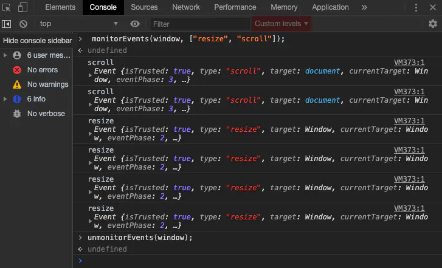
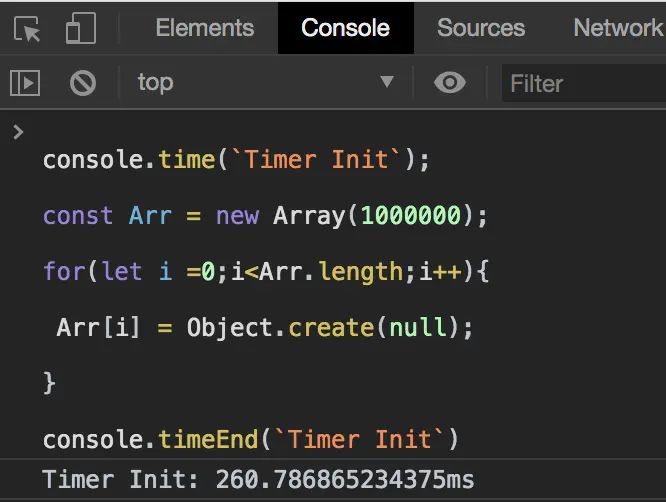
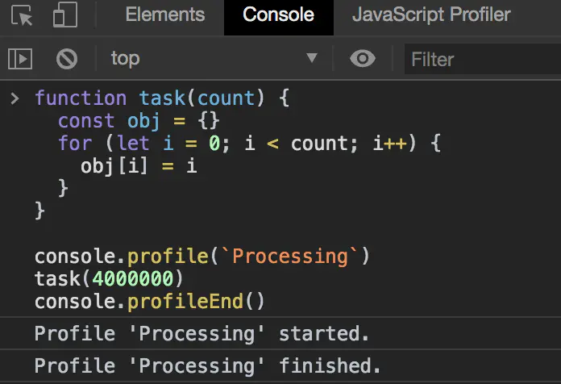
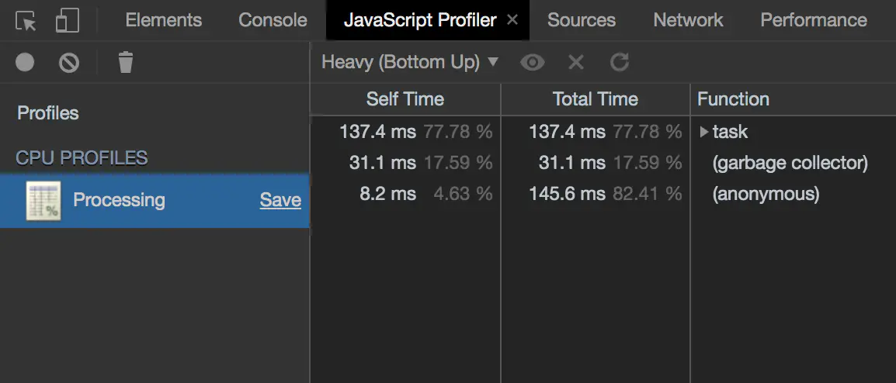
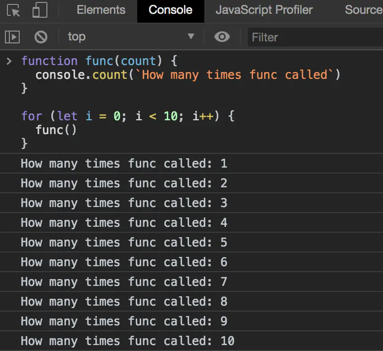

>Chrome 开发者工具（简称 DevTools）是一套 Web 开发调试工具,内嵌于 Google Chrome 浏览器中。DevTools 使开发者更加深入的了解浏览器内部以及他们编写的应用。通过使用 DevTools,可以更加高效的定位页面布局问题,设置 JavaScript 断点并且更好的理解代码优化。

## 一、控制台直接访问页面元素

**$0**,  
	在元素面板中选择一个元素，然后控制台输入 $0 ,就会在控制台中得到刚才选中的元素。
	如果页面中已经包含了JQuery，也可以使用 $($0) 进行选择
	
  你也可以反过来,在控制台输出的 DOM 元素上右键选择 Reveal in Elements Panel 来直接在 DOM 树种查看。


## 二、访问最近的控制台结果

**$_**   ，

在控制台输入 $_  可以获控制台最近一次的输出结果。

## 三、访问最近选择的元素和对象

控制台会存储最近 5 个被选择的元素和对象。

当你在元素面板选择一个元素或在分析器面板选择一个对象,记录都会存储在栈中。

可以使用 **$x**  来操作历史栈,x 是从 0 开始计数的,所以 **$0** 表示最近选择的元素,**$4** 表示最后选择的元素。

## 四、选择元素

### 4.1  $()
	
   返回满足指定CSS规则的第一个元素，此方法为 document.querySelector()的简化。
   
### 5.2  $$()

   返回满足指定CSS规则的所有元素，此方法为 querySelectorAll()的简化。
   
### 5.3  $x()

   返回满足指定 XPath 的所有元素
   
   
   
## 五、使用 console.table

该命令支持以表格的形式输出日志信息。打印复杂信息时尝试使用 console.table 来替代 console.log 会更加清晰。

## 六、使用 console.dir,可简写为 dir

console.dir(object)/dir(object) 命令可以列出参数 object 的所有对象属性。

## 七、复制 copy

你可以通过 copy 方法在控制台里复制你想要的东西。

例如：
	```js
	location
	copy($_)
	```

## 八、获取对象键值 keys(object)/values(object)

```js
const user = {name: 'null仔',age: 18};
key(user);
values(user);
```

## 九、函数监听器 monitor(function)/unmonitor(function)

monitor(function),当调用指定的函数时,会将一条消息记录到控制台,该消息指示调用时传递给该函数的函数名和参数。

使用 unmonitor(函数)停止对指定函数的监视。

```js
function sum(x,y) {
	return x + y;
}

monitor(sum);
sum(1,2);
//function sum called with arguments: 1, 2
//3


sum(3,4);
//function sum called with arguments: 3, 4
//7

unmonitor(sum);
sum(5,6);
//11
```

## 十、事件监听器 monitorEvents(object[,events])/unmonitorEvents(object[, events])

monitorEvents(object[,events]),当指定的对象上发生指定的事件之一时,事件对象将被记录到控制台。事件类型可以指定为单个事件或事件数组。

unmonitorevent (object[, events])停止监视指定对象和事件的事件。



## 十一、耗时监控

通过调用  **time()**  可以开启计时器。你必须传入一个字符串参数来唯一标记这个计时器的 ID。当你要结束计时的时候可以调用  **timeEnd()** ，并且传入指定的名字。计时结束后控制台会打印计时器的名字和具体的时间。



## 十二、分析程序性能

在 DevTools 窗口控制台中，调用 **console.profile()** 开启一个 JavaScript CPU 分析器。结束分析器直接调用 **console.profileEnd()**。



具体的性能分析会在分析器面板中：



## 十三、统计表达式执行次数

**count()** 方法用于统计表达式被执行的次数,它接受一个字符串参数用于标记不同的记号。如果两次传入相同的字符串,该方法就会累积计数。



## 十四、清空控制台历史记录

可以通过下面的方式清空控制台历史:

*	在控制台右键，或者按下 Ctrl 并单击鼠标，选择 Clear Console。
* 	在脚本窗口输入 clear()执行。
*   在 JavaScript 脚本中调用 console.clear()。
*   使用快捷键 Cmd + K (Mac) Ctrl + L (Windows and Linux)。