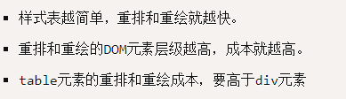

## 一、说说 cookies，sessionStorage 、 localStorage 你对它们的理解？

* cookie是网站为了表示用户身份而存储在用户本地终端上的数据（通常经过加密），cookie数据始终在同源的http请求中携带，也会在浏览器与服务器间来回传递。
* sessionStorage和localStorage不会自动把数据发给服务器，仅在本地保存。
* 大小：cookie数据大小不能超过4k。sessionStorage和localStorage虽然也有存储大小的限制，但是比cookie大得多，可以达到5M或者更大。
* 时效：localStorage存储持久数据，浏览器关闭后数据不丢失除非用户主动删除数据或者清除浏览器/应用缓存；sessinStorage数据在当前浏览器窗口关闭后自动删除。cookie设置的cookie过期时间之前一直有效，即使窗口或者浏览器关闭
* 部分面试官可能还会再深入一些：

> 1）、如何让cookie浏览器关闭就失效？   不对cookie设置任何正、负或者0时间的即可。
> 2）、sessionStroage在浏览器多窗口之间（同域）数据是否互通共享？   不会，都是独立的localStorage会共享；
> 3）、能让localStorage也跟cookie一样设置过期时间？   可以的，在存储数据时，也存储一个时间戳，get数据之前，先拿当前时间跟你之前存储的时间戳做比较 。

## 二、简述一下你对HTML语义化的理解 ？
* 语义化是指根据内容的类型，选择合适的标签(代码语义化)，即用正确的标签做正确的事情；
* html语义化让页面的内容结构化，结构更清晰，有助于浏览器、搜索引擎解析对内容的抓取；
* 语义化的HTML在没有css的情况下也能呈现较好的内容结构与代码结构；
* 搜索引擎的爬虫也依赖于HTML标记来确定上下文和各个关键字的权重，利于SEO；

## 三、:before 和 :after 两伪元素，平时都是使用双冒号还是单冒号？有什么区别？以及它们的作用？

* 单冒号（ : ）用于CSS3伪类，双冒号（::）用于CSS3伪元素。（伪元素由双冒号和伪元素名称组成）；
* 双冒号是在当前规范中引入的，用于区分伪类和伪元素。不过浏览器需要同时支持旧的已经存在的伪元素写法， 比如:first-line、:first-letter、:before、:after等， 而新的在CSS3中引入的伪元素则不允许再支持旧的单冒号的写法;
* 想让插入的内容出现在其它内容前，使用::before，之后则使用::after； 
* 在代码顺序上，::after生成的内容也比::before生成的内容靠后。 如果按堆栈视角，::after生成的内容会在::before生成的内容之上;

**伪类** ( pseudo classes )

>是添加到选择器的关键字，指定要选择的元素的特殊状态。

例如，:hover 可被用于在用户将鼠标悬停在按钮上时改变按钮的颜色。

伪类连同伪元素一起，他们允许你不仅仅是根据个文档DOM树中的内容对元素应用样式，而且还允许你根据诸如像导航历史这样的外部因素来应用样式（例如 ==:visited==），同样的，可以鞥见内容的状态（例如在一些表单元素上的 ==:checked==），或者鼠标的位置（例如: ==:hover== 让你知道鼠标是否在一个元素上悬浮）来应用样式。

<div class='note' >
注意： 与伪类相反，pseudo-elements(伪元素) 可被用于为一个元素的 特定部分 应用样式。
</div>


**伪元素** （pseudo-elements）

就像 pseudo classes (伪类)一样， 伪元素添加到选择器，但不是描述特殊状态，它们允许您为元素的某些部分设置样式。 下例中的 ::first-line  伪元素改变段落第一行的文字样式。

```css?linenums
/* The first line of every <p> element. */
p::first-line {
  color: blue;
  text-transform: uppercase;
}
```


**注意**：
* 与伪元素比较，pseudo-classes 能够用来改变基于状态的元素样式。
* 伪类用于当已有元素处于的某个状态时，为其添加对应的样式，这个状态是根据用户行为而动态变化的。
* 伪元素用于创建一些不在文档树中的元素，并为其添加样式。


## 四、Chrome、Safari等浏览器，当表单提交用户选择记住密码后，下次自动填充表单的背景变成黄色，影响了视觉体验是否可以修改？

```css
input:-webkit-autofill, textarea:-webkit-autofill, select:-webkit-autofill {
  background-color: #fff;//设置成元素原本的颜色
  background-image: none;
  color: rgb(0, 0, 0);
}
```

## 五、js有哪些基本数据类型？

   ECMAScript 标准定义有7种数据类型： 
   
   *  Boolean 
   *  Null
   *  Number
   *  String
   *  Symbol （ECMAScript 6 新定义 ，Symbol 生成一个全局唯一、表示独一无二的值）
   *  Object ( Array、Function、Object )

## 六、js的 for 跟for in 循环它们之间的区别？

* 遍历数组时的异同： for循环 数组下标的typeof类型:number, for in 循环数组下标的typeof类型:string

```js
var southSu = ['苏南','深圳','18','男'];
for(var i=0;i<southSu.length;i++){
	console.log(typeof i); //number
	console.log(southSu[i]);// 苏南 , 深圳 , 18 , 男
}
var arr = ['苏南','深圳','18','男','帅气'];
for(var k in arr){
	console.log(typeof k);//string
	console.log(arr[k]);// 苏南 , 深圳 , 18 , 男 , 帅气
}
```

* 遍历对象时的异同：for循环 无法用于循环对象，获取不到obj.length; for in 循环遍历对象的属性时，原型链上的所有属性都将被访问，解决方案：使用hasOwnProperty方法过滤或Object.keys会返回自身可枚举属性组成的数组 

```js
Object.prototype.test = '原型链上的属性';
var southSu = {name:'苏南',address:'深圳',age:18,sex:'男',height:176};
for(var i=0 ; i<southSu.length;i++){
	console.log(typeof i); //空
	console.log(southSu[i]);//空
}

for(var k in southSu){
	console.log(typeof k);//string
	console.log(southSu[k]);// 苏南 , 深圳 , 18 , 男 , 176 , 原型链上的属性
}
```

## 七、js把一串字符串去重(能统计出字符重复次数更佳)，列出你的思路（两种以上）：

```js
<script>
	let str = "12qwe345671dsfa233dsf9876ds243dsaljhkjfzxcxzvdsf";
	let array = str.split("");

	//方案一：//
	array = [...new Set(array)].join("");
	array = ((a)=>[...new Set(a)])(array).join("");
	console.log(array);//12qwe34567dsfa98ljhkzxcv  只能过滤，不会统计

	//方案二：
	function unique (arr) {
		const seen = new Map()
		return (arr.filter((a) => !seen.has(a) && seen.set(a, 1))).join("");
	}
	console.log(unique(array)) // 12qwe34567dsfa98ljhkzxcv

	//方案三：
	function unique (arr) {
		let arrs=[];
		var news_arr = arr.sort();//排序能减少一次循环
		for(var i=0;i<news_arr.length;i++){
				if(news_arr[i] == news_arr[i+1] && news_arr[i]!= news_arr[i-1] ){
						arrs.push(arr[i]);
				};
 
		};
		return arrs.join("");
	}
	console.log(unique(array)) // 12qwe34567dsfa98ljhkzxcv

	//方案四：
	function unique (arr) {
		let obj={};
		for(var i=0;i<arr.length;i++){
			let key = arr[i];
			if(!obj[key] ){
					obj[key]=1;
			}else{
				obj[key]+=1;
			}
 
		};
		return obj;
	}
	console.log(unique(array)) // object 对应每个key以及它重复的次数 

</script>
```

## 八、项目上线前，你们做过哪些性能优化：
* 图片预加载，css样式表放在顶部且link链式引入，javascript放在底部body结束标签前;
* 使用dns-prefetch对项目中用到的域名进行 DNS 预解析，减少 DNS 查询，如： <link rel="dns-prefetch" href="//github.com"/>; 
* 减少http请求次数:图片静态资源使用CDN托管;API接口数据设置缓存，CSS Sprites/SVG Sprites(如有疑惑：该如何以正确的姿势插入SVG Sprites？这篇说的很详细), JS、CSS源码压缩、图片大小控制合适，使用iconfont(字体图标)或SVG，它们比图片更小更清晰，网页Gzip压缩;
* 减少DOM操作次数，优化javascript性能;
* 减少 DOM 元素数量，合理利用:after、:before等伪类;避免重定向、图片懒加载;
* 前后端分离开发，资源按需加载，最好能做到首屏直出(即服务端渲染); 
* 避免使用CSS Expression（css表达式)又称Dynamic properties(动态属性) ;
* 多域名分发划分内容到不同域名，解决浏览器域名请求并发数问题，同时也解决了请求默认携带的cookie问题;
* 尽量减少 iframe 使用，它会阻塞主页面的渲染; 
* 对所有资源压缩 JavaScript 、 CSS 、字体、图片等，甚至html;
* 等........

## 九、重排和重绘

网页生成的时候，至少会渲染一次。用户访问的过程中，还会不断重新渲染。

以下三种情况，会导致网页重新渲染。
* 修改DOM
* 修改样式表
* 用户事件（比如鼠标悬停、页面滚动、输入框键入文字、改变窗口大小等等）

重新渲染，就需要重新生成布局和重新绘制。前者叫做"重排"（reflow），后者叫做"重绘"（repaint）。

需要注意的是，"重绘"不一定需要"重排"，比如改变某个网页元素的颜色，就只会触发"重绘"，不会触发"重排"，因为布局没有改变。但是，"重排"必然导致"重绘"，比如改变一个网页元素的位置，就会同时触发"重排"和"重绘"，因为布局改变了。

### 对于性能的影响

重排和重绘会不断触发，这是不可避免的。但是，它们非常耗费资源，是导致网页性能低下的根本原因。

**提高网页性能，就是要降低"重排"和"重绘"的频率和成本，尽量少触发重新渲染。**

DOM变动和样式变动，都会触发重新渲染。但是，浏览器已经很智能了，会尽量把所有的变动集中在一起，排成一个队列，然后一次性执行，尽量避免多次重新渲染。

一般来说，对位置的读写操作，都会引发浏览器立即重新渲染。所以，从性能角度考虑，尽量不要把读操作和写操作，放在一个语句里面。


**一般的规则是：**



### 最小化重排和重绘，提高性能的九个技巧

有一些技巧，可以降低浏览器重新渲染的频率和成本。

#### 1、DOM 的多个读操作（或多个写操作），应该放在一起。不要两个读操作之间，加入一个写操作。
#### 2、如果某个样式是通过重排得到的，那么最好缓存结果。避免下一次用到的时候，浏览器又要重排。
#### 3、不要一条条地改变样式，而要通过改变class，或者csstext属性，一次性地改变样式。

#### 4、尽量使用离线DOM，而不是真实的网面DOM，来改变元素样式。比如，操作Document Fragment对象，完成后再把这个对象加入DOM。再比如，使用 cloneNode() 方法，在克隆的节点上进行操作，然后再用克隆的节点替换原始节点。
#### 5、先将元素设为display: none（需要1次重排和重绘），然后对这个节点进行100次操作，最后再恢复显示（需要1次重排和重绘）。这样一来，你就用两次重新渲染，取代了可能高达100次的重新渲染。
#### 6、position属性为absolute或fixed的元素，重排的开销会比较小，因为不用考虑它对其他元素的影响。
#### 7、只在必要的时候，才将元素的display属性为可见，因为不可见的元素不影响重排和重绘。另外，visibility : hidden的元素只对重绘有影响，不影响重排。
#### 8、使用虚拟DOM的脚本库，比如React等。
#### 9、使用 window.requestAnimationFrame()、window.requestIdleCallback() 这两个方法调节重新渲染

## 十、浏览器的兼容模式下和苹果浏览器下都不识别new Date('2019-01-09 00 : 00 : 00')里面的短横线；

得把 **-** 替换成 **/**,例如：new Date('2019-01-09 00 : 00 : 00').replace(/-/g, '/')