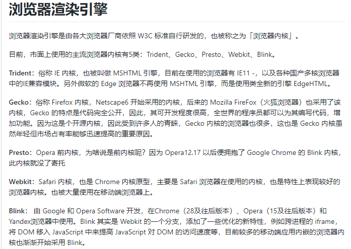

## 1、大致的整个过程
* 1、用户输入url地址
* 2、浏览器解析url，解析出主机名
* 3、浏览器将主机名转换成服务器ip地址（浏览器先查询本地DNS缓存列表 没有的话 再向浏览器默认的DNS服务器发送查询请求 同时缓存）
* 4、浏览器将端口号从url中解析出来
* 5、浏览器建立一条与目标Web服务器的TCP连接（三次握手）
* 6、浏览器向服务器发送一条HTTP请求报文
* 7、服务器向浏览器返回一条HTTP响应报文
* 8、关闭连接 浏览器解析文档
## 2.浏览器渲染页面的过程
> 从耗时的角度，浏览器请求、加载、渲染一个页面，时间在下面五件事上：

1.DNS查询
2.TCP连接
4.服务端响应
5.客户端渲染

### 1.DNS查询
>DNS解析是一个递归查询的过程。
    


上述图片是查找www.google.com 的IP地址过程。首先在本地域名服务器中查询IP地址，如果没有找到的情况下，本地域名服务器会向根域名服务器发送一个请求，如果根域名服务器也不存在该域名时，本地域名会向com顶级域名服务器发送一个请求，依次类推下去。直到最后本地域名服务器得到google的IP地址并把它缓存到本地，供下次查询使用。从上述过程中，可以看出网址的解析是一个从右向左的过程: com -> google.com -> www.google.com。 但是你是否发现少了点什么，根域名服务器的解析过程呢？事实上，真正的网址是www.google.com.， 并不是我多打了一个.，这个.对应的就是根域名服务器，默认情况下所有的网址的最后一位都是.，既然是默认情况下，为了方便用户，通常都会省略，浏览器在请求DNS的时候会自动加上，所有网址真正的解析过程为: . -> .com -> google.com. -> www.google.com.。

  **DNS优化**

  了解了DNS的过程，可以为我们带来哪些？上文中请求到google的IP地址时，经历了8个步骤，这个过程中存在多个请求(同时存在UDP和TCP请求，为什么有两种请求方式，请自行查找)。如果每次都经过这么多步骤，是否太耗时间？如何减少该过程的步骤呢？那就是DNS缓存。
  
  **DNS缓存**
  
  DNS存在着多级缓存，从离浏览器的距离排序的话，有以下几种: 浏览器缓存，系统缓存，路由器缓存，IPS服务器缓存，根域名服务器缓存，顶级域名服务器缓存，主域名服务器缓存。
  
### 2.TCP连接
>TCP/IP不是一个协议，而是一个协议族的统称。里面包括了IP协议，IMCP协议，TCP协议，以及我们更加熟悉的http、ftp、pop3协议等等。

**TCP/IP协议分层**


主要是**TCP三次握手**：
所谓三次握手（Three-Way Handshake）即建立TCP连接，就是指建立一个TCP连接时，需要客户端和服务端总共发送3个包以确认连接的建立。在socket编程中，这一过程由客户端执行connect来触发，整个流程如下图所示：


（1）第一次握手：Client将标志位SYN置为1，随机产生一个值seq=J，并将该数据包发送给Server，Client进入SYN_SENT状态，等待Server确认。

（2）第二次握手：Server收到数据包后由标志位SYN=1知道Client请求建立连接，Server将标志位SYN和ACK都置为1，ack=J+1，随机产生一个值seq=K，并将该数据包发送给Client以确认连接请求，Server进入SYN_RCVD状态。

（3）第三次握手：Client收到确认后，检查ack是否为J+1，ACK是否为1，如果正确则将标志位ACK置为1，ack=K+1，并将该数据包发送给Server，Server检查ack是否为K+1，ACK是否为1，如果正确则连接建立成功，Client和Server进入ESTABLISHED状态，完成三次握手，随后Client与Server之间可以开始传输数据了。

简单来说，就是

1、建立连接时，客户端发送SYN包（SYN=i）到服务器，并进入到SYN-SEND状态，等待服务器确认

2、服务器收到SYN包，必须确认客户的SYN（ack=i+1）,同时自己也发送一个SYN包（SYN=k）,即SYN+ACK包，此时服务器进入SYN-RECV状态

3、客户端收到服务器的SYN+ACK包，向服务器发送确认报ACK（ack=k+1）,此包发送完毕，客户端和服务器进入ESTABLISHED状态，完成三次握手，客户端与服务器开始传送数据。
### 3.HTTP请求即响应
HTTP Request 这里不多介绍
### 4.服务端响应
Response 这里不多介绍
### 5.客户端渲染
> 浏览器在收到HTML,CSS,JS文件后，它是如何把页面呈现到屏幕上的？下图对应的就是WebKit渲染的过程。分为五个步骤：

* 1.处理html标记并构建DOM树。

     解析html过程中，会碰到几类特殊的节点需要特殊的处理：
	 1). style、link元素以及具有内联样式的元素：交给CSSOM生成
	 2). script（无论是否外链）元素：见'script标签的处理'
	 
* 2.处理css标记并构建成CSSOM树。

    **style和内联样式**
	
	对于这两类，浏览器会直接根据样式声明生成CSSOM，因为他们本身就直接包含了样式内容。
	
	**link**
	
	对于外联样，浏览器会先发送请求，待请求成功后获取外联样式，浏览器会解析该外联样式，并生成相应的CSSOM。
	
	由于CSSOM负责存储渲染信息，浏览器就必须保证在合成渲染树之前，CSSOM是完备的，这种完备是指所有的CSS（内联、内部和外部）都已经下载完，并解析完，只有CSSOM和DOM的解析完全结束，浏览器才会进入下一步的渲染，这就是传说中的CSS阻塞渲染。
	
	CSS阻塞渲染意味着，在CSSOM完备前，页面将一直处理白屏的状态，这就是为何样要放在head中，仅仅是为了更快地的解析CSS，保证更快的首次渲染。
	
	需要注意的是，即便你没有给页面任何的样式声明，CSSOM依然会生成，默认生成的CSSOM自带浏览器默认样式。
	
	样式解析生成的CSSOM便含有渲染信息，这些信息会与DOM一起，生成渲染树Render-Tree。最后，一样附上Chrome官方的事例来个总结：
	
	```css?linenums
	body { font-size: 16px }
	p { font-weight: bold }
	span { color: red }
	p span { display: none }
	img { float: right }
	```

	
	
	在讲渲染树前，我们还需要讲讲一直被我们搁置的script。
	
	**script标签的处理**
	
	Js可以操作DOM来修改DOM结构，可以操作CSSOM来修改节点样式，这就导致了浏览器在解析HMTL时，一旦碰到script，就会立即停止HTML的解析（而css不会），执行js，再返还控制权。
	
	事实上，JS执行前不仅仅是停止了HTML的解析，它还必须等待CSS的解析完成。当浏览器碰到script元素时，发现该元素前面的CSS还未解析完，就会等待CSS解析完成，再去执行JS。
	
	JS阻塞了HTML的解析，也阻塞了其后的CSS解析，整个解析进程必须等待JS的执行完成才能够继续，这就是所谓的JS阻塞页面。一个script标签，推迟了DOM的生成、CSSOM的生成以及之后的所有渲染过程，从性能角度上讲，将script放在页面底部，也就合情合理了。
	
* 3.将DOM与CSSOM合并成一个渲染树。

     当DOM和CSSOM构建完成，它们一个存储了节点信息，一个存储了节点渲染信息，都不能直接用来渲染，为此浏览器会将两者结合，生成渲染树（Render-Tree），这棵树就包含了页面所有可见元素及其渲染信息。仍以上述同样的例子：
	 
	 
	 
	 生成渲染树，浏览器做了这些工作：
	 >1. 从DOM的根节点开始，遍历每个可视节点：script、link、meta都属于不可视节点，另外，display: none的节点也属于不可视节点
     >2. 从CSSOM中搜索可视节点的样式
     >3. 计算这些样式，将计算值应用到可视节点上
     
	
* 4.根据渲染树来布局，以计算每个节点的几何信息。
     
	 渲染树生成后，还是没有办法渲染到屏幕上，渲染到屏幕需要得到各个节点的位置信息，这就需要布局（Layout）的处理了。
	 
	 **布局**
	 
	  渲染树生成后，浏览器便可以根据渲染树中的样式信息，结合设备的屏幕信息，计算每个元素的位置和尺寸。
* 5.将各个节点绘制到屏幕上。
     
	 得到了渲染树及其节点的布局信息，浏览器便可以将最终的页面渲染到屏幕。
	 
	 整个关键渲染路径主要就包括了以上这些步骤，每个步骤的快慢都决定着页面的性能，或者说网站的性能，因此，谈到首屏或者首渲的性能优化，就不得不从关键渲染路径着手，每一步都是有或多或少的可优化点。一些优化建议什么的，就不在本文范围了。
	 
	 当我们的页面首渲完成后，会有很多页面交互，例如：动画、用户点击、滚屏。所有的交互都会引发浏览器新的渲染操作，这些操作直接影响着用户交互性能，Chrome官网里直接称作渲染性能
	  
